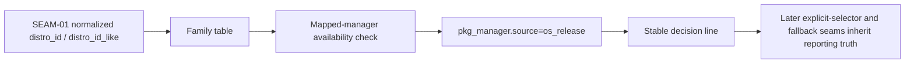

# Review Bundle - SEAM-02 Family Mapping And Decision-Line Reporting

This artifact feeds `gates.pre_exec.review`.
`../../review_surfaces.md` remains pack orientation only.

## Falsification questions

- Can the family table read or reinterpret raw os-release input instead of consuming only SEAM-01 normalized fields?
- Can the Fedora or RHEL branch drift from the accepted `dnf` then `yum` availability rule and silently change operator-visible selection behavior?
- Can the stable decision line leak into explicit-selector or PATH-fallback branches that belong to later seams instead of remaining the os-release-stage reporting contract?

## R1 - Family mapping and reporting flow

## R2 - Upstream handoff and downstream publication

## Likely mismatch hotspots

- `scripts/substrate/install-substrate.sh` still uses fixed PATH probing; SEAM-02 must add family mapping without re-opening SEAM-01 parser/input ownership.
- The decision-line template is operator-visible contract, so wording, timing, and suppression need to stay exact instead of emerging from incidental logging.
- Downstream seams consume both mapped selection truth and reporting truth, so C-03 and C-04 must remain separate from explicit-selector and fallback work.

## Pre-exec findings

- `SEAM-01` closeout is landed, `seam_exit_gate.status: passed`, and `promotion_readiness: ready`, so inbound parser/input truth is current.
- `THR-01` is revalidated for this seam through the refreshed active planning posture and no blocking remediation is open.
- No upstream stale trigger currently invalidates the family-table or decision-line basis.

## Pre-exec gate disposition

- **Review gate**: passed
- **Contract gate concerns**:
  - `C-03` must stay limited to family-table and availability-based selection.
  - `C-04` must keep exact decision-line wording, timing, and suppression without absorbing fallback or explicit-selector behavior.
- **Revalidation prerequisites**:
  - any change to SEAM-01 parser/input truth reopens this seam's revalidation gate
  - any change to the family table or decision-line wording requires downstream revalidation before closeout publication
- **Opened remediations**: none

## Planned seam-exit gate focus

- **What must be true before downstream promotion is legal**:
  - landed evidence proves family mapping and availability-based selection match `C-03`
  - landed evidence proves the stable decision line matches `C-04`
  - `THR-02` and `THR-08` are explicitly recorded as `published`
- **Which outbound contracts or threads matter most**:
  - `C-03`, `C-04`
  - `THR-02`, `THR-08`
- **Which review-surface deltas would force downstream revalidation**:
  - family-table rule changes
  - decision-line wording, timing, or suppression changes
  - any expansion of SEAM-02 into explicit-selector or fallback behavior
