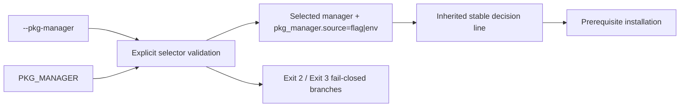

# Review Bundle - SEAM-03 Explicit Override Selection

This artifact feeds `gates.pre_exec.review`.
`../../review_surfaces.md` remains pack orientation only.

## Falsification questions

- Can a valid explicit selector still fall through to os-release mapping or the ordered `PATH` probe, breaking the fail-closed precedence contract?
- Can explicit-selector success invent a new decision line instead of reusing `SEAM-02`'s inherited reporting contract with `pkg_manager.source=flag|env`?
- Can invalid or unavailable explicit selectors collapse into generic failure handling instead of the exact exit `2` / `3` taxonomy and remediation requirements?

## R1 - Explicit selector decision flow

## R2 - Upstream handoff and downstream publication

## Likely mismatch hotspots

- `scripts/substrate/install-substrate.sh` already owns os-release selection and the stable decision line, but it does not yet expose `--pkg-manager` parsing, `PKG_MANAGER` precedence, or explicit exit `2` / `3` behavior.
- The decision-line helper currently keys off `pkg_manager.source`; explicit-selector work must widen that inherited path without restating or forking the operator-visible template from `SEAM-02`.
- Explicit-selector failure branches and fallback behavior share one script surface, so this seam must stay fail-closed without absorbing `SEAM-04` warning-line or exit `4` ownership.

## Pre-exec findings

- `SEAM-01` closeout remains landed with `THR-01` current and revalidated for this seam.
- `SEAM-02` closeout now records `C-03` and `C-04` publication, `THR-02` publication, and `promotion_readiness: ready`, so the explicit-selector basis is current.
- No blocking remediation currently targets `SEAM-03` or its inbound threads.

## Pre-exec gate disposition

- **Review gate**: passed
- **Contract gate concerns**:
  - `C-05` must keep selector precedence, allowed-value vocabulary, and `pkg_manager.source=flag|env` exact.
  - `C-06` must keep exit `2` / `3` remediation content fail-closed and must not absorb fallback or wrapper behavior.
  - explicit-selector success must reuse the inherited decision-line template instead of minting a second reporting vocabulary.
- **Revalidation prerequisites**:
  - any change to parser/input truth, mapping/reporting truth, supported manager vocabulary, or exit `2` / `3` remediation requirements reopens this seam's revalidation gate
  - any change to explicit-selector success reporting must be checked against `C-04` before closeout publication
- **Opened remediations**: none

## Planned seam-exit gate focus

- **What must be true before downstream promotion is legal**:
  - landed evidence proves flag-over-env precedence and no-fallthrough explicit selection
  - landed evidence proves exits `2` and `3` match `C-06`
  - `THR-03` is explicitly recorded as `published`
- **Which outbound contracts or threads matter most**:
  - `C-05`, `C-06`
  - `THR-03`
- **Which review-surface deltas would force downstream revalidation**:
  - selector precedence changes
  - supported manager vocabulary changes
  - exit `2` / `3` remediation wording changes
  - decision-line interaction for explicit-selector success changes
