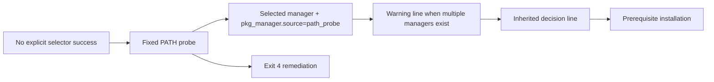

# Review Bundle - SEAM-04 Fallback Probe And Failure Taxonomy

This artifact feeds `gates.pre_exec.review`.
`../../review_surfaces.md` remains pack orientation only.

## Falsification questions

- Can the fallback stage drift from the fixed probe order and effectively choose by raw PATH ordering instead of the contract-owned precedence list?
- Can multi-manager hosts miss the exact warning text or place it after the inherited decision line, breaking operator-facing ordering guarantees?
- Can the no-manager branch collapse into generic installer failure or explicit-selector behavior instead of the exact exit `4` remediation posture?

## R1 - Fallback decision flow

## R2 - Upstream handoff and downstream publication

## Likely mismatch hotspots

- `scripts/substrate/install-substrate.sh` now carries parser/input, mapping/reporting, and explicit-selector logic on one decision path, so fallback work must preserve those upstream boundaries instead of re-deciding earlier stages.
- The stable decision line is already owned by `SEAM-02` and inherited through `SEAM-03`, so warning placement must compose with that line rather than duplicating or rewording it.
- Exit `4` is the first no-manager branch after all upstream stages are exhausted; it must remain distinct from explicit-selector exit `2` / `3` handling and from generic installer failure.

## Pre-exec findings

- `SEAM-01`, `SEAM-02`, and `SEAM-03` closeouts are landed and record `seam_exit_gate.status: passed` with `promotion_readiness: ready`.
- `SEAM-03` closeout now records `C-05` and `C-06` publication, `THR-03` publication, and no blocking remediations, so explicit-selector truth is current for fallback planning.
- No blocking remediation currently targets `SEAM-04` or its inbound threads.

## Pre-exec gate disposition

- **Review gate**: passed
- **Contract gate concerns**:
  - `C-07` must keep the fixed path-probe order exact and must publish `pkg_manager.source=path_probe` without changing upstream selector or reporting vocabulary.
  - the multi-manager warning line must match the contract-owned text and appear before the inherited decision line when both are emitted.
  - exit `4` remediation must stay distinct from explicit-selector exits and must not absorb wrapper/docs or validation ownership.
- **Revalidation prerequisites**:
  - any change to explicit-selector behavior reopens the fallback seam revalidation gate
  - any change to mapping/reporting truth, fixed probe order, warning template, or exit `4` remediation requirements reopens this seam's revalidation gate
  - warning placement changes must be checked against `C-04` before closeout publication
- **Opened remediations**: none

## Planned seam-exit gate focus

- **What must be true before downstream promotion is legal**:
  - landed evidence proves the fixed path-probe order and deterministic earliest-manager selection
  - landed evidence proves the exact warning line and ordering relative to the inherited decision line
  - landed evidence proves exit `4` remediation and no-manager posture
  - `THR-04` is explicitly recorded as `published`
- **Which outbound contracts or threads matter most**:
  - `C-07`
  - `THR-04`
- **Which review-surface deltas would force downstream revalidation**:
  - fixed probe order changes
  - warning template or placement changes
  - `pkg_manager.source=path_probe` semantics changes
  - exit `4` remediation wording changes
