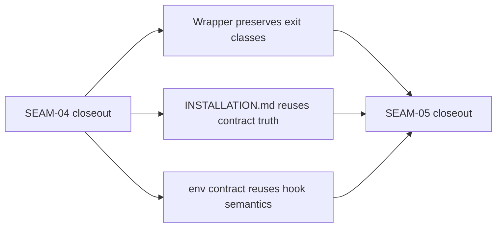

# Review Bundle - SEAM-05 Wrapper And Doc Propagation

This artifact feeds `gates.pre_exec.review`.
`../../review_surfaces.md` remains pack orientation only.

## Falsification questions

- Can the wrapper still collapse installer feature exits `2`, `3`, or `4` into a generic non-zero result and hide operator-facing remediation class boundaries?
- Can `docs/INSTALLATION.md` or `docs/reference/env/contract.md` paraphrase precedence, warning, or remediation truth enough to drift from the installer contract?
- Can macOS-hosted wording imply native macOS package-manager-selection logic instead of the intended Lima-backed Linux hosted-install path?

## R1 - Wrapper and doc handoff

## Likely mismatch hotspots

- `scripts/substrate/install.sh` is a thin wrapper over the direct installer, so wrapper parity must preserve upstream exit classes instead of inventing wrapper-owned taxonomy.
- `docs/INSTALLATION.md` and `docs/reference/env/contract.md` consume contracts from `SEAM-02`, `SEAM-03`, and `SEAM-04`; wording drift here would create a second operator-facing authority.
- macOS-hosted wording must clarify behavior coverage through Lima-backed Linux installation while still preserving the feature's Linux-scoped package-manager-selection logic.

## Pre-exec findings

- `SEAM-02`, `SEAM-03`, and `SEAM-04` closeouts are landed and record ready seam-exit handoffs.
- `THR-02`, `THR-03`, and `THR-04` now provide current upstream truth for wrapper and doc propagation.
- No blocking remediation currently targets `SEAM-05` or its inbound threads.

## Pre-exec gate disposition

- **Review gate**: passed
- **Contract gate concerns**:
  - `C-08` must preserve wrapper pass-through for exits `0`, `2`, `3`, and `4` without collapsing to a generic wrapper error.
  - `C-09` must reuse upstream precedence, warning, and remediation vocabulary exactly instead of summarizing it loosely.
  - macOS-hosted wording must stay scoped to Lima-backed Linux hosted-install coverage.
- **Revalidation prerequisites**:
  - any decision-line wording or placement change reopens this seam's revalidation gate
  - any exit taxonomy change reopens wrapper parity review
  - any warning or remediation wording change reopens doc parity review
  - any `SUBSTRATE_INSTALL_OS_RELEASE_PATH` semantics change reopens env-doc review
- **Opened remediations**: none

## Planned seam-exit gate focus

- **What must be true before downstream promotion is legal**:
  - wrapper preserves feature exits `0`, `2`, `3`, and `4`
  - installation and env docs reuse upstream operator-facing truth without drift
  - macOS-hosted wording is explicit about Lima-backed Linux behavior coverage
  - `THR-05` is recorded as `published`
- **Which outbound contracts or threads matter most**:
  - `C-08`
  - `C-09`
  - `THR-05`
