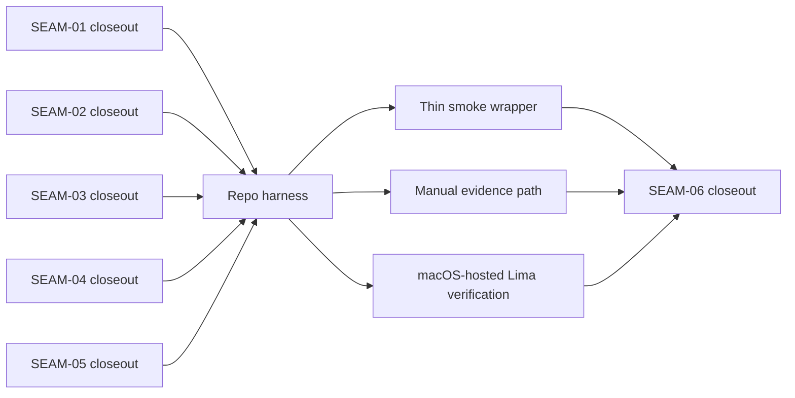

# Review Bundle - SEAM-06 Validation And Evidence Topology

This artifact feeds `gates.pre_exec.review`.
`../../review_surfaces.md` remains pack orientation only.

## Falsification questions

- Can the repo harness, smoke wrapper, and manual playbook still drift into competing assertion authorities instead of one validation topology?
- Can the validation topology omit wrapper parity, warning/remediation posture, or doc-propagation truth even though `SEAM-05` now publishes `C-08` and `C-09`?
- Can macOS-hosted verification still stop at compile-only parity and fail to exercise the Lima-backed Linux installer path explicitly enough?

## R1 - Validation topology handoff

## Likely mismatch hotspots

- `tests/installers/pkg_manager_detection_smoke.sh` must stay the behavior authority for the published installer, wrapper, and doc contracts instead of sharing ownership with thin wrappers or prose docs.
- `docs/project_management/packs/draft/best-effort-distro-package-manager/smoke/linux-smoke.sh` must remain a thin wrapper over the authoritative harness, not a second assertion surface.
- `docs/project_management/packs/draft/best-effort-distro-package-manager/manual_testing_playbook.md` and `scripts/mac/smoke.sh` must reuse the same expected stderr, exit, and behavior topology, especially for the Lima-backed Linux path on macOS hosts.

## Pre-exec findings

- `SEAM-01` through `SEAM-05` closeouts are landed and record ready seam-exit handoffs.
- `THR-01`, `THR-02`, `THR-03`, `THR-04`, and `THR-05` now provide current upstream truth for validation topology planning.
- No blocking remediation currently targets `SEAM-06` or its inbound threads.

## Pre-exec gate disposition

- **Review gate**: passed
- **Contract gate concerns**:
  - `C-10` must keep the repo harness authoritative for installer, wrapper, and doc assertions.
  - smoke-wrapper, manual evidence, and macOS-hosted verification work must reuse that authority instead of defining parallel contract truth.
  - macOS-hosted coverage must prove behavior through the Lima-backed Linux installer path, not just compile parity.
- **Revalidation prerequisites**:
  - wrapper/doc contract changes reopen validation-topology review
  - repo harness path changes reopen topology review
  - smoke-wrapper topology changes reopen thin-wrapper review
  - manual evidence expectations or macOS Lima-backed verification path changes reopen conformance review
- **Opened remediations**: none

## Planned seam-exit gate focus

- **What must be true before downstream promotion is legal**:
  - repo harness, smoke wrapper, manual evidence, and macOS-hosted verification all consume one authoritative validation topology
  - wrapper parity and remediation branches are explicitly asserted by the validation plan
  - `THR-06` is recorded as `published`
- **Which outbound contracts or threads matter most**:
  - `C-10`
  - `THR-06`
