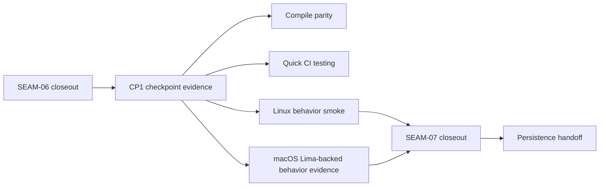

# Review Bundle - SEAM-07 Checkpoint And Downstream Handoff

This artifact feeds `gates.pre_exec.review`.
`../../review_surfaces.md` remains pack orientation only.

## Falsification questions

- Can checkpoint evidence still consume planning assumptions or partial diffs instead of the realized `SEAM-06` closeout and published `C-10` handoff?
- Can macOS-hosted coverage still stop at compile parity or generic world smoke instead of proving the Lima-backed Linux installer behavior path explicitly enough?
- Can downstream readiness or stale-trigger publication still be emitted without one checkpoint-backed closeout record that downstream persistence can trust?

## R1 - Checkpoint handoff

## Likely mismatch hotspots

- `plan.md`, `ci_checkpoint_plan.md`, and `tasks.json` must name one checkpoint boundary and consume realized upstream truth instead of restating planning assumptions.
- macOS-hosted evidence must stay behavior-scoped to the Lima-backed Linux path and must not regress into compile-only parity.
- downstream readiness must publish stale triggers and handoff posture from recorded closeout evidence only.

## Pre-exec findings

- `SEAM-06` closeout is landed with `seam_exit_gate.status: passed`, `promotion_readiness: ready`, and `THR-06` revalidated into this seam's planning basis.
- No blocking remediation currently targets `SEAM-07` or its inbound handoff.
- The pack control plane already places `SEAM-07` as the active terminal seam with no further next seam queued.

## Pre-exec gate disposition

- **Review gate**: passed
- **Contract gate concerns**:
  - `C-11` must make the checkpoint boundary, macOS-hosted behavior evidence, and downstream readiness explicit in one closeout-backed record.
  - downstream persistence must consume realized stale triggers and readiness, not reconstructed planning state.
  - this seam must not absorb leftover implementation work from earlier seams.
- **Revalidation prerequisites**:
  - checkpoint gate set changes reopen checkpoint-readiness review
  - compile parity or CI quick requirements changes reopen evidence completeness review
  - macOS Lima-backed behavior-evidence expectation changes reopen hosted-evidence review
  - downstream persistence handoff assumption changes reopen publication review
- **Opened remediations**: none

## Planned seam-exit gate focus

- **What must be true before downstream promotion is legal**:
  - CP1 evidence is recorded from realized closeout truth
  - macOS-hosted Lima-backed behavior evidence is explicit and checkpoint-scoped
  - downstream readiness and stale triggers are published through `THR-09`
- **Which outbound contracts or threads matter most**:
  - `C-11`
  - `THR-09`
