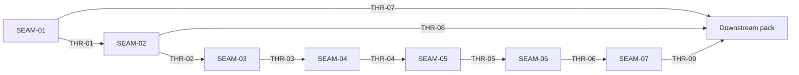

# Threading - Best-Effort Distro Package Manager

## Execution Horizon Summary

| Seam | Horizon | Role | Key output |
|------|---------|------|------------|
| SEAM-01 | future | parser/input contract owner | normalized distro facts, `<unknown>`, alternate input hook |
| SEAM-02 | future | mapping/reporting owner | family-table selection and stable decision line |
| SEAM-03 | future | explicit selector owner | flag/env precedence and exit `2` / `3` contract |
| SEAM-04 | future | fallback owner | path probe, warning line, exit `4`, no-manager posture |
| SEAM-05 | future | operator integration owner | wrapper parity, no-drift docs, and macOS-hosted path wording |
| SEAM-06 | active | evidence topology owner | repo harness, smoke wrapper, manual evidence, and macOS-hosted verification |
| SEAM-07 | next | checkpoint and handoff owner | CP1 evidence seal, macOS-hosted behavior evidence, and downstream readiness |

## Contract Registry

- **Contract ID**: `C-01`
  - **Type**: schema
  - **Owner seam**: `SEAM-01`
  - **Direct consumers**: `SEAM-02`, `SEAM-03`, `SEAM-04`, `SEAM-06`
  - **Derived consumers**: downstream pack
  - **Thread IDs**: `THR-01`, `THR-07`
  - **Definition**: selected-input parser contract for `/etc/os-release`, normalized `distro_id` / `distro_id_like`, duplicate-key rules, and `<unknown>` sentinel
  - **Versioning / compat**: v1; parser-rule changes require explicit revalidation of all downstream seams

- **Contract ID**: `C-02`
  - **Type**: config
  - **Owner seam**: `SEAM-01`
  - **Direct consumers**: `SEAM-02`, `SEAM-06`
  - **Derived consumers**: downstream pack, env docs
  - **Thread IDs**: `THR-01`, `THR-07`
  - **Definition**: `SUBSTRATE_INSTALL_OS_RELEASE_PATH` absolute-path validation, unreadable-path degradation, and no-fallback-to-`/etc/os-release` contract
  - **Versioning / compat**: v1; hook name and absence semantics are fixed

- **Contract ID**: `C-03`
  - **Type**: schema
  - **Owner seam**: `SEAM-02`
  - **Direct consumers**: `SEAM-03`, `SEAM-04`, `SEAM-05`, `SEAM-06`
  - **Derived consumers**: downstream pack
  - **Thread IDs**: `THR-02`, `THR-08`
  - **Definition**: distro-family mapping table and availability-based manager selection rules
  - **Versioning / compat**: v1; supported family rules are fixed for this feature

- **Contract ID**: `C-04`
  - **Type**: API
  - **Owner seam**: `SEAM-02`
  - **Direct consumers**: `SEAM-03`, `SEAM-04`, `SEAM-05`, `SEAM-06`
  - **Derived consumers**: operators, downstream pack
  - **Thread IDs**: `THR-02`, `THR-08`
  - **Definition**: stable decision-line template, timing, suppression rules, and `pkg_manager.source=os_release` reporting posture
  - **Versioning / compat**: v1; wording and placement are contractual

- **Contract ID**: `C-05`
  - **Type**: API
  - **Owner seam**: `SEAM-03`
  - **Direct consumers**: `SEAM-04`, `SEAM-05`, `SEAM-06`
  - **Derived consumers**: operators
  - **Thread IDs**: `THR-03`
  - **Definition**: `--pkg-manager` and `PKG_MANAGER` precedence, allowed values, `pkg_manager.source=flag|env`, and no-fallback-after-explicit-selection rule
  - **Versioning / compat**: v1; selector names and source vocabulary are fixed

- **Contract ID**: `C-06`
  - **Type**: schema
  - **Owner seam**: `SEAM-03`
  - **Direct consumers**: `SEAM-05`, `SEAM-06`
  - **Derived consumers**: operator docs
  - **Thread IDs**: `THR-03`
  - **Definition**: explicit-selector failure taxonomy for exit `2` and `3`, including remediation element requirements
  - **Versioning / compat**: v1; exit meanings and remediation elements are fixed

- **Contract ID**: `C-07`
  - **Type**: UX affordance
  - **Owner seam**: `SEAM-04`
  - **Direct consumers**: `SEAM-05`, `SEAM-06`
  - **Derived consumers**: operators
  - **Thread IDs**: `THR-04`
  - **Definition**: ordered PATH probe, multi-manager warning template, `pkg_manager.source=path_probe`, and exit `4` no-manager remediation posture
  - **Versioning / compat**: v1; ordered probe list and warning text are fixed

- **Contract ID**: `C-08`
  - **Type**: API
  - **Owner seam**: `SEAM-05`
  - **Direct consumers**: `SEAM-06`, `SEAM-07`
  - **Derived consumers**: operators
  - **Thread IDs**: `THR-05`
  - **Definition**: wrapper pass-through contract for feature exits `0`, `2`, `3`, and `4`
  - **Versioning / compat**: v1; wrapper must preserve upstream feature exit classes

- **Contract ID**: `C-09`
  - **Type**: UX affordance
  - **Owner seam**: `SEAM-05`
  - **Direct consumers**: `SEAM-06`, `SEAM-07`
  - **Derived consumers**: docs readers and maintainers
  - **Thread IDs**: `THR-05`
  - **Definition**: no-drift propagation of precedence, warning, remediation, and alternate-input semantics into `docs/INSTALLATION.md` and `docs/reference/env/contract.md`
  - **Versioning / compat**: v1; propagated docs must reuse upstream vocabulary verbatim

- **Contract ID**: `C-10`
  - **Type**: state
  - **Owner seam**: `SEAM-06`
  - **Direct consumers**: `SEAM-07`
  - **Derived consumers**: future maintenance
  - **Thread IDs**: `THR-06`
  - **Definition**: authoritative validation topology covering repo harness path, thin smoke wrapper, manual evidence model, and macOS-hosted Lima-backed verification of the Linux installer path
  - **Versioning / compat**: v1; no second assertion authority is allowed

- **Contract ID**: `C-11`
  - **Type**: state
  - **Owner seam**: `SEAM-07`
  - **Direct consumers**: downstream pack
  - **Derived consumers**: pack closeout and future promotion
  - **Thread IDs**: `THR-09`
  - **Definition**: CP1 evidence seal, explicit macOS-hosted behavior evidence, downstream stale-trigger emission, and persistence-pack readiness statement
  - **Versioning / compat**: v1; downstream handoff must consume recorded closeout truth only

## Thread Registry

- **Thread ID**: `THR-01`
  - **Producer seam**: `SEAM-01`
  - **Consumer seam(s)**: `SEAM-02`, `SEAM-03`, `SEAM-04`, `SEAM-06`
  - **Carried contract IDs**: `C-01`, `C-02`
  - **Purpose**: move trusted Linux input and parser truth into all later selection and validation work
  - **State**: revalidated
  - **Revalidation trigger**: parser rules, hook semantics, or `<unknown>` behavior change
  - **Satisfied by**: `SEAM-01` closeout with landed parser and alternate-input evidence; `SEAM-02` pre-exec revalidation in seam-local planning
  - **Notes**: foundation thread for every later selection-stage seam

- **Thread ID**: `THR-02`
  - **Producer seam**: `SEAM-02`
  - **Consumer seam(s)**: `SEAM-03`, `SEAM-04`, `SEAM-05`, `SEAM-06`
  - **Carried contract IDs**: `C-03`, `C-04`
  - **Purpose**: carry mapping-table and decision-line truth into explicit selectors, fallback behavior, docs, and tests
  - **State**: revalidated
  - **Revalidation trigger**: family-table changes, decision-line template changes, or timing changes
  - **Satisfied by**: `SEAM-02` closeout with landed mapping/reporting evidence and `SEAM-03` pre-exec revalidation against that handoff
  - **Notes**: downstream seams must not restate or fork the decision line

- **Thread ID**: `THR-03`
  - **Producer seam**: `SEAM-03`
  - **Consumer seam(s)**: `SEAM-04`, `SEAM-05`, `SEAM-06`
  - **Carried contract IDs**: `C-05`, `C-06`
  - **Purpose**: carry explicit selector semantics and the exit `2` / `3` failure posture
  - **State**: revalidated
  - **Revalidation trigger**: precedence changes, supported-value changes, or remediation wording changes
  - **Satisfied by**: `SEAM-03` closeout with landed explicit-selector evidence and `SEAM-04` pre-exec revalidation against that handoff
  - **Notes**: this thread fixes what the operator can force, not final fallback

- **Thread ID**: `THR-04`
  - **Producer seam**: `SEAM-04`
  - **Consumer seam(s)**: `SEAM-05`, `SEAM-06`
  - **Carried contract IDs**: `C-07`
  - **Purpose**: carry deterministic fallback, warning, and no-manager semantics into docs and validation
  - **State**: revalidated
  - **Revalidation trigger**: fixed probe order changes, warning-template changes, or exit `4` remediation changes
  - **Satisfied by**: `SEAM-04` closeout with landed fallback evidence and `SEAM-05` pre-exec revalidation against that handoff
  - **Notes**: this is the final decision-stage thread before propagation

- **Thread ID**: `THR-05`
  - **Producer seam**: `SEAM-05`
  - **Consumer seam(s)**: `SEAM-06`, `SEAM-07`
  - **Carried contract IDs**: `C-08`, `C-09`
  - **Purpose**: carry the final operator-facing contract into evidence-producing work
  - **State**: revalidated
  - **Revalidation trigger**: wrapper handling changes or doc wording drift
  - **Satisfied by**: `SEAM-05` closeout with wrapper/doc parity evidence and `SEAM-06` pre-exec revalidation against that handoff
  - **Notes**: docs are integration outputs, not a second authority

- **Thread ID**: `THR-06`
  - **Producer seam**: `SEAM-06`
  - **Consumer seam(s)**: `SEAM-07`
  - **Carried contract IDs**: `C-10`
  - **Purpose**: carry one authoritative validation topology, manual evidence model, and macOS-hosted verification posture into checkpoint sealing
  - **State**: published
  - **Revalidation trigger**: repo harness path, smoke-wrapper topology, manual evidence expectations, or macOS Lima-backed verification path change
  - **Satisfied by**: `SEAM-06` closeout with recorded validation evidence, published `C-10`, and `seam_exit_gate.status: passed`
  - **Notes**: keeps repo harness authoritative, smoke wrapper thin, and macOS-hosted verification explicit

- **Thread ID**: `THR-07`
  - **Producer seam**: `SEAM-01`
  - **Consumer seam(s)**: downstream pack (`persist-detected-linux-distro-pkg-manager`)
  - **Carried contract IDs**: `C-01`, `C-02`
  - **Purpose**: export parser/input truth that downstream persistence must inherit rather than redefine
  - **State**: published
  - **Revalidation trigger**: alternate-input hook or `<unknown>` semantics change
  - **Satisfied by**: `SEAM-01` closeout and published downstream stale triggers when needed
  - **Notes**: cross-pack boundary thread

- **Thread ID**: `THR-08`
  - **Producer seam**: `SEAM-02`
  - **Consumer seam(s)**: downstream pack (`persist-detected-linux-distro-pkg-manager`)
  - **Carried contract IDs**: `C-03`, `C-04`
  - **Purpose**: export selected-manager and source/reporting truth into persistence work
  - **State**: published
  - **Revalidation trigger**: mapping-table or decision-line/source-vocabulary change
  - **Satisfied by**: `SEAM-02` closeout with published selection/reporting evidence
  - **Notes**: downstream persistence owns storage, not selection semantics

- **Thread ID**: `THR-09`
  - **Producer seam**: `SEAM-07`
  - **Consumer seam(s)**: downstream pack (`persist-detected-linux-distro-pkg-manager`)
  - **Carried contract IDs**: `C-11`
  - **Purpose**: publish the final checkpoint-backed readiness signal, including macOS-hosted behavior evidence and any downstream stale triggers
  - **State**: identified
  - **Revalidation trigger**: checkpoint gate set, macOS-hosted evidence expectations, or handoff evidence requirements change
  - **Satisfied by**: `SEAM-07` closeout with `seam_exit_gate.status: passed`
  - **Notes**: downstream promotion may consume only realized closeout truth

## Dependency Graph

## Critical Path

`SEAM-01` -> `SEAM-02` -> `SEAM-03` -> `SEAM-04` -> `SEAM-05` -> `SEAM-06` -> `SEAM-07`

## Workstreams

No separate workstream owner namespace is used. Ownership is seam-only:

- `SEAM-01`: domain
- `SEAM-02`: capability
- `SEAM-03`: capability
- `SEAM-04`: capability
- `SEAM-05`: integration
- `SEAM-06`: conformance
- `SEAM-07`: conformance
