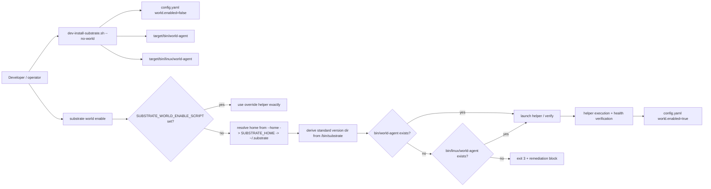
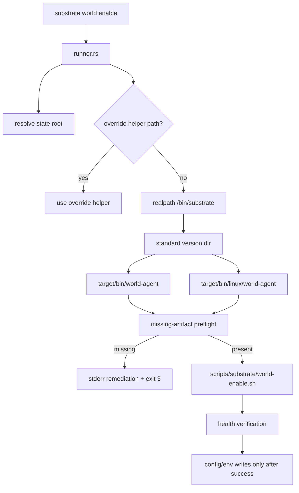
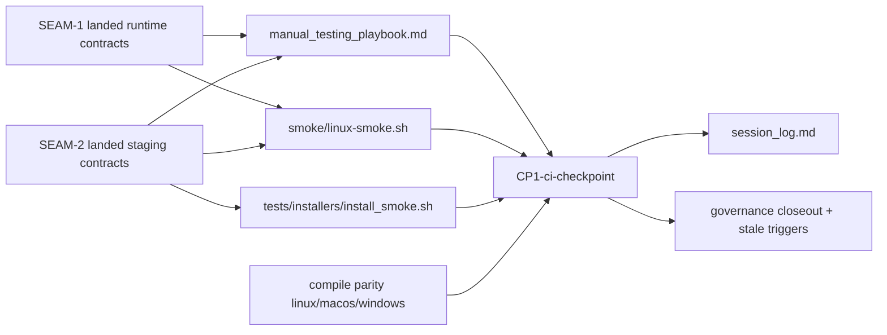

# Review Surfaces - dev-install-world-agent-staging

These diagrams orient the pack. They show the actual product/work shape that is expected to land.

They do not, by themselves, satisfy seam-local pre-exec review.

Active and next seams still require seam-local `review.md` artifacts later.

## R1 - Linux enable-later workflow

Why this matters:

- The landed workflow is coherent only when runtime preflight and dev-install staging agree on the same accepted path set.
- The operator-visible failure class is part of the product shape, not an implementation detail.

## R2 - Runtime path derivation and ordering controls

Orientation notes:

- The override path is an explicit carve-out and should not be mistaken for the standard version-dir guarantee.
- The no-write ordering and remediation visibility both belong to the runtime contract surface.

## R3 - Validation and checkpoint evidence flow

Orientation notes:

- The checkpoint is a product-facing proof surface because it validates the entire enable-later workflow after both behavior seams land.
- Pack-level diagrams orient the evidence flow only; active and next seams still need seam-local review artifacts before execution.
