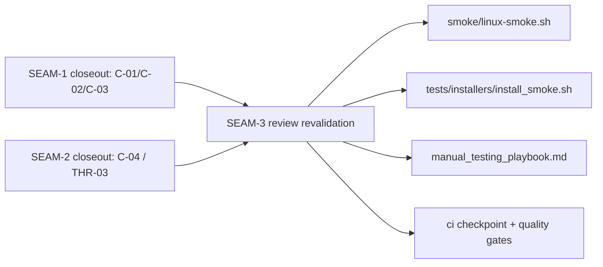
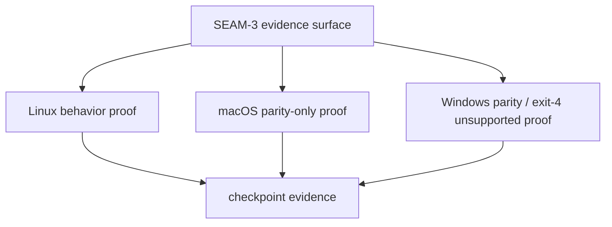

# Review Bundle - SEAM-3 Cross-platform validation + drift guards

This artifact feeds `gates.pre_exec.review`.
`../../review_surfaces.md` is pack orientation only.

## Falsification questions

- Can Linux smoke, installer smoke, manual cases, or checkpoint notes drift away from the closeout-backed `C-01` / `C-02` / `C-03` / `C-04` contract set?
- Can platform parity artifacts overclaim macOS or Windows behavior beyond the pack’s parity-only / unsupported boundaries?
- Can checkpoint or quality-gate text claim proof before the smoke and manual evidence surfaces actually bind to landed upstream truth?
- Can the open overlap watchpoint in `REM-003` stale the evidence basis without explicit revalidation against the current `SEAM-1` / `SEAM-2` closeouts?

## R1 - Closeout-to-evidence flow

## R2 - Platform claim boundary

## Likely mismatch hotspots

- Linux smoke or installer smoke drifting from the closeout-backed accepted path and remediation rules
- manual playbook or checkpoint notes overclaiming behavior beyond the landed Linux-only delta
- compile-parity artifacts drifting from the pack’s explicit macOS / Windows boundaries
- overlap on shared runner or dev-install surfaces invalidating evidence that was drafted against stale upstream truth

## Pre-exec findings

- `THR-01` is revalidated here against `../../governance/seam-1-closeout.md`; the accepted staged path rule and no-write ordering remain the current runtime basis.
- `THR-02` is revalidated here against `../../governance/seam-1-closeout.md`; the deterministic missing-artifact failure and remediation visibility remain closeout-backed truth.
- `THR-03` is revalidated here against `../../governance/seam-2-closeout.md`; the selected-profile staging, dual accepted paths, refresh semantics, and disabled-world evidence are now closeout-backed truth.
- `REM-003` remains open as a follow-up overlap watchpoint in `../../governance/remediation-log.md`, but it does not block `exec-ready` because it has `blocked_targets: []` and no contradictory upstream closeout delta is recorded in the current pack state.

## Pre-exec gate disposition

- **Review gate**: passed
- **Contract gate**: passed
- **Revalidation gate**: passed
- **Opened remediations**: none

## Planned seam-exit gate focus

- **What must be true before pack closeout or downstream evidence is legal**:
  - Linux smoke, installer smoke, manual cases, and checkpoint artifacts all bind to the closeout-backed `SEAM-1` / `SEAM-2` truth.
  - platform parity wording stays explicitly bounded for macOS and Windows.
  - stale-trigger records capture any future drift on shared runner, dev-install, or checkpoint surfaces.
- **Which outbound contracts/threads matter most**:
  - `THR-01`
  - `THR-02`
  - `THR-03`
- **Which review-surface deltas would force revalidation**:
  - any change to the accepted path rule, remediation block content, selected-profile staging, or refresh semantics
  - any change to Linux smoke, installer smoke, checkpoint wording, or platform claim boundaries
