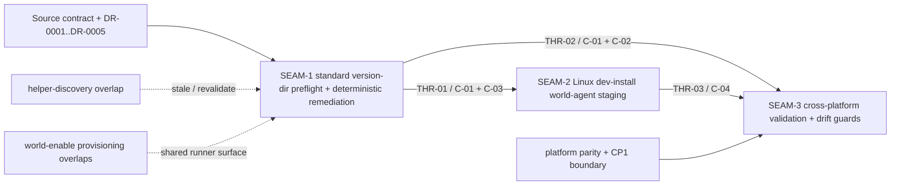

# Threading - dev-install-world-agent-staging

## Execution horizon summary

- **Active seam**: none
- **Next seam**: none
- **Future seams**: `SEAM-1`, `SEAM-2`, `SEAM-3`

Horizon policy for this pack:

- no active seam remains in the forward window because all three seams are now landed or closed
- no next seam remains in the forward window; any new next seam requires an explicit horizon decision
- `SEAM-3` has landed with a passed seam-exit gate and left the forward planning window
- downstream planning now binds to closeout-backed truth from `SEAM-1`, `SEAM-2`, and `SEAM-3`

## Contract registry

- **Contract ID**: `C-01`
  - **Type**: `state`
  - **Owner seam**: `SEAM-1`
  - **Direct consumers**: `SEAM-2`, `SEAM-3`
  - **Derived consumers**: future helper-discovery, provisioning, or packaging follow-on work that depends on the standard version-dir layout
  - **Thread IDs**: `THR-01`, `THR-02`
  - **Definition**: In the standard version-dir flow, `substrate world enable` resolves `<home>/bin/substrate`, derives the standard version dir from the canonical binary target, checks `<version_dir>/bin/world-agent` before `<version_dir>/bin/linux/world-agent`, and treats either accepted executable path as sufficient to continue.
  - **Versioning / compat**: the root `bin/world-agent` path wins when both exist; any change to derivation, accepted path set, sufficiency rule, or override carve-out forces downstream revalidation.

- **Contract ID**: `C-02`
  - **Type**: `UX affordance`
  - **Owner seam**: `SEAM-1`
  - **Direct consumers**: `SEAM-3`
  - **Derived consumers**: future `world enable` UX or provisioning work that must preserve deterministic failure classification
  - **Thread IDs**: `THR-02`
  - **Definition**: When neither accepted staged path exists in the standard version-dir flow, `substrate world enable` exits `3` before helper launch, privileged provisioning, health verification, config writes, or manager-env writes, and renders one remediation block naming both accepted paths, `scripts/substrate/dev-install-substrate.sh --no-world`, and `cargo build -p world-agent`.
  - **Versioning / compat**: dry-run shares the same preflight; any change to minimum remediation text, exit taxonomy mapping, or the “fail before privileged work” ordering forces revalidation.

- **Contract ID**: `C-03`
  - **Type**: `config`
  - **Owner seam**: `SEAM-1`
  - **Direct consumers**: `SEAM-2`, `SEAM-3`
  - **Derived consumers**: future work that expands `world enable` or dev-install semantics but must preserve state-root and ordering guarantees
  - **Thread IDs**: `THR-01`
  - **Definition**: `substrate world enable` resolves state root as `--home` → `SUBSTRATE_HOME` → `~/.substrate`; `--dry-run` writes no config or system state; missing-artifact paths write nothing; non-dry-run success keeps `world.enabled: false` until helper execution and health verification succeed; `SUBSTRATE_WORLD_ENABLE_SCRIPT` remains an explicit override carve-out outside the standard preflight guarantee.
  - **Versioning / compat**: no new env vars, no `--prefix` on `substrate world enable`, no manager-env mutation before success, and any precedence or ordering change forces staging and conformance revalidation.

- **Contract ID**: `C-04`
  - **Type**: `state`
  - **Owner seam**: `SEAM-2`
  - **Direct consumers**: `SEAM-3`
  - **Derived consumers**: future dev-install or packaging work that depends on the enable-later bridge layout
  - **Thread IDs**: `THR-03`
  - **Definition**: On Linux, `scripts/substrate/dev-install-substrate.sh --no-world --profile <debug|release>` stages executable links at `target/bin/world-agent` and `target/bin/linux/world-agent` from `target/<profile>/world-agent`, keeps `world.enabled: false`, skips provisioning and systemd mutation, and refreshes both links with `ln -sfn` on rerun; `substrate world enable --profile` does not retarget the staged bridge.
  - **Versioning / compat**: changing selected-profile mapping, staging paths, refresh semantics, or the “enable later, not build later” meaning of `--no-world` stales downstream proof.

## Thread registry

- **Thread ID**: `THR-01`
  - **Producer seam**: `SEAM-1`
  - **Consumer seam(s)**: `SEAM-2`, `SEAM-3`
  - **Carried contract IDs**: `C-01`, `C-03`
  - **Purpose**: publish the accepted staged path rule, state-root precedence, and no-write ordering that Linux staging and later conformance must honor.
  - **State**: `closed`
  - **Revalidation trigger**: accepted path set changes, standard-version-dir derivation changes, `--home` precedence changes, `world.enabled` ordering changes, or `SUBSTRATE_WORLD_ENABLE_SCRIPT` carve-out changes.
  - **Satisfied by**: `governance/seam-1-closeout.md` published the landed path derivation and ordering truth, and `governance/seam-3-closeout.md` records the final evidence lock-in that consumed that truth without reopening it.
  - **Notes**: `SEAM-2` and `SEAM-3` both landed against the same closeout-backed runtime basis; downstream work now treats this thread as closed unless a stale trigger fires.

- **Thread ID**: `THR-02`
  - **Producer seam**: `SEAM-1`
  - **Consumer seam(s)**: `SEAM-3`
  - **Carried contract IDs**: `C-01`, `C-02`
  - **Purpose**: let the conformance seam prove the deterministic missing-artifact failure, dry-run parity, and visible remediation posture against the landed runtime boundary.
  - **State**: `closed`
  - **Revalidation trigger**: remediation text changes, exit-code mapping changes, helper-output suppression changes, or any new enable step appears before preflight.
  - **Satisfied by**: `governance/seam-1-closeout.md` published the landed remediation and early-failure contract, and `governance/seam-3-closeout.md` records smoke, manual, and checkpoint evidence that consumes that same closeout-backed truth.
  - **Notes**: `SEAM-3` finished the only downstream conformance work that needed this operator-facing failure contract, so the thread is now closed pending any future stale trigger.

- **Thread ID**: `THR-03`
  - **Producer seam**: `SEAM-2`
  - **Consumer seam(s)**: `SEAM-3`
  - **Carried contract IDs**: `C-04`
  - **Purpose**: publish the actual staged `world-agent` bridge layout, selected-profile mapping, and refresh posture that the checkpoint evidence must consume.
  - **State**: `closed`
  - **Revalidation trigger**: selected-profile mapping changes, `ln -sfn` refresh semantics change, accepted staging paths change, or `scripts/substrate/install-substrate.sh` moves from reference-only posture into an actual touched surface.
  - **Satisfied by**: `governance/seam-2-closeout.md` published the landed `C-04` bridge layout, and `governance/seam-3-closeout.md` records Linux smoke, installer smoke, and checkpoint evidence that consumed that closeout-backed staging truth.
  - **Notes**: `SEAM-3` completed the final downstream consumption of the selected-profile and refresh contract, so this thread is now closed.

## Dependency graph

## Critical path

1. `SEAM-1` landed the standard version-dir path rule, deterministic exit `3` remediation, dry-run / no-write ordering, and override carve-out.
2. `SEAM-2` revalidates against `SEAM-1` closeout and then lands Linux `world-agent` staging, selected-profile mapping, and `ln -sfn` refresh behavior.
3. `SEAM-3` revalidates against both producer closeouts and only then publishes Linux smoke, installer smoke, cross-platform compile parity, checkpoint evidence, and drift guards.

Critical-path failure modes to watch:

- If helper-discovery work lands first on `world enable` or dev-install surfaces, revalidate `SEAM-1` and `SEAM-2` before promotion.
- If `--no-world` semantics drift from “enable later” toward “build later” or “skip all world-related work,” `THR-03` and likely `THR-01` both stale.
- If the missing-artifact remediation text, exit mapping, or helper-output path changes, `THR-02` must be revalidated before the checkpoint evidence is trusted.
- If `scripts/substrate/install-substrate.sh` becomes an actual modified surface rather than a regression-only reference, `SEAM-2` and `SEAM-3` both need scope revalidation.
- If validation starts claiming `cargo clean` robustness or widened macOS behavior, the conformance seam has drifted beyond the source contract and must be narrowed or split.

## Workstreams

- **Workstream A — Runtime contract landing**
  - Seam(s): `SEAM-1`
  - Why grouped: owns the first publishable runtime contracts and the earliest user-visible failure boundary.

- **Workstream B — Linux staging landing**
  - Seam(s): `SEAM-2`
  - Why grouped: consumes the path rule and publishes the actual staged bridge layout that makes enable-later work.

- **Workstream C — Conformance and checkpoint lock-in**
  - Seam(s): `SEAM-3`
  - Why grouped: owns smoke / manual / compile parity evidence, checkpoint proof, and drift guards after the behavior seams land.

Concurrency posture:

- `SEAM-2` can draft seam-local review questions early, but authoritative decomposition waits on `THR-01`.
- `SEAM-3` can sketch evidence scaffolds early, but it stays future until `THR-02` and `THR-03` have closeout-backed truth to consume.
