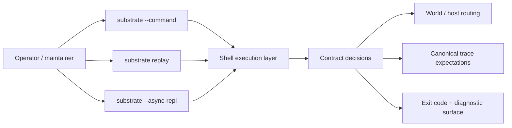
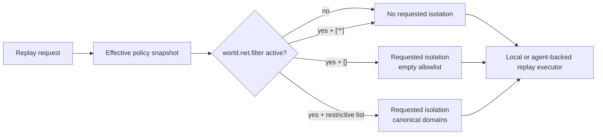
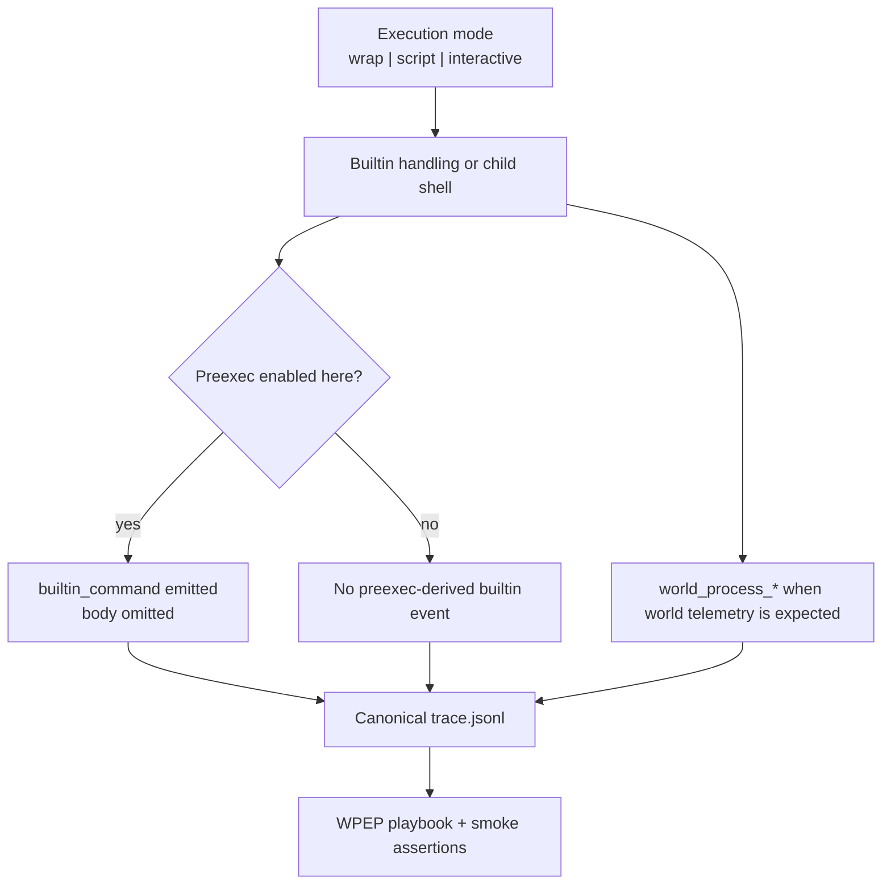
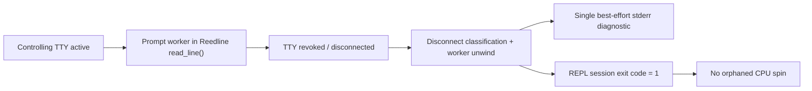
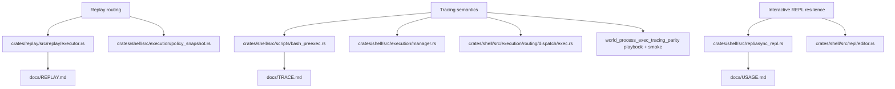

# Review Surfaces - execution-surface-parity-hardening

These diagrams orient the pack. They show the actual execution surfaces, routing decisions, trace publication points, and abnormal-terminal-loss behavior that are expected to land.
They do not, by themselves, satisfy seam-local pre-exec review.
`SEAM-1` and `SEAM-2` still require seam-local `review.md` artifacts later.

## R1 - High-level execution-surface workflow

## R2 - Replay routing parity flow

## R3 - Tracing behavior and validation flow

## R4 - Interactive terminal-loss handling flow

## R5 - Touch-surface orientation map

