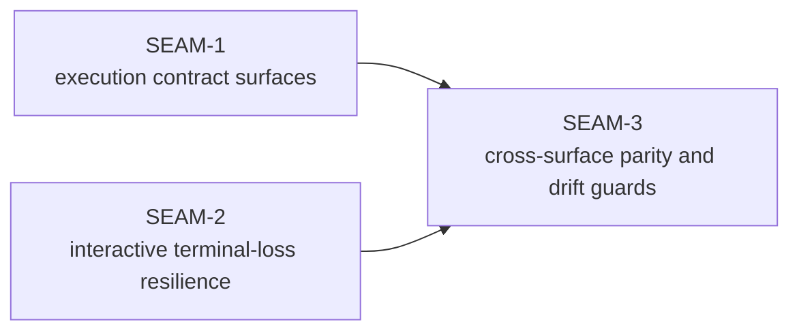

# Seam Map - execution-surface-parity-hardening

The four source documents describe one coherent hardening initiative, but they do not yet separate foundation contracts from implementation seams and later lock-in work. This extractor keeps the work at governance-ready seam depth and avoids prematurely decomposing future work.

| Seam | Horizon | Type | Core value | Direct blockers | Main touch surface | Source-work-item anchors |
| --- | --- | --- | --- | --- | --- | --- |
| `SEAM-1` | `active` | `integration` | Publish the authoritative replay-routing and tracing-validation contract surfaces so the initiative stops validating or executing against stale assumptions. | None inside the pack; external anchors are the current policy snapshot contract, trace safety posture, and the active WPEP pack. | `crates/replay/src/replay/executor.rs`, `crates/shell/src/execution/policy_snapshot.rs`, `crates/shell/src/scripts/bash_preexec.rs`, `crates/shell/src/execution/manager.rs`, `crates/shell/src/execution/routing/dispatch/exec.rs`, `docs/REPLAY.md`, `docs/TRACE.md`, `docs/internals/env/inventory.md`, `docs/project_management/packs/active/world_process_exec_tracing_parity/` | `aligning_otter_work_item_intake.md`, `untangling_lemur_work_item_intake.md` |
| `SEAM-2` | `next` | `capability` | Prevent async REPL orphan-spin behavior on controlling-TTY loss and make abnormal interactive termination explicit to operators and tests. | None inside the pack; external semantic anchors are the exit-code taxonomy and existing REPL prompt-worker architecture. | `crates/shell/src/repl/async_repl.rs`, `crates/shell/src/repl/editor.rs`, `crates/shell/tests/`, `docs/project_management/adrs/draft/ADR-0016-world-first-repl-persistent-pty.md`, `docs/reference/env/contract.md`, `docs/USAGE.md` | `taming_tapir_work_item_intake.md`, `taming_tapir_fact_finding.md` |
| `SEAM-3` | `future` | `conformance` | Lock replay, tracing, and interactive-shell docs, playbooks, smoke guidance, and drift guards to the landed contracts from the first two seams. | `SEAM-1`, `SEAM-2`, `THR-01`, `THR-02` | `docs/project_management/packs/active/world_process_exec_tracing_parity/manual_testing_playbook.md`, `docs/project_management/packs/active/world_process_exec_tracing_parity/smoke/_core.sh`, `docs/REPLAY.md`, `docs/TRACE.md`, `docs/USAGE.md`, regression suites that pin routing and REPL abnormal-exit behavior | derived from all source work items because it exists to consume their landed contracts rather than add new runtime behavior |

Why this split is the right seam map:

- `SEAM-1` has one purpose: turn the currently ambiguous replay-routing and tracing-validation expectations into explicit contracts that later work can consume without re-deciding them locally.
- `SEAM-2` has one purpose: harden one concrete runtime failure mode in the interactive shell and publish a bounded abnormal-termination contract.
- `SEAM-3` has one purpose: keep the landed behavior from drifting by locking docs, playbooks, smoke wrappers, and regression expectations only after the runtime contracts exist.

Why no additional seams were extracted:

- A separate docs-only seam would be too small and would sever documentation from the conformance work that verifies it.
- A separate platform seam for macOS revoke handling would be an anti-pattern because the user value is one interactive-shell failure contract, even though the highest-confidence reproduction lives on macOS.
- A separate telemetry-only seam for `SEAM-1` would duplicate ownership across the same routing and validation surfaces; the value is contract publication across replay and tracing together, not one more partial foundation seam.

Horizon note:

- `SEAM-1` is the only seam eligible for authoritative deep planning by default.
- `SEAM-2` may later receive seam-local review and only provisional deeper planning.
- `SEAM-3` remains a seam brief until `SEAM-1` and `SEAM-2` publish their contracts and closeout evidence.
