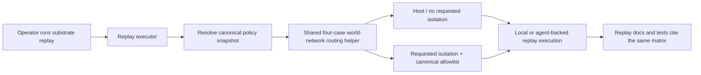
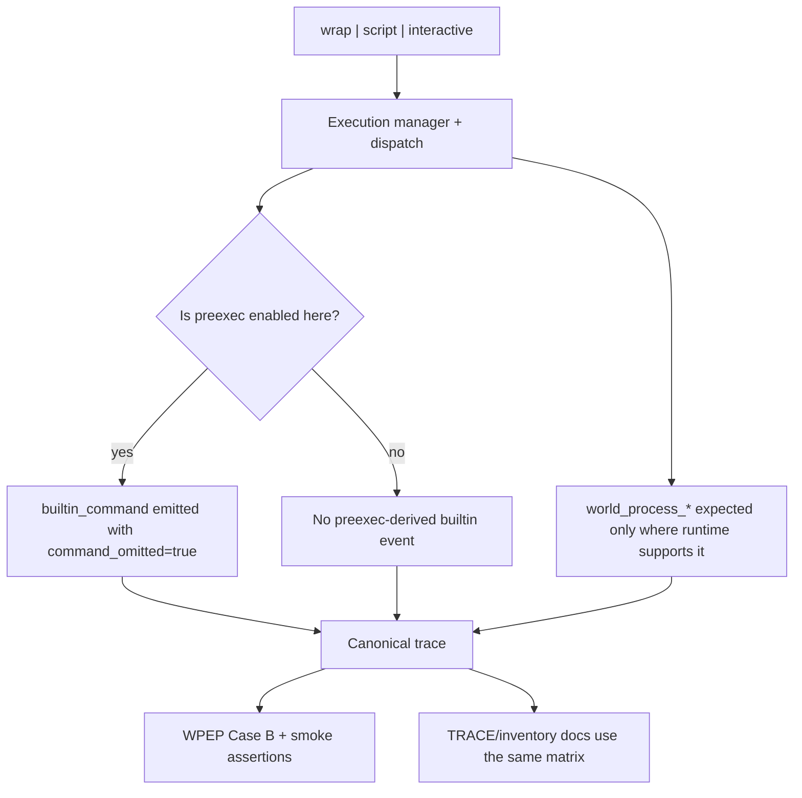

# Review Bundle - SEAM-1 Execution contract surfaces

This artifact feeds `gates.pre_exec.review`.
`../../review_surfaces.md` is pack orientation only.

## Falsification questions

- Can replay still compute `policy_snapshot` and `world_network` differently from normal shell execution, especially on the empty-allowlist and restrictive-allowlist cases?
- Can WPEP Case B keep validating a proxy signal that diverges from the runtime truth about `world_process_*`, `builtin_command`, or `SUBSTRATE_ENABLE_PREEXEC`?
- Can the owned contracts remain half-published, with runtime behavior changing but `docs/REPLAY.md`, `docs/TRACE.md`, and the active WPEP pack still documenting the prior assumptions?

## R1 - Replay routing flow that should land

## R2 - Tracing behavior matrix and validation flow that should land

## Likely mismatch hotspots

- `crates/replay/src/replay/executor.rs` currently derives a `PolicySnapshotV3` with `net_allowed: Vec::new()` and constructs replay requests with `world_network: None`, while `crates/shell/src/execution/policy_snapshot.rs` already owns the canonical routing helper and four-case tests.
- `crates/shell/src/execution/manager.rs` toggles `SUBSTRATE_ENABLE_PREEXEC`, but the pack still needs one explicit cross-mode answer for when that toggle is honored and what WPEP Case B should assert.
- `crates/shell/src/scripts/bash_preexec.rs` preserves safe trace omission through `command_omitted: true`, so any behavior-matrix publication that implies raw builtin bodies would be invalid.
- The active WPEP pack already contains multiple slices/specs and smoke/manual guidance, which raises the risk of changing runtime semantics without updating the operator-facing validation language in the same publication unit.

## Pre-exec findings

- Basis revalidated against current repo evidence:
  - `crates/shell/src/execution/policy_snapshot.rs` already defines the canonical four-case routing behavior and related tests.
  - `crates/replay/src/replay/executor.rs` still carries replay-local snapshot construction that does not yet consume that contract.
  - `crates/shell/src/scripts/bash_preexec.rs` explicitly omits raw command bodies in canonical trace.
  - `docs/project_management/packs/active/world_process_exec_tracing_parity/manual_testing_playbook.md` and `smoke/_core.sh` are authoritative validation surfaces that must move with `C-02`.
- No remediation is opened during decomposition. The contract-definition slice exists precisely to remove the current ambiguity before execution starts.

## Pre-exec gate disposition

- **Review gate**: pending
- **Contract gate concerns**:
  - `S00` must make `C-01` and `C-02` concrete enough that downstream slices do not reinterpret routing or behavior-matrix semantics locally.
- **Revalidation prerequisites**:
  - re-check `crates/replay/src/replay/executor.rs`, `crates/shell/src/execution/policy_snapshot.rs`, `crates/shell/src/execution/manager.rs`, `crates/shell/src/scripts/bash_preexec.rs`, and the active WPEP playbook/smoke assets immediately before promotion to `exec-ready`
- **Opened remediations**: none

## Planned seam-exit gate focus

- **What must be true before downstream promotion is legal**:
  - `THR-01` is published with explicit evidence that replay now consumes the same routing matrix as shell execution and that the behavior matrix / Case B validation surfaces all reflect one contract.
- **Which outbound contracts/threads matter most**: `C-01`, `C-02`, `THR-01`
- **Which review-surface deltas would force downstream revalidation**:
  - any change to the four-case routing matrix, allowed-domain canonicalization, empty-allowlist handling, `SUBSTRATE_ENABLE_PREEXEC` routing, canonical trace omission posture, or WPEP Case B assertions
