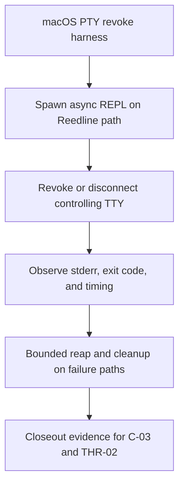

# Review Bundle - SEAM-2 Interactive terminal-loss resilience

This artifact feeds `gates.pre_exec.review`.
`../../review_surfaces.md` is pack orientation only.

## Falsification questions

- Can controlling-TTY revoke or disconnect still leave the Reedline prompt worker blocked in `read_line()` so the host REPL never reaches the abnormal-exit path?
- Can abnormal terminal loss still collapse into a normal `CtrlD` or generic prompt error path, causing exit code `0` or ambiguous stderr behavior even though the ADR says the REPL must exit `1` after startup?
- Can the macOS regression proof claim success while still leaking a stuck child or missing the Reedline path entirely because it falls back to the stdio prompt worker or incomplete PTY cleanup?

## R1 - Runtime flow that should land

## R2 - Regression proof flow that should land

## Likely mismatch hotspots

- `crates/shell/src/repl/async_repl.rs` currently lets `PromptWorker::shutdown()` send `Shutdown` and then `join`, but the worker thread can be stuck inside `line_editor.read_line(&prompt)` and never observe the shutdown command without an explicit unwind path.
- `crates/shell/src/repl/async_repl.rs` currently distinguishes `CtrlD` and generic `PromptWorkerResponse::Error`, but it does not carry an explicit abnormal session-termination cause that separates controlling-TTY loss from normal operator exit semantics.
- `docs/project_management/adrs/draft/ADR-0016-world-first-repl-persistent-pty.md` already states that controlling-TTY loss after startup must exit `1`, while the pack still lacks landed runtime proof and a dedicated macOS revoke regression harness that exercises the Reedline path specifically.
- Existing PTY-based REPL tests in `crates/shell/tests/repl_world_first_routing_v1.rs` and `crates/shell/tests/repl_world_first_rendering_v1.rs` prove harness and rendering behavior, but they do not currently provide a dedicated revoke/disconnect proof with bounded child reap guarantees for this seam.

## Pre-exec findings

- Basis revalidated against current repo evidence:
  - `crates/shell/src/repl/async_repl.rs` routes Reedline input through a dedicated worker thread whose current shutdown path cannot interrupt `read_line()` once blocked.
  - `PromptWorkerResponse::CtrlD` and generic `PromptWorkerResponse::Error` exist, but the async REPL lacks an explicit terminal-loss termination-cause contract.
  - `docs/project_management/adrs/draft/ADR-0016-world-first-repl-persistent-pty.md` already defines abnormal controlling-TTY loss as exit code `1` after startup.
  - `docs/reference/env/contract.md` and `docs/USAGE.md` do not yet publish a focused operator contract for this revoke/disconnect path.
  - Current PTY harnesses prove Reedline/PTTY plumbing exists, but they do not yet lock the exact macOS revoke failure mode.
  - `../../governance/seam-1-closeout.md` now publishes the execution-language baseline this seam expected, so no upstream contract ambiguity remains on the path to `exec-ready`.
- No remediation is opened during decomposition. The contract-definition and runtime-proof slices exist to remove the current ambiguity before execution starts.

## Pre-exec gate disposition

- **Review gate**: passed
- **Contract gate concerns**:
  - `S00` now bounds `C-03` tightly enough that implementation does not need to guess how to distinguish abnormal terminal loss, how many diagnostics to print, or what cleanup proof counts as sufficient.
- **Revalidation prerequisites**:
  - re-check `crates/shell/src/repl/async_repl.rs`, optional prompt-editor support in `crates/shell/src/repl/editor.rs`, the existing PTY REPL harnesses, and the authoritative exit wording in `docs/project_management/adrs/draft/ADR-0016-world-first-repl-persistent-pty.md`, `docs/reference/env/contract.md`, and `docs/USAGE.md` immediately before execution starts
- **Contract gate**: passed (the seam-local contract baseline is concrete in `S00` and carried consistently into the runtime, regression, publication, and exit-gate slices.)
- **Revalidation gate**: passed (`SEAM-1` closeout-backed execution-language publication is now landed, the seam basis still matches current repo evidence, and no blocking pre-exec remediations are open.)
- **Opened remediations**: none

## Planned seam-exit gate focus

- **What must be true before downstream promotion is legal**:
  - `THR-02` is published with explicit evidence that abnormal terminal loss on the Reedline path unwinds promptly, emits one bounded stderr diagnostic, exits with code `1`, and leaves no unreaped or CPU-spinning child behind.
- **Which outbound contracts/threads matter most**: `C-03`, `THR-02`
- **Which review-surface deltas would force downstream revalidation**:
  - any change to prompt-worker shutdown mechanics, controlling-TTY loss classification, abnormal-exit wording, Reedline/crossterm revoke behavior, or the macOS revoke harness cleanup assumptions
