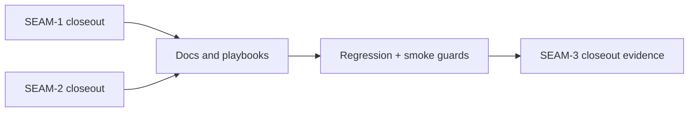

# Review Bundle - SEAM-3 Cross-surface parity and drift guards

This artifact feeds `gates.pre_exec.review`.
`../../review_surfaces.md` remains pack orientation only.

## Falsification questions

- Can `docs/REPLAY.md`, `docs/TRACE.md`, or `docs/USAGE.md` still describe behavior that diverges from the published `SEAM-1` and `SEAM-2` closeouts?
- Can the active WPEP playbook or smoke checks still validate a proxy contract instead of the landed replay-routing and abnormal-terminal-loss truth?
- Can the regression surfaces pin replay or REPL behavior that no longer matches the docs, allowing drift to recur silently?

## R1 - Cross-surface conformance flow

## Likely mismatch hotspots

- `docs/REPLAY.md`, `docs/TRACE.md`, or the active WPEP pack may still carry wording that predates the final replay-routing and tracing publication from `SEAM-1`.
- `docs/USAGE.md` may now reflect the published abnormal-terminal-loss contract from `SEAM-2`, but replay and tracing docs or smoke surfaces can still drift if they continue using provisional language.
- Existing regression surfaces may prove runtime behavior without proving the same operator-facing statements that the docs and playbooks publish.

## Pre-exec findings

- Basis revalidated against current repo evidence:
  - `../../governance/seam-1-closeout.md` records `THR-01` as published and promotion-ready.
  - `../../governance/seam-2-closeout.md` records `THR-02` as published and promotion-ready.
  - `docs/project_management/adrs/draft/ADR-0016-world-first-repl-persistent-pty.md`, `docs/reference/env/contract.md`, and `docs/USAGE.md` now align on the abnormal-terminal-loss contract landed by `SEAM-2`.
  - The remaining work is conformance-only: align downstream docs, playbook/smoke assets, and regression guards to the already-published truths.
- No blocking remediations are open for this seam.

## Pre-exec gate disposition

- **Review gate**: passed
- **Contract gate**: passed (`SEAM-3` consumes already-published contracts and does not own a new producer contract that requires an `S00` boundary slice.)
- **Revalidation gate**: passed (`THR-01` and `THR-02` are published, their closeouts are promotion-ready, and the seam basis matches current repo evidence.)
- **Opened remediations**: none

## Planned seam-exit gate focus

- **What must be true before closeout is legal**:
  - every changed doc/playbook/smoke/regression surface cites or proves the same published upstream contract
  - any remaining drift risk is captured as an explicit stale trigger instead of being left implicit
- **Which outbound contracts/threads matter most**: `THR-01`, `THR-02`
- **Which deltas would force revalidation**:
  - any change to replay-routing, tracing-validation, or abnormal-terminal-loss publication surfaces after this seam decomposes
