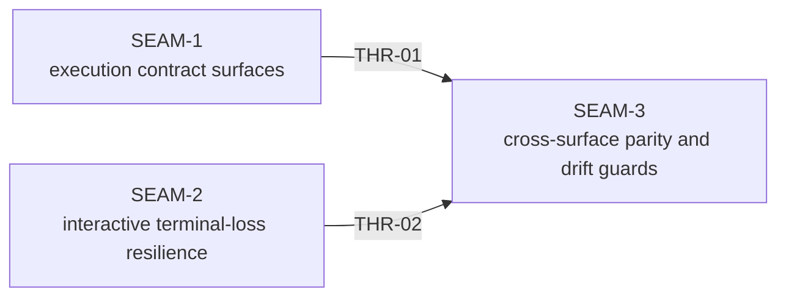

# Threading - Execution Surface Parity Hardening

## Execution horizon summary

- **Active seam**: none
  - `SEAM-3` has passed its seam-exit gate and left the forward planning window.
- **Next seam**: `none`
- **Previous active seam**: `SEAM-3`
  - its closeout is now the authoritative terminal evidence set for `THR-01` and `THR-02`
- **Future seams**: none

## Source basis carried forward from intake and fact-finding

- **Routing and replay basis**:
  - `docs/project_management/intake/work_items/aligning_otter_work_item_intake.md`
  - `docs/REPLAY.md`
  - `crates/replay/src/replay/executor.rs`
  - `crates/shell/src/execution/policy_snapshot.rs`
- **Tracing and validation basis**:
  - `docs/project_management/intake/work_items/untangling_lemur_work_item_intake.md`
  - `docs/project_management/packs/active/world_process_exec_tracing_parity/manual_testing_playbook.md`
  - `docs/project_management/packs/active/world_process_exec_tracing_parity/smoke/_core.sh`
  - `docs/TRACE.md`
  - `docs/internals/env/inventory.md`
- **Interactive REPL basis**:
  - `docs/project_management/intake/work_items/taming_tapir_work_item_intake.md`
  - `docs/project_management/intake/work_items/taming_tapir_fact_finding.md`
  - `crates/shell/src/repl/async_repl.rs`
  - `docs/project_management/adrs/draft/ADR-0016-world-first-repl-persistent-pty.md`
  - `docs/reference/env/contract.md`

## Contract registry

- **Contract ID**: `C-01`
  - **Type**: `config`
  - **Owner seam**: `SEAM-1`
  - **Direct consumers**: `SEAM-3`
  - **Derived consumers**: future replay-related packs, operator docs, and any code path that constructs replay `world_network` or policy snapshots
  - **Thread IDs**: `THR-01`
  - **Definition**: Replay request construction uses the same four-case routing matrix as the normal shell and world-agent path:
    - gate off plus restrictive `net_allowed` means no requested isolation
    - gate on plus allow-all `["*"]` means no requested isolation
    - gate on plus deny-all `[]` means requested isolation with an empty allowlist
    - gate on plus restrictive allowlist means requested isolation with canonical domains
    Local and agent-backed replay both derive `policy_snapshot.net_allowed` and `world_network` from this same contract rather than from replay-specific heuristics.
  - **Versioning / compat**: no new public CLI or config surface; helper extraction is preferred over duplicate logic; downstream docs and tests must treat the four-case matrix as canonical once published.

- **Contract ID**: `C-02`
  - **Type**: `schema`
  - **Owner seam**: `SEAM-1`
  - **Direct consumers**: `SEAM-3`
  - **Derived consumers**: the active `world_process_exec_tracing_parity` pack, `docs/TRACE.md`, `docs/internals/env/inventory.md`, and future tracing-related planning packs
  - **Thread IDs**: `THR-01`
  - **Definition**: Publish one explicit behavior matrix for execution mode by platform describing:
    - when `world_process_*` telemetry is expected
    - when `builtin_command` is expected
    - whether `SUBSTRATE_ENABLE_PREEXEC` is honored in wrap, script, and interactive paths
    - what Case B in the WPEP playbook must assert
    The matrix must preserve the safe-by-default invariant that canonical trace omits raw builtin or preexec command bodies.
  - **Versioning / compat**: if a later ADR or config lever changes preexec posture, the matrix and playbook assertions must change in the same publication unit; safe trace omission remains non-negotiable.

- **Contract ID**: `C-03`
  - **Type**: `UX affordance`
  - **Owner seam**: `SEAM-2`
  - **Direct consumers**: `SEAM-3`
  - **Derived consumers**: operator docs, REPL regression harnesses, and future shell-resilience work
  - **Thread IDs**: `THR-02`
  - **Definition**: Abnormal controlling-TTY loss during async REPL execution causes prompt-worker unwind, one best-effort stderr diagnostic, and process exit code `1`; normal operator exit remains `0`; the process must not remain orphaned and CPU-spinning after the TTY is revoked or disconnected.
  - **Versioning / compat**: no new flags or config keys; the contract is published through runtime behavior, regression proof, and the small set of authoritative docs that describe REPL exit semantics.

## Thread registry

- **Thread ID**: `THR-01`
  - **Producer seam**: `SEAM-1`
  - **Consumer seam(s)**: `SEAM-3`
  - **Carried contract IDs**: `C-01`, `C-02`
  - **Purpose**: publish one coherent routing plus tracing-validation basis before docs, smoke guidance, and regression lock-in try to consume those behaviors.
  - **State**: `revalidated`
  - **Revalidation trigger**: changes to policy snapshot semantics, replay request construction, `SUBSTRATE_ENABLE_PREEXEC` forwarding rules, WPEP Case B scope, or canonical trace omission rules.
  - **Satisfied by**: `governance/seam-1-closeout.md` recording the landed four-case replay-routing contract and behavior matrix, followed by `threaded-seams/seam-3-cross-surface-parity-and-drift-guards/review.md` revalidating downstream docs, playbooks, and regression surfaces against that truth.
  - **Notes**: this thread intentionally carries both replay and tracing semantics because the pack's biggest failure mode is validating one execution surface against assumptions that were made in another.

- **Thread ID**: `THR-02`
  - **Producer seam**: `SEAM-2`
  - **Consumer seam(s)**: `SEAM-3`
  - **Carried contract IDs**: `C-03`
  - **Purpose**: publish the abnormal interactive-terminal-loss contract so documentation and regression surfaces can lock onto one explicit operator experience.
  - **State**: `revalidated`
  - **Revalidation trigger**: changes to async REPL shutdown behavior, exit-code taxonomy wording, Reedline or crossterm integration, or the macOS revoke regression harness.
  - **Satisfied by**: `governance/seam-2-closeout.md` recording landed revoke/disconnect evidence and `threaded-seams/seam-3-cross-surface-parity-and-drift-guards/review.md` revalidating docs and tests against the landed runtime behavior.
  - **Notes**: the runtime fix is bounded, but the drift risk is high because exit status, stderr wording, and cleanup semantics can diverge again without explicit lock-in.

## Dependency graph

## Critical path

1. `SEAM-1` landed and published `THR-01`, establishing the replay-routing and tracing-validation basis.
2. `SEAM-2` landed and published `THR-02`, establishing the abnormal terminal-loss runtime and proof basis.
3. `SEAM-3` landed and now records the terminal cross-surface revalidation evidence for the full published contract set.

## Workstreams

- **Execution contract workstream**
  - `SEAM-1`
  - owns replay-routing parity, behavior-matrix publication, and the choice of what WPEP Case B should actually validate

- **Interactive shell resilience workstream**
  - `SEAM-2`
  - owns prompt-worker unwind, abnormal terminal-loss exit semantics, and the macOS-targeted regression proof

- **Conformance and drift-guard workstream**
  - `SEAM-3`
  - consumes revalidated `THR-01` and `THR-02` to align docs, smoke guidance, and regression surfaces against the landed runtime truth
