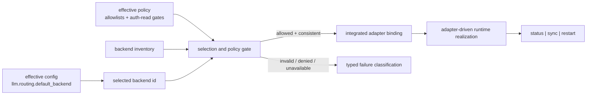
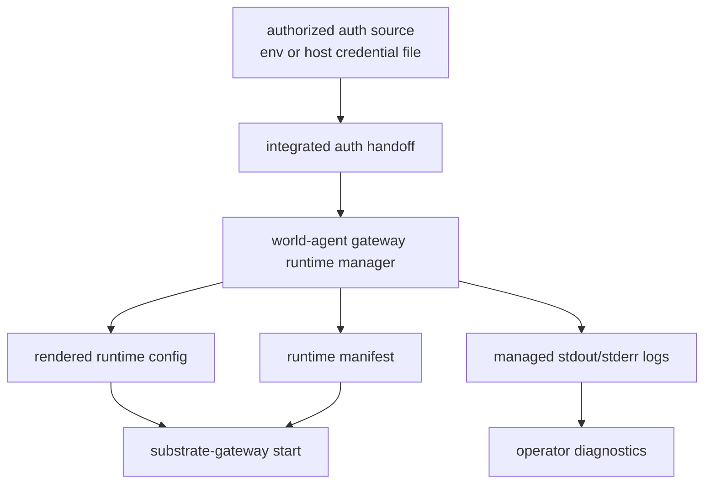
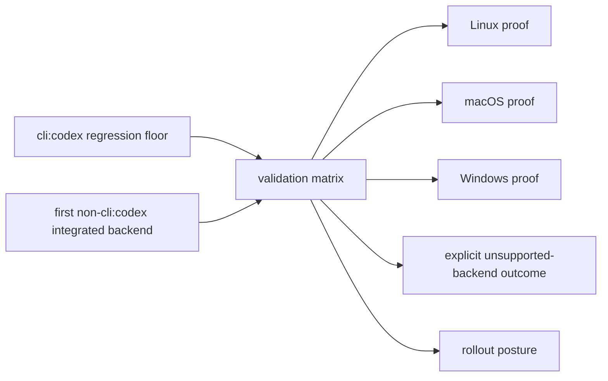

# Review Surfaces - gateway-backend-selection-runtime-integration

These diagrams are execution review surfaces for this pack. They capture the decisions and handoffs reviewers need to validate before the pack advances.
They do not, by themselves, satisfy seam-local pre-exec review.
`SEAM-1` and `SEAM-2` still require seam-local `review.md` artifacts later.

## R1 - Selected-backend realization flow

Review focus:

- confirms the selected-backend source of truth and deny-by-default gate order
- confirms inventory identity and filename consistency checks happen before adapter dispatch
- confirms invalid selection, policy denial, and dependency unavailable remain distinct
- unlocks `SEAM-2` by fixing the upstream handoff it must consume

## R2 - Auth handoff and managed artifact path

Review focus:

- confirms env-primary, file-fallback-only auth precedence is preserved in implementation
- confirms runtime realization stays inside the existing typed lifecycle boundary
- confirms managed config, manifest, and log artifacts stay part of the runtime-owned execution path
- unlocks `SEAM-2` implementation slices for adapter-driven launch, readiness, and restart behavior

## R3 - Future parity and rollout proof

Review focus:

- confirms parity and rollout are later proof obligations, not current blockers on `SEAM-1` or `SEAM-2`
- confirms Linux/macOS/Windows evidence must verify the landed runtime path rather than define it
- confirms first-additional-backend proof is deferred until a runtime implementation exists and a named backend is intentionally selected
