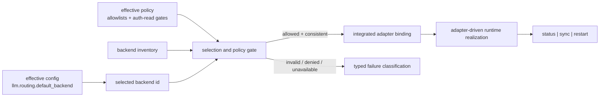
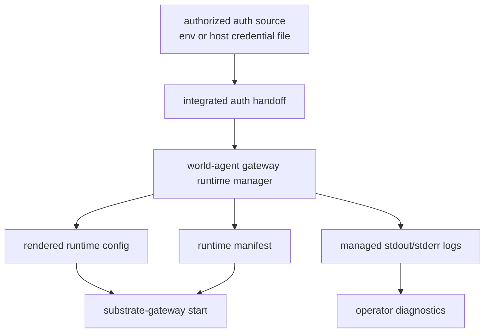
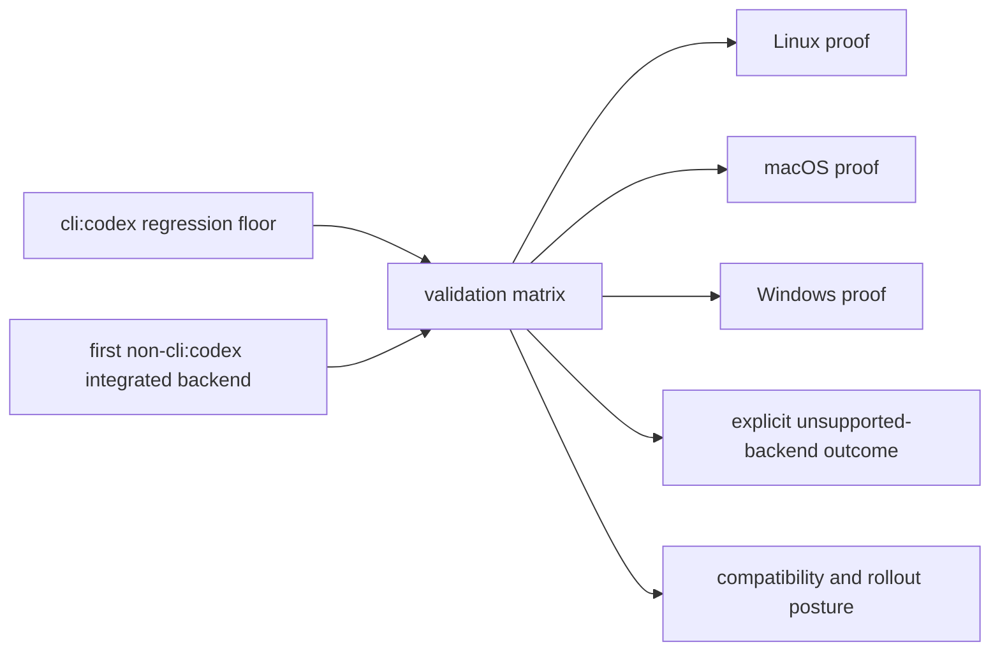

# Review Surfaces - gateway-backend-selection-runtime-integration

These diagrams orient the pack. They show the actual operator flow, integrated runtime flow, and parity/rollout proof shape that are expected to land.
They do not, by themselves, satisfy seam-local pre-exec review.
`SEAM-1` and `SEAM-2` still require seam-local `review.md` artifacts later.

## R1 - Selected-backend realization flow

## R2 - Auth handoff and managed artifact path

## R3 - Future parity and rollout proof

