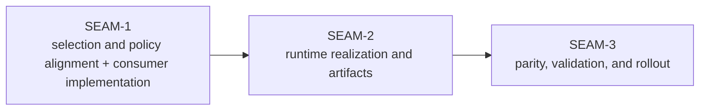

# Seam Map - gateway-backend-selection-runtime-integration

ADR-0046 and the pre-planning pack already imply a three-part implementation spine. This pack preserves that sequencing, but it now treats the work as execution rather than another governance extraction.

| Seam | Horizon | Type | Core value | Direct blockers | Main touch surface | Source-pack anchors |
| --- | --- | --- | --- | --- | --- | --- |
| `SEAM-1` | `landed` | `integration` | Finish the narrow selection/policy contract alignment that is still needed in-repo, then land consumer alignment and proof so one selected backend id flows through config, policy, inventory, and auth precedence without Codex-specific shortcuts. | none; `THR-01` is published and revalidated by the active seam | Canonical refs: `docs/contracts/substrate-gateway-backend-adapter-selection.md`, `docs/contracts/substrate-gateway-policy-evaluation.md`; implementation surfaces: `crates/shell/src/execution/config_model.rs`, `crates/shell/src/execution/policy_model.rs`, `crates/broker/src/policy.rs`, `crates/shell/src/builtins/world_gateway.rs` | ADR-0046, `pre-planning/spec_manifest.md`, `pre-planning/workstream_triage.md` lineage `GBSRI-01` |
| `SEAM-2` | `landed` | `integration` | Realize one adapter-driven integrated runtime from the upstream handoff: binding lookup, capability gating, auth handoff validation, config rendering, managed artifacts, launch, readiness, and restart behavior. | none; `THR-01` was revalidated and `THR-02` is now published in closeout | Canonical refs: `docs/contracts/substrate-gateway-backend-adapter-protocol.md`, `docs/contracts/substrate-gateway-backend-adapter-schema.md`, `docs/contracts/substrate-gateway-runtime-parity.md`; implementation surfaces: `crates/world-service/src/gateway_runtime.rs`, `crates/world-service/src/service.rs`, `crates/transport-api-types/src/lib.rs`, `crates/shell/src/builtins/world_gateway.rs` | ADR-0046, `pre-planning/spec_manifest.md`, `pre-planning/workstream_triage.md` lineage `GBSRI-02` |
| `SEAM-3` | `active / exec-ready` | `conformance` | Prove parity, validation, and rollout behavior from the revalidated runtime handoff: `cli:codex` regression floor, explicit unsupported-backend behavior, and the named `api:openai` proof target across Linux/macOS/Windows. | none inside the pack; consumes the revalidated `THR-02` handoff from `SEAM-2` | Canonical ref: `docs/contracts/substrate-gateway-runtime-parity.md`; supporting execution surfaces: `platform-parity-spec.md`, `compatibility-spec.md`, `manual_testing_playbook.md`; evidence: smoke scripts, `crates/world-service/tests/gateway_runtime_parity.rs`, `crates/shell/tests/world_gateway.rs` | ADR-0046, `pre-planning/impact_map.md`, `pre-planning/ci_checkpoint_plan.md`, `pre-planning/workstream_triage.md` lineage `GBSRI-03` |

Why this split is the right seam map:

- `SEAM-1` has one clear purpose: stop the implementation from inferring selection and policy truth from the current Codex-only path.
- `SEAM-2` has one clear purpose: turn the selected backend handoff into a real adapter-driven integrated runtime path.
- `SEAM-3` has one clear purpose: verify the landed runtime path and later rollout posture rather than turning validation into a design phase.

Why no additional seams were extracted:

- Splitting selection and policy into separate seams would duplicate the same upstream handoff and consumer-alignment work.
- Splitting runtime realization from runtime artifacts would create an artificial boundary inside one tightly ordered launch/readiness/manifests flow.
- Splitting parity from rollout would be premature until the runtime path exists and a future additional backend is actually named.

Horizon note:

- `SEAM-1` is now landed and no longer occupies the forward window.
- `SEAM-2` is now landed and published `THR-02`.
- `SEAM-3` is now the active seam, and promotion refreshed seam-local planning through `exec-ready` from that revalidated runtime handoff.
