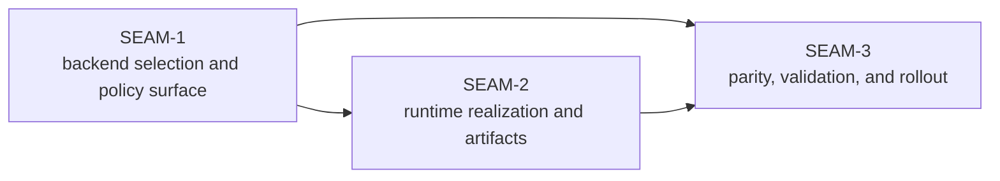

# Seam Map - gateway-backend-selection-runtime-integration

The ADR and pre-planning pack already imply a three-part critical path. This extractor preserves that structure, treats the older `GBSRI-*` workstream ids as lineage only, and lifts the work into governance-ready seam briefs without creating seam-local planning artifacts.

| Seam | Horizon | Type | Core value | Direct blockers | Main touch surface | Source-pack anchors |
| --- | --- | --- | --- | --- | --- | --- |
| `SEAM-1` | `active` | `integration` | Freeze backend selection and policy truth for the integrated lifecycle: selection order, deny-by-default gating, trusted-input boundary, auth precedence, and backend inventory rules. | None inside the pack, but `REM-001` and `REM-002` block promotion to exec-ready. | Feature-local owned outputs: `contract.md`, `policy-spec.md`, `env-vars-spec.md`; consumed external authorities: `docs/contracts/substrate-gateway-backend-adapter-selection.md`, `docs/contracts/substrate-gateway-policy-evaluation.md`; code evidence: `crates/shell/src/builtins/world_gateway.rs` | ADR-0046, `pre-planning/spec_manifest.md`, `pre-planning/workstream_triage.md` lineage `GBSRI-01` |
| `SEAM-2` | `next` | `integration` | Freeze runtime realization and artifacts after selection succeeds: integrated binding lookup, capability gating, auth handoff classification, config rendering, runtime artifact semantics, launch, readiness, and restart ordering. | `SEAM-1`, `THR-01`, `REM-003`, `REM-004` | Feature-local owned outputs: `gateway-runtime-adapter-protocol-spec.md`, `gateway-runtime-adapter-schema-spec.md`, `filesystem-semantics-spec.md`; consumed external authorities: `docs/contracts/substrate-gateway-backend-adapter-protocol.md`, `docs/contracts/substrate-gateway-backend-adapter-schema.md`; code evidence: `crates/world-agent/src/gateway_runtime.rs`, `crates/world-agent/src/service.rs`, `crates/agent-api-types/src/lib.rs` | ADR-0046, `pre-planning/spec_manifest.md`, `pre-planning/workstream_triage.md` lineage `GBSRI-02` |
| `SEAM-3` | `future` | `conformance` | Freeze parity, validation, and rollout proof: `cli:codex` regression floor, first additional backend proof, explicit unsupported-backend posture, and Linux/macOS/Windows evidence. | `SEAM-1`, `SEAM-2`, `THR-01`, `THR-02`, `REM-005` | Feature-local owned outputs: `platform-parity-spec.md`, `compatibility-spec.md`, `manual_testing_playbook.md`; consumed external authorities: `docs/contracts/substrate-gateway-runtime-parity.md`, `docs/contracts/substrate-gateway-operator-contract.md`; evidence: smoke scripts, `crates/world-agent/tests/gateway_runtime_parity.rs`, `crates/shell/tests/world_gateway.rs` | ADR-0046, `pre-planning/impact_map.md`, `pre-planning/ci_checkpoint_plan.md`, `pre-planning/workstream_triage.md` lineage `GBSRI-03` |

Why this split is the right seam map:

- `SEAM-1` has one clear purpose: publish the trusted backend-selection and policy-evaluation truth before any runtime seam can safely bind it.
- `SEAM-2` has one clear purpose: turn that upstream truth into one adapter-driven integrated runtime path with explicit artifact and failure semantics.
- `SEAM-3` has one clear purpose: prove parity, compatibility, and rollout posture after the upstream selection and runtime contracts exist.

Why no additional seams were extracted:

- Splitting selection and policy into separate seams would fragment the active critical path and duplicate the same contract-authority questions across two pre-exec reviews.
- Splitting runtime realization from runtime artifacts would create an artificial seam boundary inside one tightly ordered launch/readiness/manifests flow.
- Splitting parity from rollout would be premature because the unresolved first-additional-backend baseline means those concerns still move together as one proof seam.

Horizon note:

- `SEAM-1` is the only seam eligible for authoritative deep planning by default.
- `SEAM-2` may later receive seam-local review and only provisional deeper planning because unresolved upstream authority still affects protocol/schema and artifact semantics.
- `SEAM-3` remains a future seam brief until the runtime realization handoff and the first additional backend baseline are concrete.
