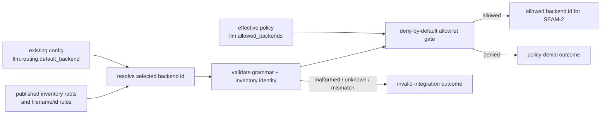
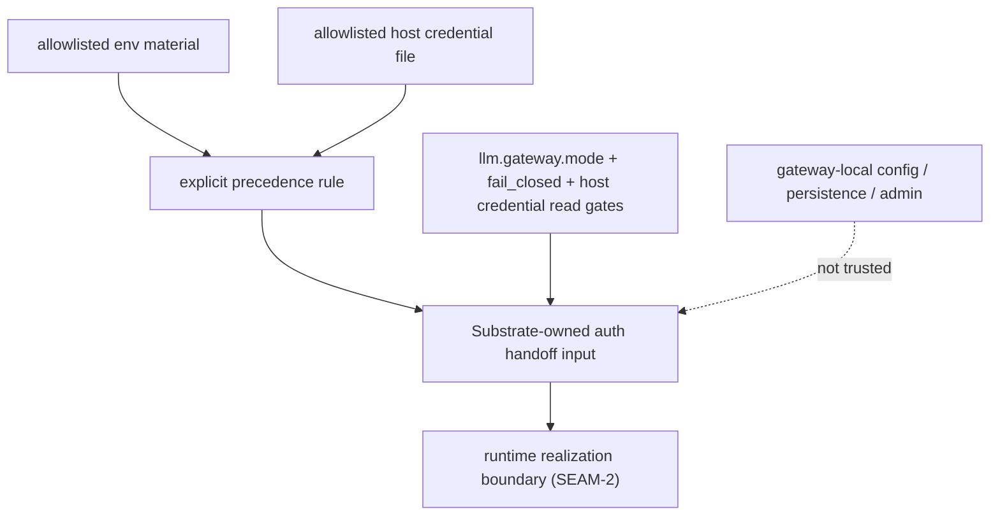

# Review Bundle - SEAM-1 Backend selection and policy surface

This artifact feeds `gates.pre_exec.review`.
`../../review_surfaces.md` is pack orientation only.

## Falsification questions

- Can the gateway lifecycle still authorize or choose a backend from gateway-local persistence, admin state, or any surface outside the existing ADR-0027 config and policy inputs?
- Can backend inventory discoverability or filename-to-id consistency remain implicit enough that `SEAM-2` would have to invent runtime-facing rules locally?
- Can env material and host credential files both remain allowed without one explicit precedence rule, causing the current `cli:codex` branch to become accidental contract truth?

## R1 - Selected-backend gate that must land

## R2 - Auth precedence and trusted-input boundary that must land

## Likely mismatch hotspots

- `docs/contracts/substrate-gateway-backend-adapter-selection.md` already names a one-file-per-backend model, but it does not yet pin the discoverability roots tightly enough to satisfy `REM-002`.
- `docs/contracts/substrate-gateway-policy-evaluation.md` now publishes the env-primary precedence rule for `REM-001`, but supporting ADR-0046 docs and landed consumers can still drift away from that canonical rule before seam exit.
- `crates/shell/src/builtins/world_gateway.rs` currently makes env material win over file material for `cli:codex`; if canonical docs do not either codify or deliberately replace that rule, `THR-01` remains unpublished in practice.
- Supporting ADR-0046 docs can easily drift into acting as canonical publication surfaces unless they are explicitly aligned behind the `docs/contracts/` refs.

## Pre-exec findings

- The review gate passes. The selected-backend and auth-boundary diagrams still expose falsifiable product-facing flows, and the out-of-scope line against tuple/status widening remains explicit.
- The contract gate remains blocked by the existing seam-owned remediation `REM-002`, because `docs/contracts/substrate-gateway-backend-adapter-selection.md` still names a one-file-per-backend inventory model without publishing the discoverability roots and filename/id invariants tightly enough for downstream runtime work to consume without local invention.
- `REM-001` stays open as seam-local landing and seam-exit follow-through: the canonical policy contract now publishes one explicit precedence rule between allowlisted env material and allowlisted host credential files, but supporting ADR-0046 docs plus landed shell/runtime consumers still need to align to that published rule.
- Revalidation passes against current repo evidence:
  - `crates/shell/src/builtins/world_gateway.rs` still keeps invalid integration, policy denial, transient runtime failure, and component unavailability distinct at the shell boundary.
  - `crates/shell/src/builtins/world_gateway.rs` still enforces fail-closed posture for disabled or host-only gateway lifecycle use before dispatch.
  - `crates/shell/src/builtins/world_gateway.rs` still prefers allowlisted env auth material when an access token is present and falls back to the allowlisted host credential file only when env auth is absent; partial env material still fails as invalid integration.
- No additional pre-exec remediation is opened by this review refresh. The current seam-local plan remains bounded correctly; the unresolved issues are already captured in the governance log with seam-local ownership.
- The likely failure mode is not missing code alone; it is downstream runtime planning silently inheriting incomplete selection or auth semantics from the current `cli:codex` path.

## Pre-exec gate disposition

- **Review gate**: passed
- **Contract gate**: failed
- **Contract gate blockers**:
  - `REM-002`
- **Revalidation gate**: passed
- **Revalidation evidence**:
  - the latest shell gateway implementation still matches the documented selection boundary and failure buckets before execution starts
  - no external upstream closeout or contract publication changed this seam's basis outside the planned stale triggers
- **Opened remediations**:
  - none; rely on carried blocker `REM-002` plus carried seam-exit follow-through `REM-001`

## Planned seam-exit gate focus

- **What must be true before downstream promotion is legal**:
  - `C-01` and `C-02` are published in canonical `docs/contracts/` refs with explicit selection, inventory, precedence, and trusted-input rules
  - `THR-01` is recorded as `published` in `../../governance/seam-1-closeout.md`
  - any review-surface delta from the planned selection/policy flow is captured as a stale trigger for `SEAM-2` and `SEAM-3`
- **Which outbound contracts/threads matter most**:
  - `C-01`
  - `C-02`
  - `THR-01`
- **Which review-surface deltas would force downstream revalidation**:
  - changes to inventory roots or filename/id invariants
  - changes to auth precedence or host-fallback behavior
  - changes to invalid-integration versus dependency-unavailable classification
