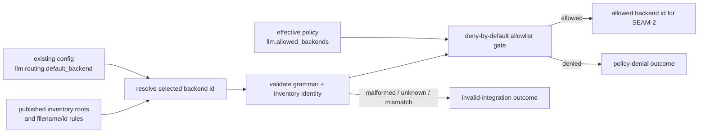
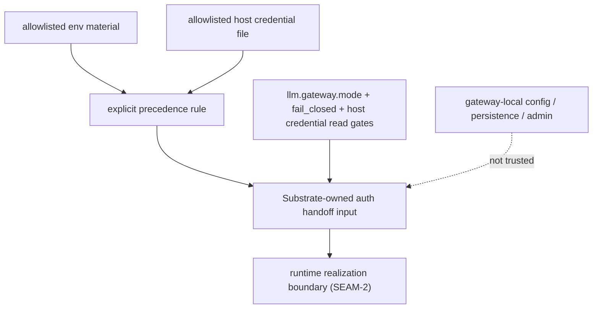

# Review Bundle - SEAM-1 Backend selection and policy surface

This artifact feeds `gates.pre_exec.review`.
`../../review_surfaces.md` is pack orientation only.

## Falsification questions

- Can the gateway lifecycle still authorize or choose a backend from gateway-local persistence, admin state, or any surface outside the existing ADR-0027 config and policy inputs?
- Can shell validation still skip the published inventory and selection rules badly enough that `SEAM-2` would have to invent runtime-facing behavior locally?
- Can env material and host credential files both remain allowed without one explicit precedence rule, causing the current `cli:codex` branch to become accidental contract truth?

## R1 - Selected-backend gate that must land

## R2 - Auth precedence and trusted-input boundary that must land

## Likely mismatch hotspots

- `docs/contracts/substrate-gateway-backend-adapter-selection.md` already publishes inventory roots, filename/id invariants, and selection order, but `crates/shell/src/builtins/world_gateway.rs` still does not realize those rules generically before runtime dispatch.
- `docs/contracts/substrate-gateway-policy-evaluation.md` already publishes env-primary precedence, but shell tests still need explicit coverage for “both env and file exist; env wins without merge.”
- `crates/shell/src/builtins/world_gateway.rs` still keeps runtime lifecycle reachable for non-`cli:codex` backends without proving inventory-backed shell validation first, leaving the runtime to surface invalid-integration cases that should become shell-owned where possible.
- Supporting ADR-0046 docs can easily drift into acting as canonical publication surfaces unless they are explicitly aligned behind the `docs/contracts/` refs.

## Pre-exec findings

- The review gate passes. The selected-backend and auth-boundary diagrams still expose falsifiable product-facing flows, and the out-of-scope line against tuple/status widening remains explicit.
- The contract gate passes. Canonical `C-01` and `C-02` already publish the selection, inventory, precedence, and fail-closed rules this seam needs.
- `REM-001` and `REM-002` remain only as seam-exit follow-through: the canonical contracts already publish the rules; the remaining work is shell adoption, supporting-doc alignment, and landed evidence capture before closeout can publish `THR-01`.
- Revalidation passes against current repo evidence:
  - `crates/shell/src/builtins/world_gateway.rs` still keeps invalid integration, policy denial, transient runtime failure, and component unavailability distinct at the shell boundary.
  - `crates/shell/src/builtins/world_gateway.rs` still enforces fail-closed posture for disabled or host-only gateway lifecycle use before dispatch.
  - `crates/shell/src/builtins/world_gateway.rs` still prefers allowlisted env auth material when an access token is present and falls back to the allowlisted host credential file only when env auth is absent; partial env material still fails as invalid integration.
- No blocking pre-exec remediations remain open against the `decomposed -> exec-ready` transition, so the seam is ready to execute even though seam-exit publication work is still pending.
- No new pre-exec remediation is opened by this review refresh. The missing work is implementation and evidence, not fresh contract publication.
- The likely failure mode is downstream runtime work inheriting too much shell-owned validation from the current `cli:codex` path.

## Pre-exec gate disposition

- **Review gate**: passed
- **Contract gate**: passed
- **Revalidation gate**: passed
- **Revalidation evidence**:
  - the latest shell gateway implementation still matches the documented selection boundary and failure buckets before execution starts
  - no external upstream closeout or contract publication changed this seam's basis outside the planned stale triggers
- **Opened remediations**:
  - none
- **Carried seam-exit follow-through**:
  - `REM-001`
  - `REM-002`

## Planned seam-exit gate focus

- **What must be true before downstream promotion is legal**:
  - shell behavior and shell tests demonstrably adopt published `C-01` and `C-02`
  - `THR-01` is recorded as `published` in `../../governance/seam-1-closeout.md`
  - any review-surface delta from the planned selection/policy flow is captured as a stale trigger for `SEAM-2` and `SEAM-3`
- **Which outbound contracts/threads matter most**:
  - `C-01`
  - `C-02`
  - `THR-01`
- **Which review-surface deltas would force downstream revalidation**:
  - changes to shell-owned selection or inventory validation behavior
  - changes to auth precedence or host-fallback behavior
  - changes to invalid-integration versus policy-denial versus runtime-unavailable classification
