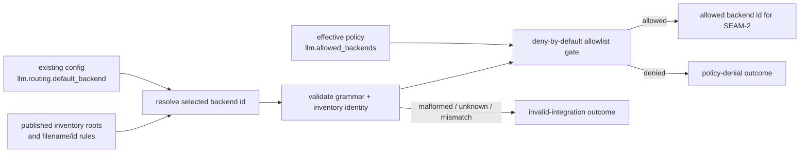
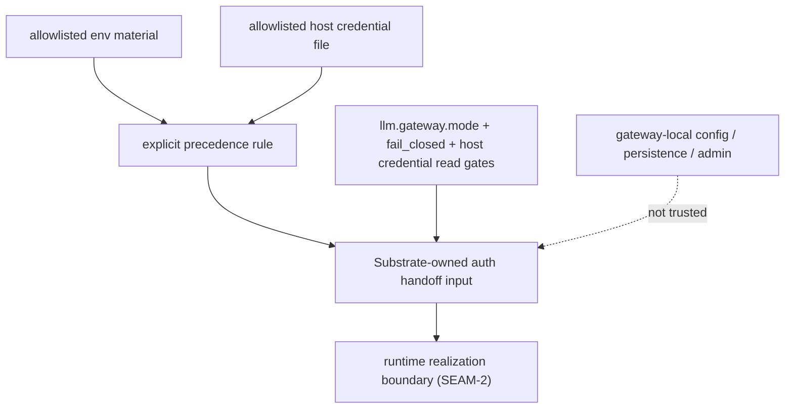

# Review Bundle - SEAM-1 Backend selection and policy surface

This artifact feeds `gates.pre_exec.review`.
`../../review_surfaces.md` is pack orientation only.

## Falsification questions

- Can the gateway lifecycle still authorize or choose a backend from gateway-local persistence, admin state, or any surface outside the existing ADR-0027 config and policy inputs?
- Can backend inventory discoverability or filename-to-id consistency remain implicit enough that `SEAM-2` would have to invent runtime-facing rules locally?
- Can env material and host credential files both remain allowed without one explicit precedence rule, causing the current `cli:codex` branch to become accidental contract truth?

## R1 - Selected-backend gate that must land

## R2 - Auth precedence and trusted-input boundary that must land

## Likely mismatch hotspots

- `docs/contracts/substrate-gateway-backend-adapter-selection.md` already names a one-file-per-backend model, but it does not yet pin the discoverability roots tightly enough to satisfy `REM-002`.
- `docs/contracts/substrate-gateway-policy-evaluation.md` names governed inputs and fail-closed behavior, but it does not yet resolve env-versus-file precedence tightly enough to satisfy `REM-001`.
- `crates/shell/src/builtins/world_gateway.rs` currently makes env material win over file material for `cli:codex`; if canonical docs do not either codify or deliberately replace that rule, `THR-01` remains unpublished in practice.
- Supporting ADR-0046 docs can easily drift into acting as canonical publication surfaces unless they are explicitly aligned behind the `docs/contracts/` refs.

## Pre-exec findings

- Existing blocking remediations remain authoritative for this seam:
  - `REM-001` blocks `exec-ready` until `C-02` pins one explicit auth precedence rule in `docs/contracts/substrate-gateway-policy-evaluation.md`.
  - `REM-002` blocks `exec-ready` until `C-01` pins backend inventory discoverability roots and filename/id invariants in `docs/contracts/substrate-gateway-backend-adapter-selection.md`.
- No additional pre-exec remediation is opened by this review bundle. The current seam-local plan is bounded correctly; the unresolved issues are already captured in the governance log with seam-local ownership.
- The likely failure mode is not missing code alone; it is downstream runtime planning silently inheriting incomplete selection or auth semantics from the current `cli:codex` path.

## Pre-exec gate disposition

- **Review gate**: pending
- **Contract gate concerns**:
  - `REM-001`
  - `REM-002`
- **Revalidation prerequisites**:
  - confirm the latest shell gateway implementation still matches the documented selection order and failure buckets before execution starts
  - confirm no external contract publication has already changed inventory roots, filename rules, or auth precedence outside this seam's planned basis
- **Opened remediations**:
  - none; rely on carried blockers `REM-001` and `REM-002`

## Planned seam-exit gate focus

- **What must be true before downstream promotion is legal**:
  - `C-01` and `C-02` are published in canonical `docs/contracts/` refs with explicit selection, inventory, precedence, and trusted-input rules
  - `THR-01` is recorded as `published` in `../../governance/seam-1-closeout.md`
  - any review-surface delta from the planned selection/policy flow is captured as a stale trigger for `SEAM-2` and `SEAM-3`
- **Which outbound contracts/threads matter most**:
  - `C-01`
  - `C-02`
  - `THR-01`
- **Which review-surface deltas would force downstream revalidation**:
  - changes to inventory roots or filename/id invariants
  - changes to auth precedence or host-fallback behavior
  - changes to invalid-integration versus dependency-unavailable classification
