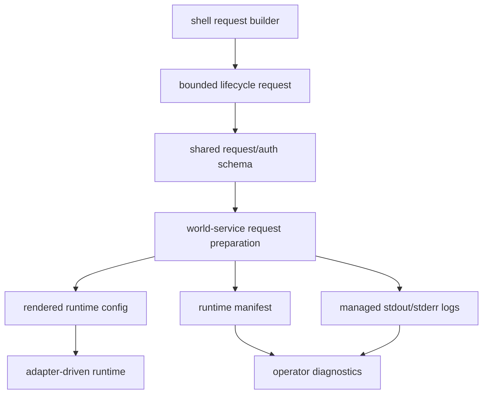

# Review Bundle - SEAM-2 Runtime realization and artifacts

This artifact feeds `gates.pre_exec.review`.
`../../review_surfaces.md` is pack orientation only.

## Falsification questions

- Can the selected backend still collapse back to `cli:codex` anywhere after `SEAM-1` has already fixed the shell-owned selection and policy handoff?
- Can runtime-owned missing-binding or unsupported-capability cases still surface as invalid selection instead of dependency unavailable or invalid request at the protocol boundary?
- Can integrated auth payloads, config render inputs, or managed runtime artifacts drift into backend-specific one-off shapes that bypass the canonical protocol and schema contracts?

## R1 - Adapter realization order that must land

## R2 - Request, auth, and artifact ownership boundary that must land

## Likely mismatch hotspots

- `crates/shell/src/builtins/world_gateway.rs` now validates backend selection pre-dispatch, but request construction still emits `GatewayIntegratedAuthPayloadV1 { cli_codex: ... }`, so the active seam must widen the runtime-owned payload shape without reintroducing shell-owned selection logic.
- `crates/world-service/src/service.rs` currently narrows `integrated_auth` to `payload.cli_codex.clone()` inside request preparation, which makes the world-service behave as if only one integrated backend can exist.
- `crates/world-service/src/gateway_runtime.rs` still hard-rejects any default backend other than `cli:codex` and resolves auth handoff only through the Codex-specific path, so adapter lookup and capability gating are not yet implemented as the protocol contract requires.
- `docs/contracts/substrate-gateway-backend-adapter-protocol.md` and `docs/contracts/substrate-gateway-backend-adapter-schema.md` already publish the owned contract baseline for this seam, so the remaining work is landing behavior and tests, not inventing a new contract phase.

## Pre-exec findings

- The review gate passes. The seam-local diagrams expose the active runtime ordering and artifact ownership surfaces that must land before `SEAM-3` can rely on them.
- The contract gate passes. Canonical `C-03` and `C-04` already exist under `docs/contracts/`, while `C-01` and `C-02` were published upstream by `SEAM-1`.
- Revalidation passes against current repo evidence:
  - `crates/shell/src/builtins/world_gateway.rs` now hands the runtime boundary one selected backend id after inventory and policy validation instead of leaving selection ambiguous.
  - `crates/transport-api-types/src/lib.rs` still exposes only `GatewayIntegratedAuthPayloadV1.cli_codex`, which keeps the schema gap concrete and bounded for this seam.
  - `crates/world-service/src/service.rs` still prepares requests by cloning only `payload.cli_codex`, which matches the seam's planned request-preparation and binding-lookup work.
  - `crates/world-service/src/gateway_runtime.rs` still rejects non-`cli:codex` backends and resolves auth through a Codex-specific path, which confirms the seam basis is current rather than stale.
- `REM-003` and `REM-004` remain deferred implementation follow-through under this seam, not pre-exec blockers on the `decomposed -> exec-ready` transition.
- No blocking pre-exec remediations remain open against the active seam, so execution may begin.
- The likeliest failure mode is mixing selection-owned invalid-integration behavior with runtime-owned dependency-unavailable or unsupported-capability behavior once adapter lookup is generalized.

## Pre-exec gate disposition

- **Review gate**: passed
- **Contract gate**: passed
- **Revalidation gate**: passed
- **Revalidation evidence**:
  - the active seam basis matches the latest published `SEAM-1` closeout and the current Codex-only runtime implementation surfaces
  - `THR-01` is revalidated for this seam because the selected-backend and auth-boundary handoff was checked against `../../governance/seam-1-closeout.md`
- **Opened remediations**:
  - none
- **Carried implementation follow-through**:
  - `REM-003`
  - `REM-004`

## Planned seam-exit gate focus

- **What must be true before downstream promotion is legal**:
  - adapter lookup, capability gating, auth validation, config render, runtime artifacts, and restart semantics land against the canonical protocol/schema contracts
  - `THR-02` is recorded as `published` in `../../governance/seam-2-closeout.md`
  - any planned-versus-landed delta that changes runtime behavior is emitted as a stale trigger for `SEAM-3`
- **Which outbound contracts/threads matter most**:
  - `C-03`
  - `C-04`
  - `THR-02`
- **Which review-surface deltas would force downstream revalidation**:
  - changes to adapter lookup or capability-gate order
  - changes to integrated auth/request shape
  - changes to managed artifact paths, permissions, or readiness/restart behavior
