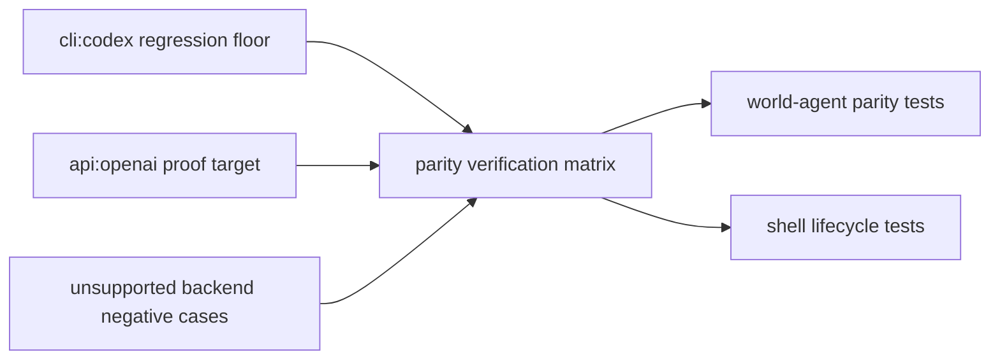
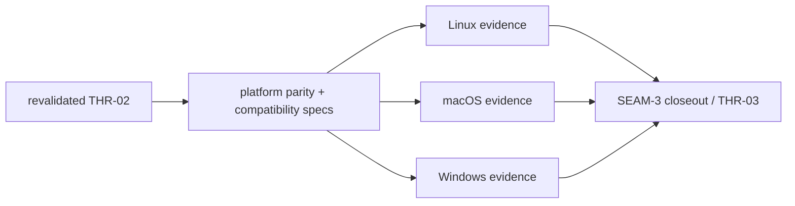

# Review Bundle - SEAM-3 Parity, validation, and rollout

This artifact feeds `gates.pre_exec.review`.
`../../review_surfaces.md` is pack orientation only.

## Falsification questions

- Can parity proof still silently route unsupported integrated backends through the old `cli:codex` path even after `SEAM-2` published explicit no-fallback runtime behavior?
- Can `api:openai` be named as the first additional-backend proof target in closeout and live tests, yet remain absent from the platform validation and rollout surfaces this seam is supposed to land?
- Can Linux/macOS/Windows evidence drift into platform-specific exceptions that contradict the single operator-facing lifecycle/status contract in `docs/contracts/substrate-gateway-runtime-parity.md`?

## R1 - Regression floor and additional-backend matrix that must land

## R2 - Platform evidence path that must stay contract-aligned

## Likely mismatch hotspots

- `crates/world-agent/tests/gateway_runtime_parity.rs` already names `api:openai` and explicit unsupported-backend cases, but the seam still has to make the proof matrix readable and durable enough that closeout can publish `THR-03` without re-reading test internals.
- `crates/shell/tests/world_gateway.rs` already proves bounded `api_env` emission and explicit unsupported-integrated-backend failures, but this seam still has to align those assertions with rollout and platform evidence rather than treating them as isolated test trivia.
- `docs/contracts/substrate-gateway-runtime-parity.md` owns lifecycle/status parity semantics already, so rollout proof must attach evidence to that canonical contract instead of inventing a seam-local compatibility taxonomy.
- The active seam references pack-local parity, compatibility, manual-testing, and smoke surfaces that do not yet exist in this pack directory, so execution must create only the minimum evidence surfaces needed to make platform proof and closeout deterministic.

## Pre-exec findings

- The review gate passes. The seam-local diagrams expose the exact matrix and platform evidence flows that must land before closeout can publish `THR-03`.
- The contract gate passes. Canonical `C-05` already exists under `docs/contracts/substrate-gateway-runtime-parity.md`, while upstream `C-01` through `C-04` were published and revalidated through `SEAM-1` and `SEAM-2`.
- Revalidation passes against current repo evidence:
  - `governance/seam-2-closeout.md` publishes `THR-02` and names `api:openai` as the first landed non-`cli:codex` proof target.
  - `crates/agent-api-types/src/lib.rs` still exposes the bounded `api_env` auth facet for `api:openai`.
  - `crates/world-agent/tests/gateway_runtime_parity.rs` still exercises `api:openai`, preserves the `cli:codex` floor, and carries explicit unsupported-backend/no-fallback behavior.
  - `crates/shell/tests/world_gateway.rs` still proves backend-aware request construction and explicit unsupported integrated backend failures.
- No blocking pre-exec remediations remain open against the active seam, so execution may begin.
- The likeliest failure mode is proving `api:openai` in code while leaving platform evidence or rollout notes vague enough that downstream consumers would have to infer the contract shape again.

## Pre-exec gate disposition

- **Review gate**: passed
- **Contract gate**: passed
- **Revalidation gate**: passed
- **Revalidation evidence**:
  - the active seam basis matches the latest published `SEAM-1` and `SEAM-2` closeouts
  - `THR-02` is revalidated for this seam because the published runtime handoff was checked against `../../governance/seam-2-closeout.md` and current runtime/test surfaces
- **Opened remediations**:
  - none
- **Carried implementation follow-through**:
  - none; the remaining work is the seam's direct execution scope, not a separate pre-exec remediation

## Planned seam-exit gate focus

- **What must be true before downstream promotion is legal**:
  - parity evidence covers the `cli:codex` regression floor, `api:openai` as the first additional-backend proof target, and explicit unsupported-backend/no-fallback behavior
  - Linux/macOS/Windows smoke/manual evidence aligns to the canonical runtime parity contract
  - `THR-03` is recorded as `published` in `../../governance/seam-3-closeout.md`
  - any planned-versus-landed delta that affects downstream rollout basis is emitted as a stale trigger
- **Which outbound contracts/threads matter most**:
  - `C-05`
  - `THR-03`
- **Which review-surface deltas would force downstream revalidation**:
  - changes to the named additional-backend proof target
  - changes to unsupported-backend/no-fallback behavior
  - changes to platform evidence ownership, smoke steps, or rollout messaging
