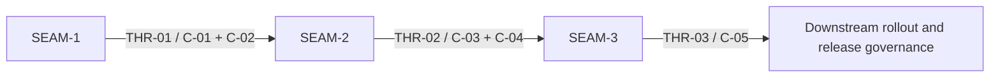

# Threading - gateway-backend-selection-runtime-integration

## Execution horizon summary

- **Active seam**: none
  - The terminal conformance seam has landed and left the forward planning window.
- **Next seam**: none currently queued
  - No safe later seam exists in this pack after `SEAM-3`, so `next_seam` remains `null`.
- **Future seams**: `SEAM-1`, `SEAM-2`, `SEAM-3`

Horizon policy for this pack:

- `SEAM-2` already satisfied its seam-exit gate and published `THR-02` in `governance/seam-2-closeout.md`
- `SEAM-3` has now landed with a passed seam-exit gate and published `THR-03`
- no later seam is queued until a safe post-`SEAM-3` target is intentionally added

## Contract registry

- **Contract ID**: `C-01`
  - **Type**: `config`
  - **Owner seam**: `SEAM-1`
  - **Direct consumers**: `SEAM-2`, `SEAM-3`
  - **Derived consumers**: shell gateway entrypoints, broker/config readers, runtime tests
  - **Thread IDs**: `THR-01`
  - **Definition**: the integrated lifecycle selection boundary over existing config, policy, and inventory inputs: stable backend id selection, backend-id grammar, one-file-per-backend posture, filename/id consistency, deny-by-default allowlisting, and the trusted-input boundary that excludes gateway-local persistence and mutation from authorization.
  - **Canonical contract ref**: `docs/contracts/substrate-gateway-backend-adapter-selection.md`
  - **Supporting feature-local surfaces**:
    - future subordinate ADR-0046 support docs under `docs/project_management/packs/draft/gateway-backend-selection-runtime-integration/`, if created later
  - **Versioning / compat**: canonical publication stays in `docs/contracts/substrate-gateway-backend-adapter-selection.md`; this pack only aligns implementation and any later subordinate ADR-0046 support docs to it.

- **Contract ID**: `C-02`
  - **Type**: `permission`
  - **Owner seam**: `SEAM-1`
  - **Direct consumers**: `SEAM-2`, `SEAM-3`
  - **Derived consumers**: auth material sourcing logic, failure taxonomy, security review
  - **Thread IDs**: `THR-01`
  - **Definition**: the integrated lifecycle policy-evaluation and auth-sourcing boundary: fail-closed posture, host env-read gating, host-credential-read gating, no-host-fallback rules when in-world execution is required, and the precedence rules for authorized auth material.
  - **Canonical contract ref**: `docs/contracts/substrate-gateway-policy-evaluation.md`
  - **Supporting feature-local surfaces**:
    - future subordinate ADR-0046 support docs under `docs/project_management/packs/draft/gateway-backend-selection-runtime-integration/`, if created later
  - **Versioning / compat**: reused ADR-0027 keys stay externally owned; this pack aligns implementation and any later subordinate ADR-0046 support docs to the published policy contract rather than reopening it.

- **Contract ID**: `C-03`
  - **Type**: `API`
  - **Owner seam**: `SEAM-2`
  - **Direct consumers**: `SEAM-3`
  - **Derived consumers**: world-service service, runtime launch path, lifecycle restart handling
  - **Thread IDs**: `THR-02`
  - **Definition**: the integrated adapter realization protocol after selection succeeds: one binding lookup, required capability gate, auth handoff validation order, adapter-driven config render, launch, readiness, and restart semantics.
  - **Canonical contract ref**: `docs/contracts/substrate-gateway-backend-adapter-protocol.md`
  - **Supporting feature-local surfaces**:
    - `docs/project_management/packs/draft/gateway-backend-selection-runtime-integration/gateway-runtime-adapter-protocol-spec.md`
  - **Versioning / compat**: canonical publication stays in `docs/contracts/substrate-gateway-backend-adapter-protocol.md`; `SEAM-2` must implement it without widening `status --json` or operator commands.

- **Contract ID**: `C-04`
  - **Type**: `schema`
  - **Owner seam**: `SEAM-2`
  - **Direct consumers**: `SEAM-3`
  - **Derived consumers**: shared request types, integrated auth payloads, runtime artifact handling, failure reporting
  - **Thread IDs**: `THR-02`
  - **Definition**: the runtime-owned realization data surfaces needed to support more than `cli:codex`: integrated auth payload shapes, runtime config payloads, managed runtime artifact naming/permission rules, and any shared types required for adapter-driven lifecycle behavior.
  - **Canonical contract ref**: `docs/contracts/substrate-gateway-backend-adapter-schema.md`
  - **Supporting feature-local surfaces**:
    - `docs/project_management/packs/draft/gateway-backend-selection-runtime-integration/gateway-runtime-adapter-schema-spec.md`
    - `docs/project_management/packs/draft/gateway-backend-selection-runtime-integration/filesystem-semantics-spec.md`
  - **Versioning / compat**: schema hardening is part of `SEAM-2` implementation if needed; this pack does not treat it as a prerequisite new contract-publication phase.

- **Contract ID**: `C-05`
  - **Type**: `state`
  - **Owner seam**: `SEAM-3`
  - **Direct consumers**: none inside this pack
  - **Derived consumers**: validation artifacts, compatibility notes, smoke scripts, downstream rollout review
  - **Thread IDs**: `THR-03`
  - **Definition**: parity and rollout proof for the selected-backend lifecycle: Linux/macOS/Windows validation expectations, `cli:codex` regression floor, explicit unsupported-backend behavior, and later first-additional-backend proof.
  - **Canonical contract ref**: `docs/contracts/substrate-gateway-runtime-parity.md`
  - **Supporting feature-local surfaces**:
    - `docs/project_management/packs/draft/gateway-backend-selection-runtime-integration-fse/platform-parity-spec.md`
    - `docs/project_management/packs/draft/gateway-backend-selection-runtime-integration-fse/compatibility-spec.md`
    - `docs/project_management/packs/draft/gateway-backend-selection-runtime-integration-fse/manual_testing_playbook.md`
  - **Consumed external authorities**:
    - `docs/contracts/substrate-gateway-operator-contract.md`
    - `docs/contracts/substrate-gateway-policy-evaluation.md`
  - **Versioning / compat**: the runtime-parity contract owns lifecycle/status parity; future additional-backend compatibility publication is deferred until that rollout work actually begins.

## Thread registry

- **Thread ID**: `THR-01`
  - **Producer seam**: `SEAM-1`
  - **Consumer seam(s)**: `SEAM-2`, `SEAM-3`
  - **Carried contract IDs**: `C-01`, `C-02`
  - **Purpose**: make the existing selection and policy contracts executable in repo consumers so runtime realization does not infer truth from the older Codex-only path.
  - **State**: `revalidated`
  - **Revalidation trigger**: selection order, backend inventory rules, allowlist semantics, auth precedence, or policy failure taxonomy changes.
  - **Satisfied by**: `governance/seam-1-closeout.md` plus evidence that shell, broker, config/policy surfaces, and any later subordinate ADR-0046 support docs align to `docs/contracts/substrate-gateway-backend-adapter-selection.md` and `docs/contracts/substrate-gateway-policy-evaluation.md`.
  - **Notes**: the canonical contracts were published by `SEAM-1`, and the thread is now `revalidated` because active `SEAM-2` rechecked its basis against `governance/seam-1-closeout.md` and the new seam-local `review.md`.

- **Thread ID**: `THR-02`
  - **Producer seam**: `SEAM-2`
  - **Consumer seam(s)**: `SEAM-3`
  - **Carried contract IDs**: `C-03`, `C-04`
  - **Purpose**: land one integrated runtime realization path that parity and rollout can verify without inventing binding, capability, auth, or artifact behavior.
  - **State**: `revalidated`
  - **Revalidation trigger**: binding lookup rules, capability gates, auth handoff validation, runtime payload shapes, artifact naming, readiness semantics, or restart behavior changes.
  - **Satisfied by**: `governance/seam-2-closeout.md` plus evidence that shell, `world-service`, and shared agent-api surfaces still implement the published adapter-protocol and runtime-owned schema surfaces without widening unrelated external ownership.
  - **Notes**: this thread was published by the landed `SEAM-2` closeout once the bounded multi-backend runtime handoff (`cli:codex` plus `api:openai`) passed tests and seam-exit review. It is now `revalidated` because active `SEAM-3` checked that closeout against live runtime/test surfaces and its seam-local `review.md`.

- **Thread ID**: `THR-03`
  - **Producer seam**: `SEAM-3`
  - **Consumer seam(s)**: none inside this pack
  - **Carried contract IDs**: `C-05`
  - **Purpose**: publish parity and rollout posture after the runtime path exists.
  - **State**: `published`
  - **Revalidation trigger**: first-additional-backend baseline changes, parity matrix changes, unsupported-backend failure posture changes, or `cli:codex` regression guarantees change.
  - **Satisfied by**: `governance/seam-3-closeout.md` plus the landed parity, platform, and rollout evidence surfaces under the `-fse` pack.
  - **Notes**: this thread is now published from the landed parity seam. The proof target is `api:openai`, `cli:codex` remains the regression floor, and unsupported backends remain explicit with no fallback.

## Dependency graph

## Critical path

1. `SEAM-1` first:
   - lock the selection and policy handoff in implementation surfaces
   - publish `THR-01` and record the closeout evidence that retired `REM-001` / `REM-002`
2. `SEAM-2` second:
   - landed adapter lookup, capability gating, auth validation, config render, manifests, readiness, and restart behavior using the revalidated `SEAM-1` handoff
   - published `THR-02` from closeout once the bounded request/auth shape and `api:openai` proof target were verified
3. `SEAM-3` third:
  - validated parity and rollout from the revalidated `THR-02` handoff
  - landed the named additional-backend proof target `api:openai` while keeping unsupported-backend handling explicit

## Workstreams

- **Selection and policy implementation lane**
  - Primary seam: `SEAM-1`
  - Focus: landed selected-backend source of truth, allowlists, auth precedence, inventory/root alignment, trusted-input boundary, broker/shell/config consumer evidence
- **Runtime realization lane**
  - Primary seam: `SEAM-2`
  - Focus: active binding lookup, capability gates, auth validation, config render, artifact semantics, launch and restart order
- **Parity and rollout lane**
  - Primary seam: `SEAM-3`
  - Focus: next regression matrix, unsupported-backend behavior, Linux/macOS/Windows evidence, later additional-backend rollout proof

Workstream note:

- These lanes follow the old `GBSRI-*` lineage but the current pack treats them as execution work, not seam-extraction outputs.
- No seam currently owns the forward planning window because the terminal parity seam has landed.
