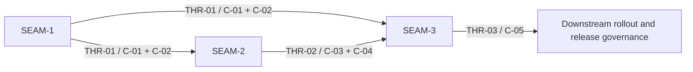

# Threading - gateway-backend-selection-runtime-integration

## Execution horizon summary

- **Active seam**: `SEAM-1`
  - This seam must publish the selection/policy truth before downstream runtime work can become deterministic.
- **Next seam**: `SEAM-2`
  - This seam depends directly on `SEAM-1` and remains eligible only for provisional deeper planning later.
- **Future seams**: `SEAM-3`
  - This seam depends on both upstream contracts plus a future additional-backend baseline that is not yet fixed.

Horizon policy for this extracted pack:

- only the active seam gets authoritative downstream deep planning by default
- the next seam may later receive seam-local review and only provisional deeper planning
- the next seam stays provisional because open upstream authority questions still affect contract-publication surfaces, which disqualifies deeper planning from becoming authoritative yet
- the future seam remains seam-brief-only until upstream contracts publish and revalidation can consume recorded truth

## Contract registry

- **Contract ID**: `C-01`
  - **Type**: `config`
  - **Owner seam**: `SEAM-1`
  - **Direct consumers**: `SEAM-2`, `SEAM-3`
  - **Derived consumers**: shell gateway entrypoints, future operator docs, runtime tests
  - **Thread IDs**: `THR-01`
  - **Definition**: the integrated lifecycle selection boundary over existing config, policy, and inventory inputs: stable backend id selection, backend-id grammar, filename/id consistency, deny-by-default allowlisting, and the trusted-input boundary that excludes gateway-local persistence and mutation from authorization.
  - **Canonical contract ref**: `docs/contracts/substrate-gateway-backend-adapter-selection.md`
  - **Supporting feature-local surfaces**:
    - `docs/project_management/packs/draft/gateway-backend-selection-runtime-integration/contract.md`
    - `docs/project_management/packs/draft/gateway-backend-selection-runtime-integration/policy-spec.md`
  - **Versioning / compat**: canonical publication stays in `docs/contracts/substrate-gateway-backend-adapter-selection.md`; supporting ADR-0046 docs must align to it and must not smuggle tuple metadata or tuple-policy meaning into the selected backend surface.

- **Contract ID**: `C-02`
  - **Type**: `permission`
  - **Owner seam**: `SEAM-1`
  - **Direct consumers**: `SEAM-2`, `SEAM-3`
  - **Derived consumers**: auth material sourcing logic, failure taxonomy, security review
  - **Thread IDs**: `THR-01`
  - **Definition**: the integrated lifecycle policy-evaluation and auth-sourcing boundary: fail-closed posture, host env-read gating, host-credential-read gating, no-host-fallback rules when in-world execution is required, and the precedence rules for authorized auth material.
  - **Canonical contract ref**: `docs/contracts/substrate-gateway-policy-evaluation.md`
  - **Supporting feature-local surfaces**:
    - `docs/project_management/packs/draft/gateway-backend-selection-runtime-integration/policy-spec.md`
    - `docs/project_management/packs/draft/gateway-backend-selection-runtime-integration/env-vars-spec.md`
  - **Versioning / compat**: reused ADR-0027 keys stay externally owned; canonical publication stays in `docs/contracts/substrate-gateway-policy-evaluation.md` and supporting ADR-0046 docs align the implementation details to it.

- **Contract ID**: `C-03`
  - **Type**: `API`
  - **Owner seam**: `SEAM-2`
  - **Direct consumers**: `SEAM-3`
  - **Derived consumers**: world-agent service, runtime launch path, lifecycle restart handling
  - **Thread IDs**: `THR-02`
  - **Definition**: the integrated adapter realization protocol after selection succeeds: one binding lookup, required capability gate, auth handoff validation order, adapter-driven config render, launch, readiness, and restart semantics.
  - **Canonical contract ref**: `docs/contracts/substrate-gateway-backend-adapter-protocol.md`
  - **Supporting feature-local surfaces**:
    - `docs/project_management/packs/draft/gateway-backend-selection-runtime-integration/gateway-runtime-adapter-protocol-spec.md`
  - **Versioning / compat**: canonical publication stays in `docs/contracts/substrate-gateway-backend-adapter-protocol.md`; supporting ADR-0046 docs must stay compatible with ADR-0041 one-backend-id-to-one-adapter semantics without widening `status --json` or operator commands.

- **Contract ID**: `C-04`
  - **Type**: `schema`
  - **Owner seam**: `SEAM-2`
  - **Direct consumers**: `SEAM-3`
  - **Derived consumers**: shared request types, integrated auth payloads, runtime artifact handling, failure reporting
  - **Thread IDs**: `THR-02`
  - **Definition**: integrated adapter binding metadata, auth handoff payload shapes, auth handoff delivery-model rules, runtime config payload shapes, managed runtime artifact naming/permission rules, and explicit failure-shape semantics for missing binding, missing auth material, and unsupported capabilities.
  - **Canonical contract ref**: `docs/contracts/substrate-gateway-backend-adapter-schema.md`
  - **Supporting feature-local surfaces**:
    - `docs/project_management/packs/draft/gateway-backend-selection-runtime-integration/gateway-runtime-adapter-schema-spec.md`
    - `docs/project_management/packs/draft/gateway-backend-selection-runtime-integration/filesystem-semantics-spec.md`
  - **Versioning / compat**: canonical publication stays in `docs/contracts/substrate-gateway-backend-adapter-schema.md`; supporting ADR-0046 docs preserve the stable external backend-id contract while carrying feature-local implementation detail.

- **Contract ID**: `C-05`
  - **Type**: `state`
  - **Owner seam**: `SEAM-3`
  - **Direct consumers**: none inside this pack
  - **Derived consumers**: validation artifacts, compatibility docs, smoke scripts, downstream rollout review
  - **Thread IDs**: `THR-03`
  - **Definition**: parity and rollout proof for the selected-backend lifecycle: Linux/macOS/Windows validation expectations, `cli:codex` regression floor, explicit unsupported-backend behavior, and one named first additional integrated backend baseline.
  - **Canonical contract ref**: `docs/contracts/substrate-gateway-integrated-runtime-compatibility.md`
  - **Supporting feature-local surfaces**:
    - `docs/project_management/packs/draft/gateway-backend-selection-runtime-integration/platform-parity-spec.md`
    - `docs/project_management/packs/draft/gateway-backend-selection-runtime-integration/compatibility-spec.md`
    - `docs/project_management/packs/draft/gateway-backend-selection-runtime-integration/manual_testing_playbook.md`
  - **Consumed external authorities**:
    - `docs/contracts/substrate-gateway-runtime-parity.md`
    - `docs/contracts/substrate-gateway-operator-contract.md`
    - `docs/contracts/substrate-gateway-policy-evaluation.md`
  - **Versioning / compat**: canonical publication for the rollout and additional-backend compatibility surface is expected under `docs/contracts/substrate-gateway-integrated-runtime-compatibility.md`; supporting ADR-0046 docs and the existing runtime-parity/operator/policy contracts must stay aligned to it.

## Thread registry

- **Thread ID**: `THR-01`
  - **Producer seam**: `SEAM-1`
  - **Consumer seam(s)**: `SEAM-2`, `SEAM-3`
  - **Carried contract IDs**: `C-01`, `C-02`
  - **Purpose**: publish one authoritative selection and policy truth before runtime realization or parity proof consumes it.
  - **State**: `identified`
  - **Revalidation trigger**: selection order, backend inventory rules, allowlist semantics, auth precedence, or policy failure taxonomy changes.
  - **Satisfied by**: future `governance/seam-1-closeout.md` plus canonical publication in `docs/contracts/substrate-gateway-backend-adapter-selection.md` and `docs/contracts/substrate-gateway-policy-evaluation.md`, with supporting ADR-0046 docs aligned to those refs.
  - **Notes**: this is the critical upstream handoff. Until it is published, `SEAM-2` deeper planning must remain provisional.

- **Thread ID**: `THR-02`
  - **Producer seam**: `SEAM-2`
  - **Consumer seam(s)**: `SEAM-3`
  - **Carried contract IDs**: `C-03`, `C-04`
  - **Purpose**: publish one integrated runtime realization truth that parity and rollout proof can verify without inventing missing classification, auth handoff delivery-model, or artifact rules.
  - **State**: `identified`
  - **Revalidation trigger**: binding lookup rules, capability gates, auth handoff classification, auth handoff delivery-model rules, artifact naming, readiness semantics, or restart behavior changes.
  - **Satisfied by**: future `governance/seam-2-closeout.md` plus canonical publication in `docs/contracts/substrate-gateway-backend-adapter-protocol.md` and `docs/contracts/substrate-gateway-backend-adapter-schema.md`, with supporting ADR-0046 docs aligned to those refs.
  - **Notes**: this thread must not publish tuple metadata or status-schema widening as part of runtime realization, and it must explicitly close the unresolved delivery-rule choice between env-only, file-only, or one fixed mixed model with explicit precedence.

- **Thread ID**: `THR-03`
  - **Producer seam**: `SEAM-3`
  - **Consumer seam(s)**: none inside this pack
  - **Carried contract IDs**: `C-05`
  - **Purpose**: publish the future parity and rollout truth that downstream execution or release governance can trust.
  - **State**: `identified`
  - **Revalidation trigger**: first-additional-backend baseline changes, parity matrix changes, unsupported-backend failure posture changes, or `cli:codex` regression guarantees change.
  - **Satisfied by**: future `governance/seam-3-closeout.md` plus canonical publication in `docs/contracts/substrate-gateway-integrated-runtime-compatibility.md`, with supporting ADR-0046 docs and the existing runtime-parity contract aligned to that ref.
  - **Notes**: this thread is intentionally future-only until the upstream contracts and the additional-backend baseline exist.

## Dependency graph

## Critical path

1. `SEAM-1` first:
   - backend selection, allowlisting, auth precedence, and inventory semantics are upstream truth for everything else
   - unresolved items `REM-001` and `REM-002` make this seam the current blocker
2. `SEAM-2` second:
   - runtime realization can only become authoritative after `SEAM-1` publishes the selection/policy boundary
   - unresolved items `REM-003`, `REM-004`, and `REM-006` keep this seam provisional until the active seam handoff exists
3. `SEAM-3` third:
   - parity and rollout proof should verify published runtime truth, not invent it
   - unresolved item `REM-005` means there is no valid additional-backend baseline yet

## Workstreams

- **Selection and policy lane**
  - Primary seam: `SEAM-1`
  - Focus: selection order, allowlists, auth precedence, inventory roots, filename rules, trusted-input boundary
- **Runtime realization lane**
  - Primary seam: `SEAM-2`
  - Focus: binding lookup, capability gates, auth handoff classification, auth handoff delivery-model rules, config render, artifact semantics, launch and restart order
- **Parity and rollout lane**
  - Primary seam: `SEAM-3`
  - Focus: first additional backend baseline, regression matrix, unsupported-backend behavior, Linux/macOS/Windows evidence

Workstream note:

- These lanes follow the old `GBSRI-*` lineage but do not preserve those ids as required outputs.
