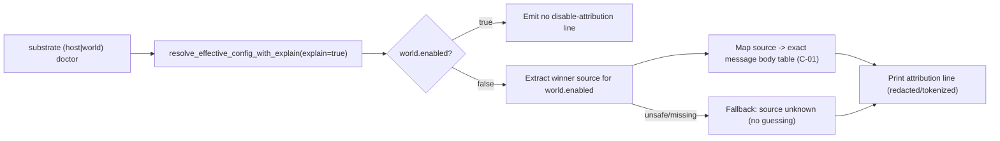
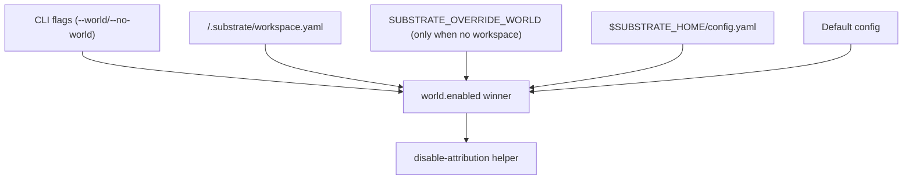

# Review Bundle - SEAM-1 Doctor text disable attribution

This artifact feeds `gates.pre_exec.review`.
`../../review_surfaces.md` is pack orientation only.

## Falsification questions

- Can doctor output still misattribute disablement (e.g., claims `--no-world` when the effective winner was workspace/global/default), or claim a source when provenance is not safely provable?
- Can any doctor path still leak raw env values or absolute host paths (especially via `ConfigExplainSource.path`) instead of rendering only tokenized display paths and the fixed safe env token?
- Can nested/forwarded doctor entrypoints lose CLI-flag provenance and accidentally map a CLI disable to a non-CLI layer (or vice versa)?

## R1 - Disable-attribution mapping workflow (doctor text)

## R2 - Precedence truth (source selection must match effective config)

## Likely mismatch hotspots

- **Doctor entrypoints currently drop provenance**: `crates/shell/src/execution/platform/mod.rs` uses `resolve_effective_config(...)` today; this seam requires `resolve_effective_config_with_explain(..., true)` for winner attribution and safe fallback.
- **`ConfigExplainSource.path` is raw**: explain sources can contain absolute paths; the doctor attribution line must never print those raw paths and must instead use stable tokenized strings (`<workspace>/.substrate/workspace.yaml`, `$SUBSTRATE_HOME/config.yaml`).
- **CLI disable needs flag identity**: the `cli_flag` layer needs to map specifically to `--no-world` for the disabled case; do not infer from `world_enabled=false` alone when the provenance is not consistent.
- **Workspace vs env override ordering**: env overrides apply only when no workspace exists; mapping must follow the existing `resolve_replace(...)` behavior in `config_model.rs` without re-implementing precedence.

## Pre-exec findings

- No new remediations opened yet. If provenance cannot be surfaced cleanly for a doctor entrypoint, open a blocking pre-exec remediation and require `source unknown` rather than any heuristic mapping.

## Pre-exec gate disposition

- **Review gate**: pending
- **Contract gate concerns**: exact message bodies must remain stable once published (`C-01`); mapping and fallback rules must be explicit (`C-02`)
- **Revalidation prerequisites**: confirm the `world.enabled` precedence and explain source layers remain as documented in `threading.md` and `config_model.rs`
- **Opened remediations**: none

## Planned seam-exit gate focus

- **What must be true before downstream promotion is legal**:
  - `C-01` and `C-02` are backed by landed evidence (tests + parity) and can be recorded as `published` in closeout.
- **Which outbound contracts/threads matter most**:
  - `THR-01` (shared attribution model + message bodies) and `THR-02` (parity drift protection).
- **Which review-surface deltas would force downstream revalidation**:
  - any change in precedence, message bodies, fallback posture, or redaction/tokenization rules.

