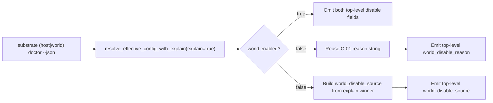
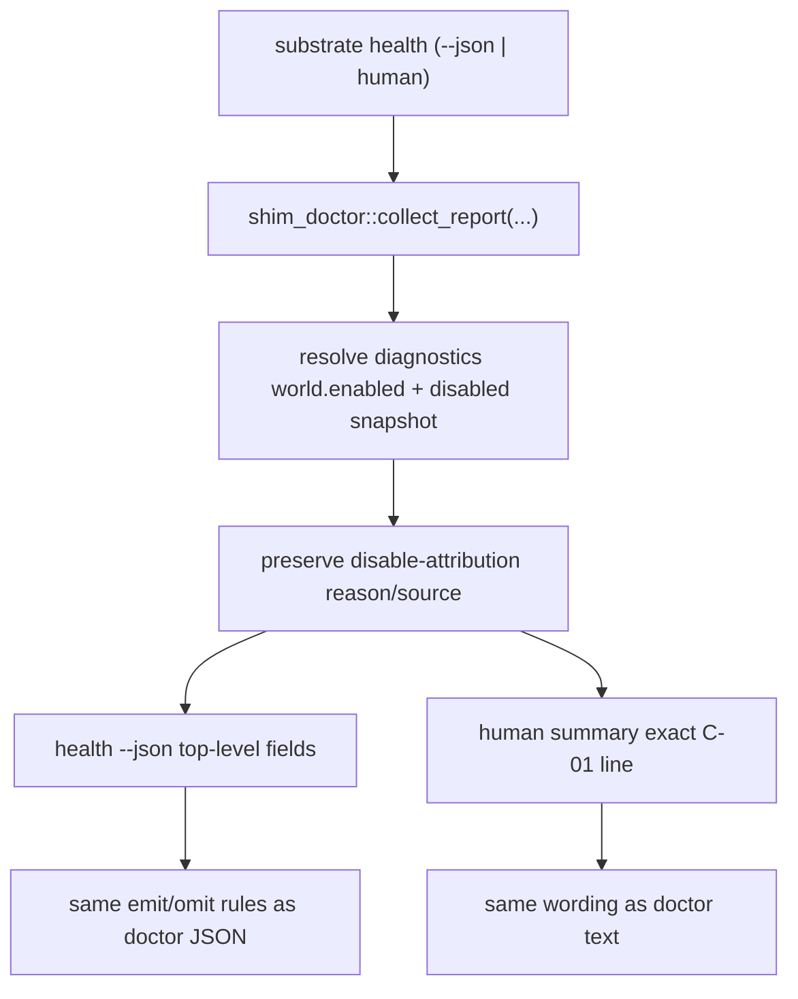

# Review Bundle - SEAM-2 JSON + health disable attribution

This artifact feeds `gates.pre_exec.review`.
`../../review_surfaces.md` is pack orientation only.

## Falsification questions

- Can any disabled JSON payload still force operators or automation to scrape nested fields or text because `world_disable_reason` and `world_disable_source` are missing, misplaced, or emitted only on some platforms?
- Can `substrate health` still drift from the published `C-01` text contract by printing a different disable message, suppressing the attribution line, or losing `cli_flag` provenance in the `--no-world` path?
- Can the new structured source object leak raw env values or absolute host paths, or diverge from the exact winner that already resolves `world.enabled` in `SEAM-1`?

## R1 - Structured disable-attribution flow

## R2 - Health disabled-path parity

## Likely mismatch hotspots

- **Health currently loses structured disable attribution**: `crates/shell/src/builtins/health.rs` emits `shim` plus `summary`, but there is no top-level disable-attribution contract and `HealthSummary::from_report(...)` only reasons over disabled status, not the winning source.
- **Disabled shim-doctor snapshots currently preserve only status, not source**: `crates/shell/src/builtins/shim_doctor/report.rs` resolves a boolean with `resolve_diagnostics_world_enabled(...)` and `disabled_world_doctor_snapshot()` records `status: disabled` without the reason/source data needed by `substrate health`.
- **Platform JSON envelopes need one stable placement**: Linux, macOS, and Windows doctor JSON already emit root fields like `schema_version`, `platform`, `world_enabled`, and `ok`; `C-03` must stay additive at that same top level rather than being buried inside `host`, `world`, or `summary`.
- **Unsupported Windows host-doctor posture is a compatibility edge**: the JSON contract must remain additive-only and must not alter the existing unsupported status/message semantics while still preserving consistent disable-attribution fields where the payload is emitted.

## Pre-exec findings

- The unblock condition for `SEAM-2` is already satisfied by recorded pack evidence: `../../threading.md`, `../../README.md`, and `../../governance/seam-1-closeout.md` make `REM-001` a `SEAM-1` closeout watchpoint instead of a missing consumed-contract blocker for this seam.
- `C-03` still needed a seam-local contract baseline. That baseline is now concretized in `slice-1-contract-definition-json-health-disable-attribution.md`, including the exact object shape, omit rules, enum set, and verification surfaces.
- No additional pre-exec remediation is required from the current evidence. If implementation reveals a payload surface that cannot preserve the upstream winner truth without heuristics, open a blocking `origin_phase: pre_exec` remediation at that time.

## Pre-exec gate disposition

- **Review gate**: passed
- **Contract gate**: passed (`C-03` is concrete, additive-only, and tied directly to the published `C-01` / `C-02` truth)
- **Revalidation gate**: passed (`SEAM-1` closeout already publishes the handoff; later native parity drift remains a stale-trigger watchpoint, not a current blocker)
- **Opened remediations**: none

## Planned seam-exit gate focus

- **What must be true before downstream promotion is legal**:
  - `C-03` is backed by landed evidence on doctor JSON and health JSON, and health human output reuses the exact `C-01` message body when disabled.
- **Which outbound contracts/threads matter most**:
  - `C-03`, `THR-01`, and `THR-02`
- **Which review-surface deltas would force downstream revalidation**:
  - any change in top-level placement, object keys, enum vocabulary, tokenized path/env rendering, or health-text wording
