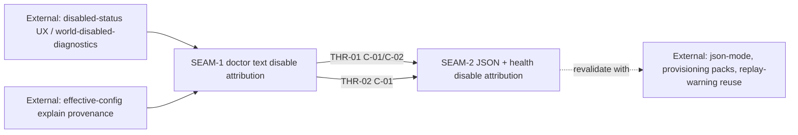

# Threading - make-doctor-health-output-explain-why

## Execution horizon summary

- **Active**: `SEAM-2` — JSON + health disable attribution. This seam now advances against the published `SEAM-1` closeout because the remaining upstream blocker is manual proof capture rather than missing consumed contract truth.
- **Previous active seam with remaining blocker**: `SEAM-1` — doctor text disable attribution. `REM-001` still blocks `promotion_readiness: ready` until native macOS/Windows doctor parity proof lands, but `governance/seam-1-closeout.md` already publishes the landed `C-01` / `C-02` handoff this seam consumes.
- **Future**: none extracted. Cross-platform validation and adjacent-queue compatibility remain pack-level threads and closeout concerns rather than separate seams.

## Contract registry

- **Contract ID**: `C-01`
  - **Type**: UX affordance
  - **Owner seam**: `SEAM-1`
  - **Direct consumers**: `SEAM-2`, operators running doctor
  - **Derived consumers**: health operators, support playbooks, future replay-warning reuse
  - **Thread IDs**: `THR-01`, `THR-02`
  - **Definition**: Exact doctor/health disable-attribution message bodies for the effective winner set:
    - `world isolation disabled by CLI flag --no-world`
    - `world isolation disabled by env override SUBSTRATE_OVERRIDE_WORLD=disabled`
    - `world isolation disabled by workspace config <workspace>/.substrate/workspace.yaml (world.enabled: false)`
    - `world isolation disabled by global config $SUBSTRATE_HOME/config.yaml (world.enabled: false)`
    - `world isolation disabled by default config (world.enabled: false)`
    - `world isolation disabled by effective config (source unknown)`
  - **Versioning / compat**: Once published, message bodies remain exact; any wording or framing change forces revalidation of health parity, smoke evidence, and external documentation that depends on these strings.

- **Contract ID**: `C-02`
  - **Type**: config
  - **Owner seam**: `SEAM-1`
  - **Direct consumers**: `SEAM-2`
  - **Derived consumers**: adjacent health/JSON packs that must preserve the same attribution truth
  - **Thread IDs**: `THR-01`, `THR-02`
  - **Definition**: Disable-source selection must use the same effective winner as `world.enabled` resolution. Authoritative precedence remains `CLI flags -> workspace patch -> SUBSTRATE_OVERRIDE_WORLD when no workspace exists -> $SUBSTRATE_HOME/config.yaml -> default config`. Safe degradation is `source unknown`; no guessing is allowed. Text and JSON must use tokenized display paths and safe env tokens only.
  - **Versioning / compat**: Any resolver, precedence, or token-display change invalidates downstream basis and requires thread revalidation before `SEAM-2` can promote.

- **Contract ID**: `C-03`
  - **Type**: schema
  - **Owner seam**: `SEAM-2`
  - **Direct consumers**: automation/CI and JSON consumers of doctor/health
  - **Derived consumers**: future JSON envelope work, provisioning-related health surfaces, support tooling
  - **Thread IDs**: none inside this pack; downstream external consumers attach after `SEAM-2` closeout
  - **Definition**: Additive top-level JSON fields `world_disable_reason` and `world_disable_source` on host doctor, world doctor, and health payloads. Emit both only when world is disabled; omit both when enabled. Enum set is `cli_flag | override_env | workspace_patch | global_patch | default | source_unknown`. `world_disable_source` uses stable keys `key`, `layer`, `value_display`, plus conditional `flag`, `env`, and `path_display` with tokenized values only.
  - **Versioning / compat**: Additive-only. No rename or removal of existing fields. Any field-placement change, nesting change, or enum change requires downstream revalidation.

## Thread registry

- **Thread ID**: `THR-01`
  - **Producer seam**: `SEAM-1`
  - **Consumer seam(s)**: `SEAM-2`
  - **Carried contract IDs**: `C-01`, `C-02`
  - **Purpose**: Carry the authoritative disable-attribution truth from doctor text into the structured and health surfaces without duplicating precedence logic.
  - **State**: revalidated
  - **Revalidation trigger**: precedence changes for `world.enabled`, message-body changes, token-display changes, or any change in how provenance is exposed to doctor entrypoints
  - **Satisfied by**: `governance/seam-1-closeout.md` already records published `C-01`/`C-02`, landed Linux evidence, and the downstream stale triggers for any later drift. The remaining `REM-001` proof work can still stale this thread if native macOS/Windows parity changes the published doctor truth.
  - **Notes**: This remains the critical handoff thread, but it is now concrete enough for `SEAM-2` to advance to `active`. Final downstream publication must still revalidate if the deferred native proof changes message bodies, precedence truth, or token-display rules.

- **Thread ID**: `THR-02`
  - **Producer seam**: `SEAM-1`
  - **Consumer seam(s)**: `SEAM-2`
  - **Carried contract IDs**: `C-01`
  - **Purpose**: Preserve exact message-body parity and CLI-flag attribution across health and nested doctor/shim paths.
  - **State**: revalidated
  - **Revalidation trigger**: health summary framing changes, world-disabled-status UX changes, platform renderer drift, or any edit to the exact message-body set
  - **Satisfied by**: `governance/seam-1-closeout.md` publishes the current exact message-body contract, and `SEAM-2` now consumes that truth with the explicit obligation to revalidate if native macOS/Windows doctor proof or downstream health work shows drift.
  - **Notes**: This thread exists because parity drift is the main failure mode after the doctor text contract is stabilized. The open `SEAM-1` proof blocker remains a closeout watchpoint, not a reason to keep `SEAM-2` out of the active window.

## Dependency graph

## Critical path

1. `SEAM-1` made the effective-winner mapping, exact wording, fallback posture, and redaction invariants concrete enough for implementation and future review.
2. `SEAM-1` landed doctor-facing truth and published closeout-backed handoff evidence for `C-01` and `C-02`.
3. `REM-001` keeps `SEAM-1` promotion readiness blocked only on manual macOS/Windows doctor parity capture; that blocker is now explicitly treated as a closeout watchpoint rather than a substantive blocker for `SEAM-2`.
4. `SEAM-2` may therefore advance to active/decomposition against the published handoff, and it exits only after its own JSON/health parity evidence is complete and any later `SEAM-1` proof drift is revalidated.

## Workstreams

These workstreams are retained from the source pack as pack-level planning surfaces, not as remediation-owner namespaces.

- **Contract lock-in** — original source workstream for `contract.md` and `decision_register.md`; it primarily feeds `SEAM-1` and secondarily constrains `SEAM-2`.
- **Schema inventory** — original source workstream for the additive JSON schema; it primarily feeds `SEAM-2`.
- **Cross-platform evidence + checkpoints** — original source workstream spanning manual playbook, smoke scripts, checkpoint prompts, and task graph cadence; it spans both seams and informs closeout evidence rather than becoming its own seam.
