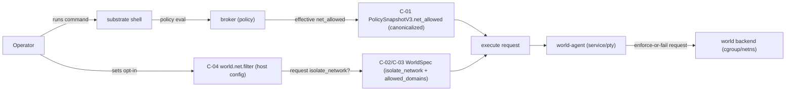
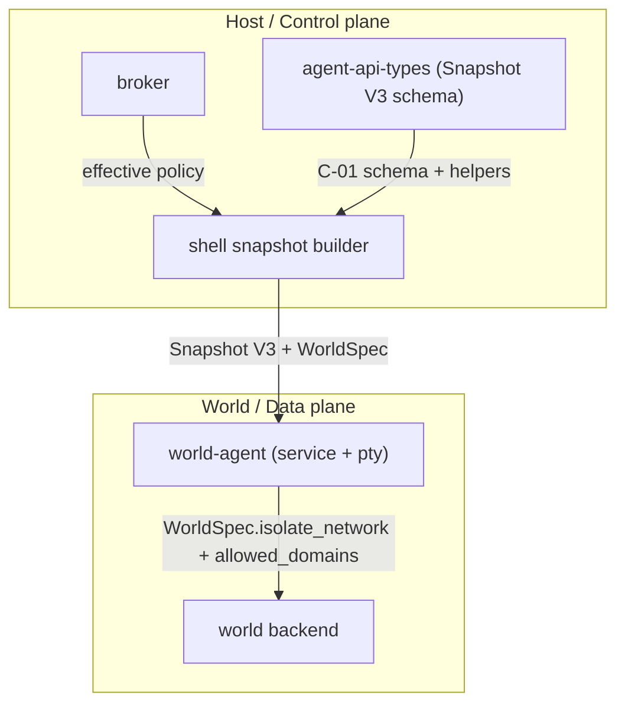

# Review Bundle - SEAM-1 Snapshot V3 `net_allowed` contract + host→world-agent plumbing

This artifact feeds `gates.pre_exec.review`.
`../../review_surfaces.md` is pack orientation only.

## Falsification questions

- Can any world-agent execution path (PTY or non-PTY) still consult `substrate_broker::allowed_domains()` (or equivalent broker-derived state) instead of Snapshot V3 `net_allowed`?
- Can the host construct Snapshot V3 `net_allowed`, but still send a `WorldSpec` that requests allow-all or deny-all in ways that diverge from the snapshot’s canonicalized semantics?
- Can a missing/unknown `net_allowed` field (older snapshot payload) silently change behavior instead of defaulting to a safe, explicit allow-all/deny-all posture?

## R1 - UX / workflow flow

## R2 - API / service / data flow

## Likely mismatch hotspots

- **Dependency inversion / unpublished config gate**: `S2` consumes `C-04` / `THR-03`, but `threading.md` still assigns that contract/thread to future `SEAM-3`; until the contract is published or the sequencing is rewritten, the active seam basis stays provisional.
- **Normalization drift**: hostname casefolding/IDNA posture implemented inconsistently across `agent-api-types`, the host snapshot builder, and the world-agent request path (decision is recorded in `S1.T1`; all consumers must share one helper).
- **PTY vs non-PTY divergence**: `service.rs` and `pty.rs` construct different `WorldSpec`/allowlist values or source them from different places.
- **Wildcard semantics**: `["*"]` is not canonicalized to exactly `["*"]`, or other wildcard forms slip through when isolation is requested.
- **Back-compat defaults**: missing `net_allowed` in older snapshots fails to `serde(default)` as intended or accidentally flips behavior.

## Pre-exec findings

- Hostname normalization posture (casefolding + IDNA) for `net_allowed` is now explicitly specified in `S1.T1`.
- Revalidation against the current repo and pack control plane shows `world.net.filter` / parity override/export surfaces are not yet landed, while the active seam plan still makes `S2` depend on `C-04` / `THR-03`; that keeps the seam basis provisional.

## Pre-exec gate disposition

- **Review gate**: passed
- **Contract gate**: failed
- **Contract gate concerns**:
  - `threading.md` makes `C-04` / `THR-03` authoritative to `SEAM-3`, but `S2` still consumes them while `SEAM-3` remains `future`.
  - The pack critical path and current active/next window do not yet reconcile that ownership/dependency ordering.
- **Revalidation**: failed
- **Revalidation concerns**:
  - No landed host-side `world.net.filter` config surface was found in the repo, so the gating input consumed by `S2` is still upstream future work.
- **Opened remediations**:
  - `REM-004` - publish `C-04` / `THR-03` from `SEAM-3` or resequence the pack so `SEAM-1` no longer depends on future work before promotion.

## Planned seam-exit gate focus

- **What must be true before downstream promotion is legal**:
  - `C-01`..`C-03` are published with tests and documented semantics.
  - `C-04` / `THR-03` are either landed upstream or removed from `SEAM-1`'s direct dependency set via an explicit pack rewrite.
  - `THR-01` and `THR-02` are advanced from `identified` to `published` in closeout.
  - world-agent no longer consults broker-derived allowlists for routing/enforcement.
- **Which outbound contracts/threads matter most**: `C-01`, `C-02`, `C-03` and `THR-01`, `THR-02`.
- **Which review-surface deltas would force downstream revalidation**:
  - Any change to canonicalization or wildcard rejection rules
  - Any change to `WorldSpec` field meaning under opt-in gating
  - Any change to PTY/non-PTY execute request shape
