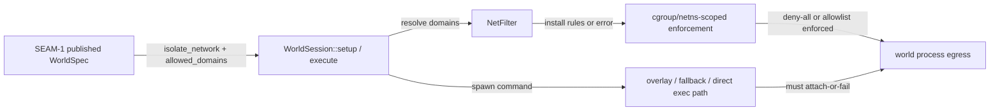
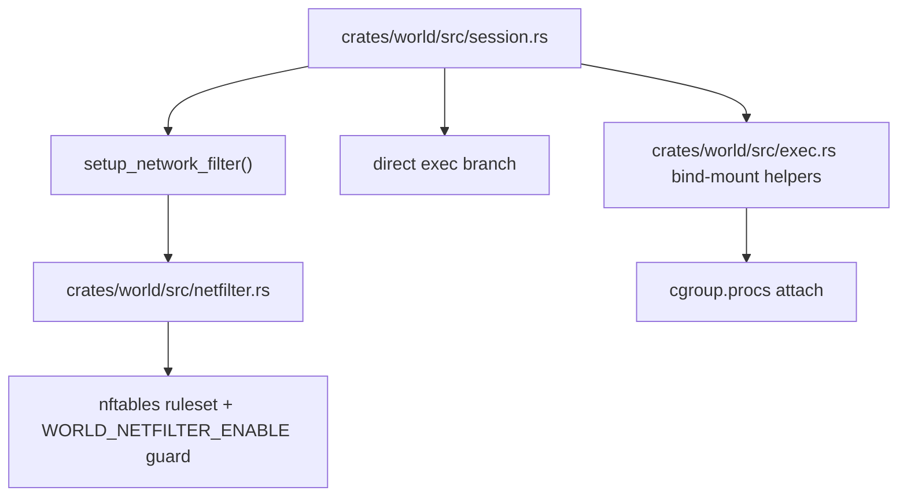

# Review Bundle - SEAM-2 `crates/world` fail-closed enforcement + cgroup invariants

This artifact feeds `gates.pre_exec.review`.
`../../review_surfaces.md` is pack orientation only.

## Falsification questions

- Can `WorldSession::setup()` or `setup_network_filter()` still log a warning and continue even though `SEAM-1` now publishes `isolate_network=true` as an enforce-or-fail contract?
- Can deny-all (`allowed_domains=[]`) still leave outbound DNS open because the nftables plan unconditionally adds DNS allow rules?
- Can any execution path still spawn a process without attaching it to the world cgroup, especially the direct-exec path or bind-mount fallbacks that currently downgrade attach failure to warnings?

## R1 - Runtime workflow

## R2 - Current code hotspots

## Likely mismatch hotspots

- **Warn-and-continue runtime gap**: `crates/world/src/session.rs` currently catches `setup_network_filter()` failures and continues without network scoping, which directly contradicts the published `C-02` enforce-or-fail semantics.
- **Missing-env soft failure**: `setup_network_filter()` currently accepts `install_rules()` returning `false` when `WORLD_NETFILTER_ENABLE` is unset, preserving an unfiltered run instead of failing closed.
- **DNS escape in deny-all**: `crates/world/src/netfilter.rs` currently adds an unconditional `udp dport 53 accept` rule, so deny-all is not yet equivalent to "deny all egress including DNS."
- **Attach warning instead of attach guard**: `crates/world/src/exec.rs` writes the child PID to `cgroup.procs` for bind-mount and world-deps fallback paths, but attach failure is currently only logged as a warning.
- **Direct-exec bypass**: `crates/world/src/session.rs` still has a direct-exec branch that calls `execute_shell_command(...)` with no cgroup attach hook at all.

## Pre-exec findings

- The upstream promotion dependency is satisfied: `../../governance/seam-1-closeout.md` records `seam_exit_gate.status: passed` and `promotion_readiness: ready`, so this seam no longer depends on provisional routing truth.
- The live code scan confirms the active plan boundary:
  - `crates/world/src/session.rs` is where requested isolation still degrades to warnings.
  - `crates/world/src/netfilter.rs` is where deny-all and `WORLD_NETFILTER_ENABLE` semantics must become fail-closed.
  - `crates/world/src/exec.rs` plus the direct-exec branch in `session.rs` are the attach-invariant surfaces that must move from warn-only or bypass behavior to attach-or-fail behavior.
- Because those runtime gaps are now explicitly inventoried and mapped into bounded active slices, the old planning blocker `REM-002` is no longer needed to block `exec-ready`.

## Pre-exec gate disposition

- **Review gate**: passed
- **Review gate concerns**:
  - none; the active review bundle now names the concrete fail-open and attach-bypass surfaces that must be closed during execution.
- **Contract gate**: passed
- **Contract gate concerns**:
  - none; `C-02` and `C-03` remain owned by `SEAM-1`, while `SEAM-2` correctly owns only the runtime realization plus `THR-04`.
- **Revalidation**: passed
- **Revalidation concerns**:
  - none; the seam basis now reflects the landed `SEAM-1` and `SEAM-3` closeouts rather than provisional upstream intent.
- **Opened remediations**:
  - none

## Planned seam-exit gate focus

- **What must be true before downstream promotion is legal**:
  - requested isolation fails instead of warning-and-continuing whenever rule install, domain resolution, or env guarding is missing
  - deny-all leaves no DNS escape hatch
  - overlay, fallback, and direct-exec paths all attach to the world cgroup or refuse to run under `isolate_network=true`
  - focused tests and privileged verification evidence are explicit enough for `SEAM-4` and `SEAM-5` to consume
- **Which outbound contracts/threads matter most**:
  - `THR-04`
- **Which review-surface deltas would force downstream revalidation**:
  - any change to runtime failure taxonomy or operator-facing error text
  - any change to attach strategy for spawned processes
  - any change to DNS handling in the nftables ruleset
