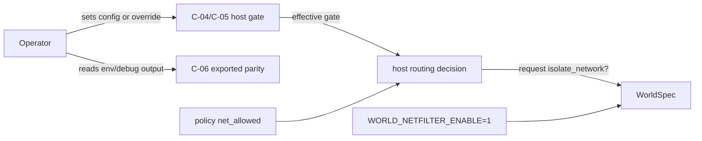
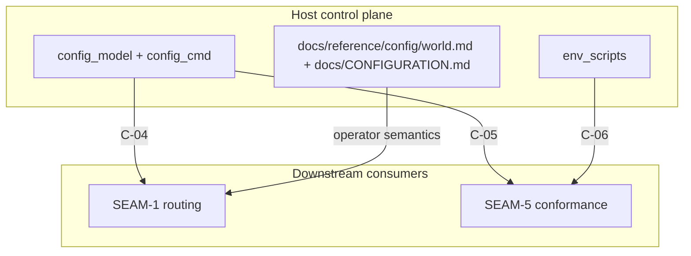

# Review Bundle - SEAM-3 Config opt-in `world.net.filter` + CLI patching + env parity

This artifact feeds `gates.pre_exec.review`.
`../../review_surfaces.md` is pack orientation only.

## Falsification questions

- Can `world.net.filter` precedence drift from existing world-config replace semantics and produce a different effective value than `config current show --explain` reports?
- Can override input (`SUBSTRATE_OVERRIDE_WORLD_NET_FILTER`) and exported parity output (`SUBSTRATE_WORLD_NET_FILTER`) diverge, especially when a workspace exists?
- Can operator docs still imply that restrictive policy or `WORLD_NETFILTER_ENABLE=1` alone turns on filtering, instead of requiring the full three-way gate?

## R1 - UX / workflow flow

## R2 - API / service / data flow

## Likely mismatch hotspots

- **Precedence drift**: `world.net.filter` is implemented with different precedence than existing world booleans or does not appear in `config current show --explain`.
- **Override leakage**: the override env applies even when a workspace exists, violating the repo’s existing override rules.
- **Parity drift**: `SUBSTRATE_WORLD_NET_FILTER` exports a value that does not match the resolved config.
- **Doc ambiguity**: examples fail to explain that `world.net.filter`, `WORLD_NETFILTER_ENABLE=1`, and policy `net_allowed` each answer different questions.

## Pre-exec findings

- The pack control plane now correctly makes `SEAM-3` the active upstream seam for `C-04` / `THR-03`.
- The operator docs/examples now land the three-way gate alignment in the actual reference docs, so `REM-003` is closed.
- `SEAM-1` now has a published upstream handoff rule for `C-04` / `THR-03` instead of a planning placeholder, so
  `REM-004` is no longer a contract blocker.

## Pre-exec gate disposition

- **Review gate**: passed
- **Review gate concerns**:
  - none; the three-way gate alignment is now published in the user-facing docs.
- **Contract gate**: passed
- **Contract gate concerns**:
  - none; `C-04` / `C-05` / `C-06` ownership and expected semantics are now localized to this active seam.
- **Revalidation**: passed
- **Revalidation concerns**:
  - none; this seam has no upstream contract producers.
- **Opened remediations**:
  - none

## Planned seam-exit gate focus

- **What must be true before downstream promotion is legal**:
  - `C-04`, `C-05`, and `C-06` are landed with tests and documentation.
  - `THR-03` is advanced and explicitly recorded in closeout.
  - `SEAM-1` can point at landed host-gate behavior instead of a provisional planning note.
- **Which outbound contracts/threads matter most**: `C-04`, `C-05`, `C-06`, `THR-03`
- **Which review-surface deltas would force downstream revalidation**:
  - any change to config precedence or override applicability
  - any change to exported parity env names/values
  - any change to the three-way gate semantics consumed by `SEAM-1`
