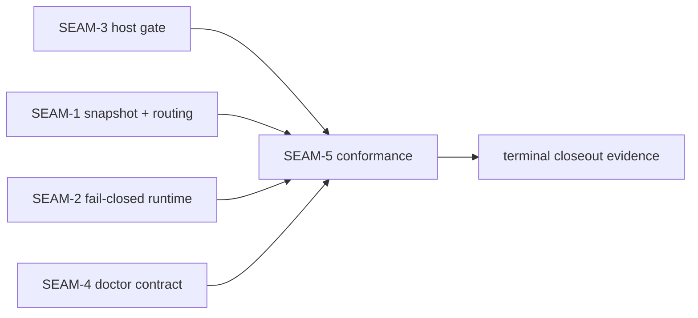
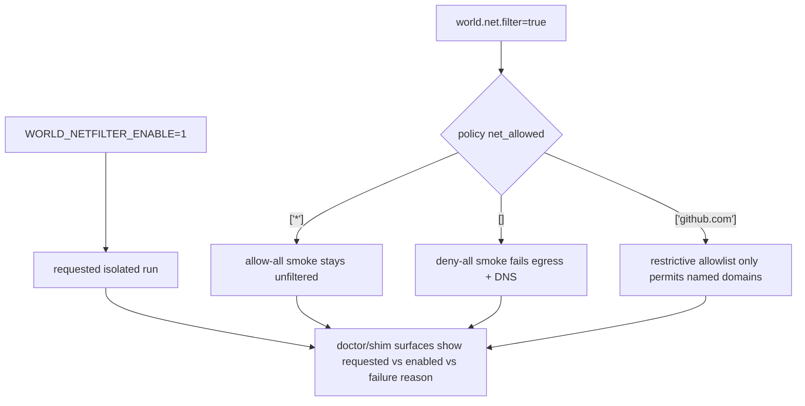

# Review Bundle - SEAM-5 verification and smoke conformance

This artifact feeds `gates.pre_exec.review`.
`../../review_surfaces.md` is pack orientation only.

## Falsification questions

- Can restrictive `net_allowed` policy still drift from the routed `world_network` request without a cross-seam regression test catching it?
- Can requested isolation fail for a known `SEAM-2` reason while doctor/shim surfaces or smoke guidance hide which of `requested`, `enabled`, or `WORLD_NETFILTER_ENABLE` is actually wrong?
- Can macOS Lima provisioning set `WORLD_NETFILTER_ENABLE=1` in the guest, yet the operator smoke path still fail to distinguish allow-all, deny-all, and restrictive allowlist postures?
- Can the only privileged Linux verification remain an ignored source-only test with no operator-facing guidance on when to run it and what evidence to capture?

## R1 - Conformance ownership map

## R2 - Operator smoke posture matrix

## Likely mismatch hotspots

- **Routing/test split**: canonicalized `net_allowed` and `world_network.allowed_domains` stay correct in unit tests, but no conformance matrix pins allow-all versus deny-all versus restrictive behavior end to end.
- **Doctor/smoke drift**: the `C-07` block lands in JSON, but smoke guidance does not assert the same requested/enabled/failure taxonomy operators will actually read.
- **Guest-env gap on macOS**: `scripts/mac/lima-warm.sh` can write the systemd env line while `scripts/mac/smoke.sh` still exercises only generic world execution, not opt-in netfilter postures.
- **Privileged evidence gap**: the ignored Linux nftables test exists, but maintainers lack one explicit place that says when it must run and what counts as passing evidence for the conformance seam closeout.

## Pre-exec findings

- The upstream promotion dependency is satisfied:
  - `../../governance/seam-4-closeout.md` records `seam_exit_gate.status: passed`, `promotion_readiness: ready`, and `gates.post_exec.landing: passed`.
  - `../../threading.md` now records `THR-05` as revalidated for the active seam after consuming the published doctor contract handoff.
- The active seam basis is current:
  - `../../governance/seam-1-closeout.md` publishes the canonical Snapshot V3 and routing contracts `C-01` through `C-03`.
  - `../../governance/seam-2-closeout.md` publishes the landed fail-closed runtime and `THR-04`.
  - `../../governance/seam-3-closeout.md` publishes the host gate, override, and parity env semantics `C-04` through `C-06`.
  - `../../governance/seam-4-closeout.md` publishes the doctor contract `C-07`.
- Contract ownership is coherent:
  - `SEAM-5` owns no new contracts; it consumes `C-01` through `C-07` and turns them into regression, privileged, and smoke evidence.
  - The slice plan keeps contract publication in upstream seams and reserves only conformance evidence and terminal closeout work here.
- Governance drift was normalized during promotion:
  - stale remediation `REM-005` conflicted with the authoritative `SEAM-2` closeout and downstream `SEAM-4` consumption; the remediation log is updated so it no longer implies a blocker that the closeouts already cleared.
- No blocking remediations currently name `SEAM-5`, its `active` transition, or its `exec-ready` transition.

## Pre-exec gate disposition

- **Review gate**: passed
- **Review gate concerns**:
  - none; the review bundle now exposes the concrete mismatch surfaces that could falsify the terminal conformance plan.
- **Contract gate**: passed
- **Contract gate concerns**:
  - none; ownership remains upstream, and the seam-local slices are concrete about which files and verification surfaces will consume each published handoff.
- **Revalidation**: passed
- **Revalidation concerns**:
  - none; the seam basis now references landed `SEAM-1` through `SEAM-4` closeouts and a revalidated `THR-05` handoff.
- **Opened remediations**:
  - none

## Planned seam-exit gate focus

- **What must be true before terminal closeout is legal**:
  - the cross-seam regression matrix must pin host gating, routing, doctor, and failure-taxonomy invariants together
  - privileged Linux evidence must be concrete enough to justify the fail-closed runtime claims in operator-facing documentation
  - macOS Lima smoke guidance must clearly separate allow-all, deny-all, and restrictive allowlist postures
- **Which consumed threads matter most**:
  - `THR-05` for doctor observability
  - `THR-01` through `THR-04` for the config/routing/runtime invariants that the conformance matrix must keep intact
- **Which review-surface deltas would force this seam to reopen**:
  - any doctor field-name or JSON placement drift
  - any change to `world.net.filter` precedence, override applicability, or parity env naming
  - any change to deny-all DNS behavior, attach-or-fail semantics, or the `WORLD_NETFILTER_ENABLE` failure taxonomy
