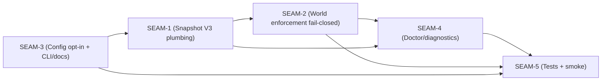

# Threading - Opt-in World Netfilter Enforcement

This document is the authoritative registry for cross-seam contracts and the threads that carry them.

Execution horizon summary:

- Active seam: `SEAM-1` (Snapshot V3 `net_allowed` contract + plumbing)
- Next seam: `SEAM-2` (World netfilter enforcement correctness + cgroup invariants)

## Contract registry

- **Contract ID**: `C-01`
  - **Type**: schema
  - **Owner seam**: `SEAM-1`
  - **Direct consumers**: `SEAM-1`, `SEAM-2`
  - **Derived consumers**: `SEAM-4`, `SEAM-5`
  - **Thread IDs**: `THR-01`
  - **Definition**: `agent-api-types::PolicySnapshotV3.net_allowed: Vec<String>` canonicalized allowlist (supports `"*"` allow-all; `[]` deny-all).
  - **Normalization posture**: ASCII lowercasing + trailing-dot stripping; Unicode/IDNA input rejected (punycode required). See `SEAM-1/S1.T1`.
  - **Versioning / compat**: additive field with `#[serde(default)]`; canonicalization rules are enforced at snapshot build/validation time.

- **Contract ID**: `C-02`
  - **Type**: API
  - **Owner seam**: `SEAM-1`
  - **Direct consumers**: `SEAM-2`
  - **Derived consumers**: `SEAM-4`, `SEAM-5`
  - **Thread IDs**: `THR-02`
  - **Definition**: `WorldSpec.isolate_network: bool` means “world backend MUST enforce outbound egress filtering; if it cannot, the command fails.”
  - **Versioning / compat**: existing field semantics tightened only under opt-in gating; default behavior remains allow-all.

- **Contract ID**: `C-03`
  - **Type**: schema
  - **Owner seam**: `SEAM-1`
  - **Direct consumers**: `SEAM-2`
  - **Derived consumers**: `SEAM-4`, `SEAM-5`
  - **Thread IDs**: `THR-02`
  - **Definition**: `WorldSpec.allowed_domains: Vec<String>` only used when `isolate_network=true`; must already be canonicalized and must reject unsupported wildcards when enforcement is requested.
  - **Versioning / compat**: treated as an allowlist of hostnames only (no URLs, ports, paths).

- **Contract ID**: `C-04`
  - **Type**: config
  - **Owner seam**: `SEAM-3`
  - **Direct consumers**: `SEAM-1`
  - **Derived consumers**: `SEAM-4`, `SEAM-5`
  - **Thread IDs**: `THR-03`
  - **Definition**: `world.net.filter: bool` (host-side, opt-in; default `false`) controls whether the host requests netfilter enforcement from world backends.
  - **Versioning / compat**: default `false` preserves existing networking behavior.

- **Contract ID**: `C-05`
  - **Type**: config
  - **Owner seam**: `SEAM-3`
  - **Direct consumers**: `SEAM-3`
  - **Derived consumers**: `SEAM-5`
  - **Thread IDs**: `THR-03`
  - **Definition**: `SUBSTRATE_OVERRIDE_WORLD_NET_FILTER=1|0|true|false` overrides `world.net.filter` only when no workspace exists.
  - **Versioning / compat**: follows existing override conventions.

- **Contract ID**: `C-06`
  - **Type**: state
  - **Owner seam**: `SEAM-3`
  - **Direct consumers**: `SEAM-5`
  - **Derived consumers**: none
  - **Thread IDs**: `THR-03`
  - **Definition**: `SUBSTRATE_WORLD_NET_FILTER=1|0` exported in env scripts for parity/debugging.
  - **Versioning / compat**: additive output.

- **Contract ID**: `C-07`
  - **Type**: API
  - **Owner seam**: `SEAM-4`
  - **Direct consumers**: `SEAM-5`
  - **Derived consumers**: none
  - **Thread IDs**: `THR-05`
  - **Definition**: `world doctor --json` includes a netfilter status block: requested vs enabled, `WORLD_NETFILTER_ENABLE` present, and last failure reason if any.
  - **Versioning / compat**: additive fields in doctor JSON.

## Thread registry

- **Thread ID**: `THR-01`
  - **Producer seam**: `SEAM-1`
  - **Consumer seam(s)**: `SEAM-2`, `SEAM-4`, `SEAM-5`
  - **Carried contract IDs**: `C-01`
  - **Purpose**: Make policy `net_allowed` available to world-agent via Snapshot V3 without relying on in-guest broker state.
  - **State**: identified
  - **Revalidation trigger**: Any change to `PolicySnapshotV3` schema or canonicalization/validation rules.
  - **Satisfied by**: Snapshot builder populates canonicalized `net_allowed`; world-agent uses it for allowed domain routing.
  - **Notes**: Canonicalization must collapse `"*"` to exactly `["*"]` and reject non-`"*"` wildcard forms when enforcement is requested.

- **Thread ID**: `THR-02`
  - **Producer seam**: `SEAM-1`
  - **Consumer seam(s)**: `SEAM-2`, `SEAM-4`, `SEAM-5`
  - **Carried contract IDs**: `C-02`, `C-03`
  - **Purpose**: Ensure the enforcement request to the world backend is unambiguous: when isolate is requested, enforce or fail.
  - **State**: identified
  - **Revalidation trigger**: Any new execution path in world backend or shim that spawns processes without cgroup attach.
  - **Satisfied by**: WorldSpec drives netfilter installation; any non-attached spawn path fails when isolation is requested.
  - **Notes**: This thread is where “fail-closed” is enforced.

- **Thread ID**: `THR-03`
  - **Producer seam**: `SEAM-3`
  - **Consumer seam(s)**: `SEAM-1`, `SEAM-4`, `SEAM-5`
  - **Carried contract IDs**: `C-04`, `C-05`, `C-06`
  - **Purpose**: Keep enforcement opt-in and operator-controlled at the host boundary.
  - **State**: identified
  - **Revalidation trigger**: Any change to default config behavior or workspace detection semantics.
  - **Satisfied by**: `world.net.filter` gates whether isolate_network is requested; env overrides/exports provide parity tooling.
  - **Notes**: Default `false` is the back-compat anchor.

- **Thread ID**: `THR-04`
  - **Producer seam**: `SEAM-2`
  - **Consumer seam(s)**: `SEAM-4`, `SEAM-5`
  - **Carried contract IDs**: `C-02`
  - **Purpose**: Operational safety guard: enforcement must not accidentally “turn on” without `WORLD_NETFILTER_ENABLE=1`.
  - **State**: identified
  - **Revalidation trigger**: Installer changes or world-agent service configuration changes.
  - **Satisfied by**: If `isolate_network=true` and `WORLD_NETFILTER_ENABLE` is missing/unset, world backend errors with a diagnostic pointing to service/env configuration.
  - **Notes**: This protects against accidental nftables installs/configuration drift.

- **Thread ID**: `THR-05`
  - **Producer seam**: `SEAM-4`
  - **Consumer seam(s)**: `SEAM-5`
  - **Carried contract IDs**: `C-07`
  - **Purpose**: Make enforcement status observable and debuggable for operators.
  - **State**: identified
  - **Revalidation trigger**: Changes to doctor endpoints or JSON schema, or new enforcement failure modes.
  - **Satisfied by**: doctor output includes requested/enabled/guard status and last failure reason.
  - **Notes**: Prevents “policy says deny-all but ping works” ambiguity.

## Dependency graph (orientation)

## Critical path (inferred)

1. `SEAM-1`: publish Snapshot V3 `net_allowed` contract and remove in-guest broker dependency for allowlists.
2. `SEAM-2`: make enforcement real + fail-closed under isolate_network, including cgroup attach invariants.
3. `SEAM-3`: land opt-in config and CLI/docs, enabling safe roll-out without surprising existing workspaces.
4. `SEAM-4` + `SEAM-5`: make enforcement status debuggable and lock it in with tests/smoke.
