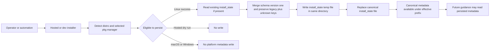
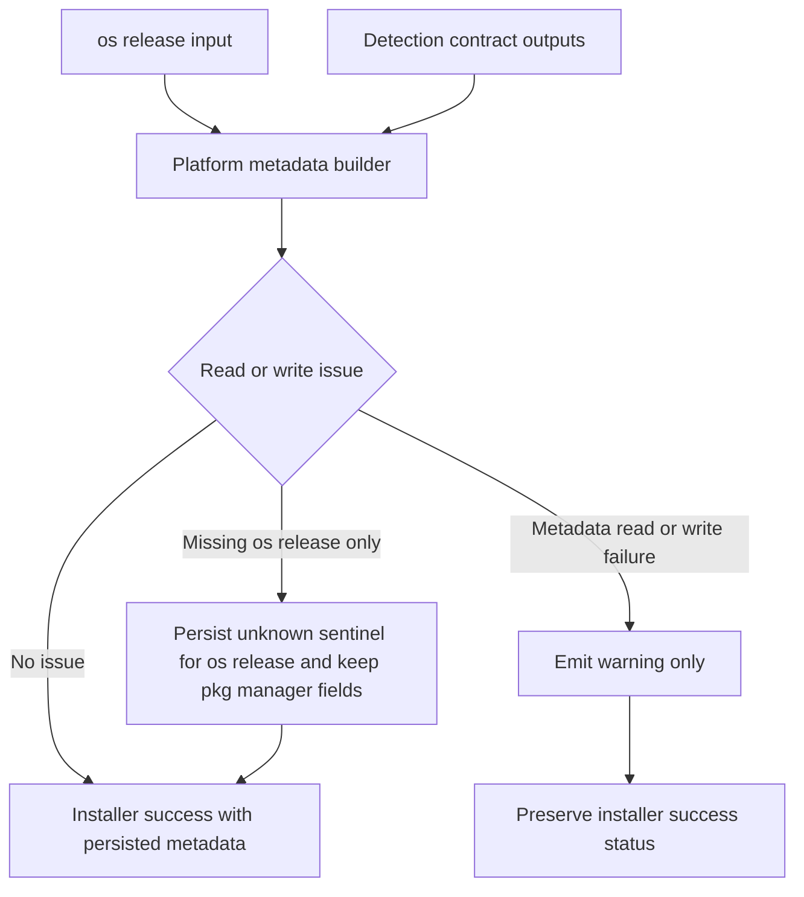
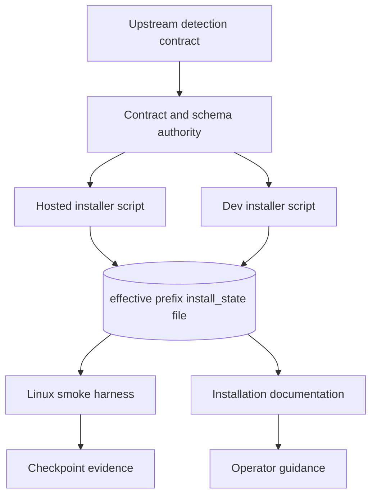
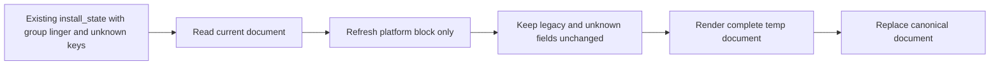

# Review Surfaces - Persist detected Linux distro + pkg manager

These diagrams orient the pack. They show the actual product/work shape that is expected to land.
They do not, by themselves, satisfy seam-local pre-exec review.
Active and next seams still require seam-local `review.md` later.

## R1 - Successful Linux install metadata flow

Orientation note:
- This is the end-to-end product shape for a successful Linux producer flow.
- The diagram intentionally separates no-write branches from the successful Linux path because the feature contract depends on that distinction.

## R2 - Failure posture and degraded metadata behavior

Orientation note:
- The landed feature is not just a file write. It is a fail-open control flow where metadata issues do not redefine installer success for this pack.

## R3 - Authority boundary and file touch map

Orientation note:
- The upstream detection contract remains external authority.
- This pack owns persistence, runtime write behavior, smoke evidence, and operator wording that depend on that upstream truth.

## R4 - Legacy compatibility and rewrite surface

Orientation note:
- This diagram highlights why the seam split matters: the feature must preserve legacy content while adding one new platform block, and it must do so without in-place truncation.
