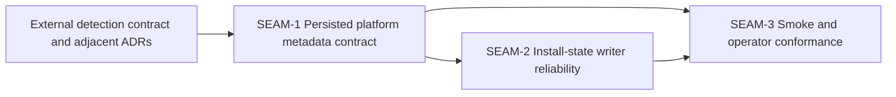

# Seam Map - Persist detected Linux distro + pkg manager

This seam map is extracted from the source pack's slice skeleton, decision register, contract surfaces, workstream triage, and checkpoint plan. It stays intentionally above seam-local slicing.

## Horizon policy

- **Active seam**: `SEAM-1`
- **Next seam**: `SEAM-2`
- **Future seam(s)**: `SEAM-3`

Explicit policy carried from extractor v2.3:

- only `SEAM-1` is eligible for authoritative downstream decomposition by default
- `SEAM-2` may later receive seam-local review and slices, but only provisional deeper planning until revalidated
- `SEAM-3` remains seam-brief only in this pack
- the old `PDLDPM*` slices are lineage inputs, not authoritative execution units here

## Seam topology

## Source-plan roll-up

- `PDLDPM-PWS-contract` and `PDLDPM-PWS-schema_inventory` are rolled into `SEAM-1`.
- `PDLDPM-PWS-slice_spec_pdldpm0` is rolled into `SEAM-1`.
- `PDLDPM-PWS-slice_spec_pdldpm1` is rolled into `SEAM-2`.
- `PDLDPM-PWS-docs_validation`, `PDLDPM-PWS-slice_spec_pdldpm2`, and `PDLDPM-PWS-tasks_checkpoints` are rolled into `SEAM-3`.

## SEAM-1 — Persisted platform metadata contract

- **Type**: `integration`
- **Execution horizon**: `active`
- **Source-plan lineage**: `PDLDPM0`, `contract.md`, `decision_register.md`, `install-state-schema-spec.md`
- **Primary value**:
  - Freeze the exact persisted field set, schema invariants, authority boundaries, path semantics, and copy-through rules that every downstream writer or validation surface must consume.
- **Primary touch surface**:
  - `contract.md`
  - `decision_register.md`
  - `install-state-schema-spec.md`
  - Downstream implementation is expected to touch both installer scripts where metadata values are marshaled, but that execution work belongs to later seam-local planning.
- **Natural boundary**:
  - This seam owns the translation from already-resolved detector outputs into the persisted install-state contract.
  - It is separable from runtime writer mechanics because field ownership and merge rules must be stable before write branches become safe to decompose.
- **Likely verification path**:
  - Confirm the contract is concrete enough for seam-local planning: exact field names, exact path rule, additive compatibility, preserved legacy fields, `unknown` sentinel behavior, and explicit ownership of upstream vocabularies.
- **Key downstream consumers**:
  - `SEAM-2` for runtime writer behavior
  - `SEAM-3` for smoke assertions and documentation wording

## SEAM-2 — Install-state writer reliability

- **Type**: `platform`
- **Execution horizon**: `next`
- **Source-plan lineage**: `PDLDPM1`
- **Primary value**:
  - Turn the schema and authority contract into one reliable producer rule across hosted install, hosted `--no-world`, dev install, and dev `--no-world`, while keeping dry-run and non-Linux branches as no-write.
- **Primary touch surface**:
  - `scripts/substrate/install-substrate.sh`
  - `scripts/substrate/dev-install-substrate.sh`
  - Any shared write helper or temp-file replacement logic introduced during seam-local planning
- **Natural boundary**:
  - This seam is about runtime branch behavior, idempotency, invalid-file fallback, and atomic replacement semantics rather than field ownership.
- **Likely verification path**:
  - Confirm branch coverage, no-write branches, temp-file placement, non-truncating replace semantics, and warning-only degradation on read/write failure.
- **Key downstream consumers**:
  - `SEAM-3` for smoke coverage, docs, and checkpoint evidence
  - Future metadata readers outside this pack once runtime behavior lands

## SEAM-3 — Smoke and operator conformance

- **Type**: `conformance`
- **Execution horizon**: `future`
- **Source-plan lineage**: `PDLDPM2`, `plan.md`, `tasks.json`, `ci_checkpoint_plan.md`, `docs/INSTALLATION.md` reconciliation
- **Primary value**:
  - Lock regression coverage, operator wording, and checkpoint evidence so the landed behavior remains provable and does not drift.
- **Primary touch surface**:
  - `tests/installers/install_state_smoke.sh`
  - `docs/INSTALLATION.md`
  - `plan.md`
  - `tasks.json`
  - `session_log.md`
- **Natural boundary**:
  - This seam is cross-cutting hardening and evidence, not net-new runtime behavior. It should consume landed truth from `SEAM-1` and `SEAM-2`.
- **Likely verification path**:
  - Confirm all required smoke branches exist, docs use accepted field/path wording, and checkpoint evidence reflects Linux behavior smoke plus cross-platform parity.
- **Key downstream consumers**:
  - Operators, support, and future maintainers
  - Pack closeout and downstream drift-guard governance

## Why the extraction stops here

The source pack already contains deep execution detail, but extractor v2.3 explicitly forbids creating new authoritative slices during extraction. This pack therefore preserves the old plan's depth as:

- rich seam briefs rather than slice specs
- explicit contracts and threads rather than task graphs
- governance remediations and closeout scaffolds rather than execution checklists
- pack-level review surfaces rather than seam-local `review.md`
