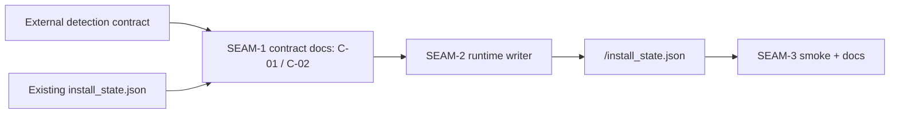
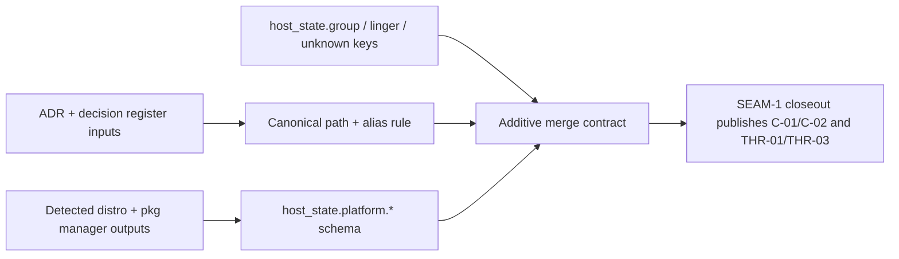

# Review Bundle - SEAM-1 Persisted Platform Metadata Contract

This artifact feeds `gates.pre_exec.review`.
`../../review_surfaces.md` is pack orientation only.

## Falsification questions

- Can any artifact or runtime surface still imply two canonical metadata locations, leaving `C-02` ambiguous about which file path downstream seams must honor?
- Can `pkg_manager.selected` or `pkg_manager.source` still be renamed, narrowed, or re-derived locally instead of copied verbatim from the external detection contract?
- Can downstream seams still treat `install_state.json` as event-only cleanup metadata because `SEAM-1` failed to publish an exact payload contract before runtime and docs work begins?

## R1 - Planned contract-to-runtime handoff flow

## R2 - Planned authority-boundary and compatibility flow

## Likely mismatch hotspots

- `scripts/substrate/install-substrate.sh` and `scripts/substrate/dev-install-substrate.sh` still expose the writer behavior gap that belongs to `SEAM-2`, so `SEAM-1` must stay limited to payload truth and canonical-path authority rather than absorbing runtime write mechanics.
- `docs/INSTALLATION.md` still describes schema `version = 1` and cleanup-only host-state metadata, so downstream smoke and operator wording drift remains the explicit `SEAM-3` remediation `REM-002`, not a blocker on this contract seam.
- `docs/project_management/adrs/draft/ADR-0032-stashing-ferret.md` still carries stale `stashing-ferret` links, but the accepted `persist-detected-linux-distro-pkg-manager/contract.md` authority section plus `DR-0005` now establish a single authoritative override for planning and downstream consumption.

## Pre-exec findings

- The accepted `persist-detected-linux-distro-pkg-manager/contract.md` authority override and accepted `DR-0005` make the resolved feature directory canonical now, so `REM-001` is resolved for pre-exec promotion even though ADR cleanup remains a seam-exit review-surface delta.
- The upstream `best-effort-distro-package-manager` contract still owns the selected-manager vocabulary, `pkg_manager.source` vocabulary, and `<unknown>` sentinel semantics that `S1` consumes, and the seam-local contract does not redefine them.
- Current installer path surfaces still converge on one effective-prefix canonical file rule (`${PREFIX}/install_state.json` in hosted install and `${PREFIX%/}/install_state.json` in dev install), which matches the accepted path contract that `S2` freezes.
- No new remediation is opened during promotion. The downstream doc drift remains `REM-002`, and the uninstaller cleanup mismatch remains the out-of-scope follow-up `REM-003`.

## Pre-exec gate disposition

- **Review gate**: passed
- **Contract gate**: passed
  - `S1` freezes the exact `host_state.platform.*` field paths, additive merge rules, and `<unknown>` sentinel copy-through behavior for `C-01`.
  - `S2` freezes one canonical path rule, one operator-facing alias relationship, and one upstream-authority boundary for `C-02`.
- **Revalidation gate**: passed
  - the accepted source-pack `contract.md` plus `DR-0005` provide the single authoritative override that resolves the feature-directory drift tracked by `REM-001`
  - the latest `best-effort-distro-package-manager` contract still matches the selected-manager vocabulary, source vocabulary, and `<unknown>` semantics assumed here
  - current installer path initialization still converges on one effective-prefix `install_state.json` location
- **Opened remediations**:
  - none; `REM-001` is resolved and the remaining open items are downstream-only `REM-002` and `REM-003`

## Planned seam-exit gate focus

- **What must be true before downstream promotion is legal**:
  - `SEAM-1` closeout publishes one exact payload/path contract and records whether any field, sentinel, or authority-boundary drift occurred during landing
  - `THR-01` and `THR-03` are explicitly advanced to `published`
- **Which outbound contracts/threads matter most**:
  - `C-01`, `C-02`
  - `THR-01`, `THR-03`
- **Which review-surface deltas would force downstream revalidation**:
  - any change to `host_state.platform.*` field paths or additive-merge rules
  - any change to `<effective_prefix>/install_state.json` versus `$SUBSTRATE_HOME/install_state.json` wording
  - any change to the verbatim-copy boundary for `pkg_manager.selected` and `pkg_manager.source`
  - any closeout evidence that weakens the accepted authoritative override for the canonical feature-directory path
