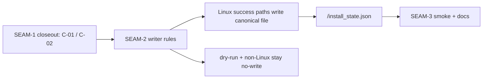
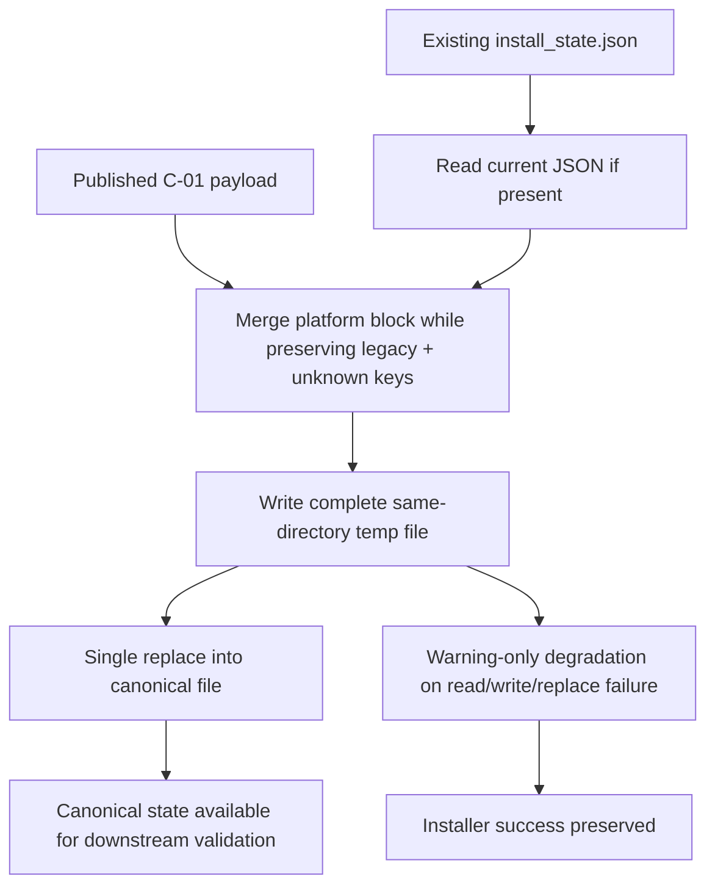

# Review Bundle - SEAM-2 Install-State Writer Reliability

This artifact feeds `gates.pre_exec.review`.
`../../review_surfaces.md` is pack orientation only.

## Falsification questions

- Can any successful Linux hosted or dev installer flow still exit without `install_state.json` because the current code writes metadata only when group or linger events exist?
- Can hosted `--dry-run` or non-Linux branches still create `install_state.json`, `install_state.json.tmp`, or a metadata-only parent directory while this seam claims they are no-write?
- Can invalid JSON temp-file failure or replace failure still truncate canonical state or flip an otherwise successful installer run into failure?

## R1 - Planned writer-matrix handoff

## R2 - Planned reliability and failure-posture flow

## Likely mismatch hotspots

- `scripts/substrate/install-substrate.sh` and `scripts/substrate/dev-install-substrate.sh` still log `No host state changes detected; skipping host metadata write.` and return early, which is the concrete runtime gap this seam must close.
- Both installers already converge on same-directory temp-file output and warning-only parse/write logging, so the reliability slice should refine and align that shared scaffold rather than invent a second persistence path.
- `tests/installers/install_state_smoke.sh` already checks `schema_version = 1` and some compatibility behavior, but it does not yet prove the full successful-Linux write matrix that `SEAM-3` will need.

## Pre-exec findings

- `../../governance/seam-1-closeout.md` published `C-01` and `C-02` and left `promotion_readiness: ready`, so `THR-01` is available for revalidated consumption.
- Current hosted and dev installer surfaces still skip metadata writes when no host-state events occur, which confirms the central writer gap is still real and well-scoped.
- Current hosted and dev installer surfaces already share warning-only invalid-file handling, `schema_version = 1` reset behavior, same-directory temp files, and a single replace step, which makes the reliability contract concrete enough to implement without reopening payload ownership.
- `REM-003` remains visible as an out-of-scope follow-up for uninstall cleanup-path alignment and does not block this seam's pre-exec posture.

## Pre-exec gate disposition

- **Review gate**: passed
- **Contract gate**: passed
  - `S1` freezes the exact successful-Linux write matrix and no-write boundaries for `C-03`.
  - `S2` freezes the same-directory temp-file replace and warning-only degradation contract for `C-04`.
- **Revalidation gate**: passed
  - `../../governance/seam-1-closeout.md` published the upstream payload and canonical-path truth needed by this consumer seam.
  - current installer path initialization still converges on one canonical `install_state.json` location in both hosted and dev flows.
  - current installer metadata code still exhibits the no-event write gap and shared warning-only/replace scaffold that this seam is expected to land.
- **Opened remediations**:
  - none; `REM-003` remains an existing non-blocking follow-up owned by `SEAM-2`

## Planned seam-exit gate focus

- **What must be true before downstream promotion is legal**:
  - `SEAM-2` closeout publishes one landed successful-Linux write matrix and one landed reliability contract
  - `THR-02` is explicitly advanced to `published`
- **Which outbound contracts/threads matter most**:
  - `C-03`
  - `C-04`
  - `THR-02`
- **Which review-surface deltas would force downstream revalidation**:
  - any change to successful-Linux producer coverage versus dry-run or non-Linux no-write branches
  - any change to temp-file placement replace semantics or warning-only failure posture
  - any change to canonical path handling that weakens alignment with `C-02`
