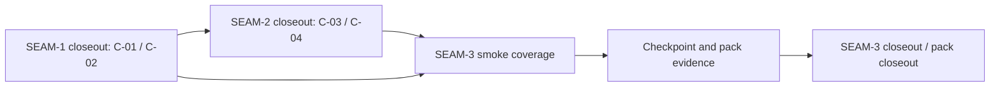
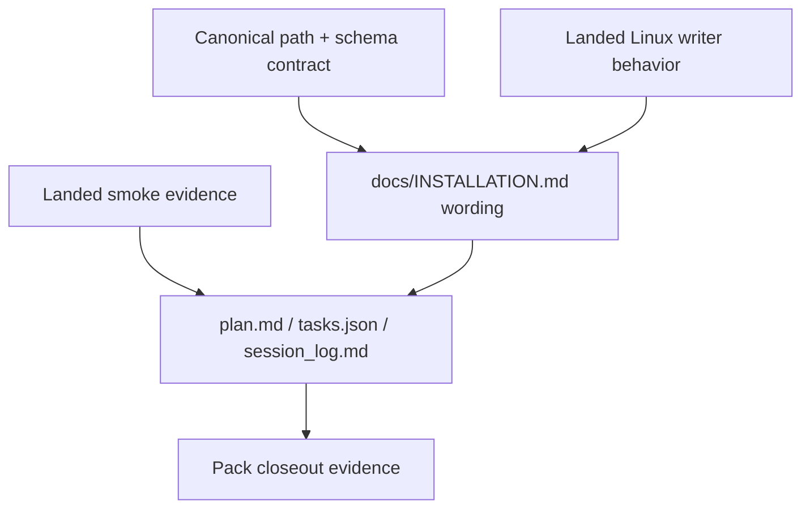

# Review Bundle - SEAM-3 Smoke And Operator Conformance

This artifact feeds `gates.pre_exec.review`.
`../../review_surfaces.md` is pack orientation only.

## Falsification questions

- Can the smoke harness still miss any of the successful-Linux producer branches or no-write boundaries published in `SEAM-2` closeout?
- Can the operator doc still drift from the accepted canonical path story, shared producer scope, `schema_version = 1`, or the four persisted `host_state.platform.*` fields published by `SEAM-1` and `SEAM-2`?
- Can checkpoint evidence still point at commands or artifacts that no longer prove the same contract the smoke harness and docs claim to cover?

## R1 - Planned smoke and evidence handoff

## R2 - Planned operator wording and checkpoint alignment

## Likely mismatch hotspots

- `tests/installers/install_state_smoke.sh` already covers upgrade, invalid-JSON, write-failure, and replace-failure behavior, but it still needs the final conformance pass that freezes the exact producer matrix and persisted platform fields expected by `SEAM-3`.
- `docs/INSTALLATION.md` remains the primary operator drift surface called out by `REM-002`; it must be checked against both the schema/path closeout and the runtime writer closeout before this seam lands.
- The source planning-pack evidence surfaces (`plan.md`, `tasks.json`, `session_log.md`) can stale independently from the smoke harness and docs unless they are updated from the same landed contract truth.

## Pre-exec findings

- `../../governance/seam-1-closeout.md` publishes `C-01`, `C-02`, and `THR-03` with promotion readiness `ready`, so schema and canonical-path truth are available for revalidated downstream consumption.
- `../../governance/seam-2-closeout.md` publishes `C-03`, `C-04`, and `THR-02` with promotion readiness `ready`, so the successful-Linux branch matrix and warning-only reliability story are available for conformance planning.
- The current smoke harness already contains reliability-focused assertions and additive-compatibility scaffolding, which keeps the remaining conformance work narrow instead of reopening runtime writer design.
- `REM-002` remains visible as a material documentation-drift follow-up owned by `SEAM-3`, but it does not block pre-exec readiness because the seam-local slices make that work explicit and bounded.

## Pre-exec gate disposition

- **Review gate**: passed
- **Contract gate**: passed
  - `S1` freezes the smoke-evidence contract for `C-05`.
  - `S2` freezes the operator-wording and checkpoint-alignment contract for `C-06`.
- **Revalidation gate**: passed
  - `THR-02` is revalidated against the published `SEAM-2` closeout.
  - `THR-03` is revalidated against the published `SEAM-1` closeout.
  - current smoke and documentation surfaces still match the touch set described by the seam brief.
- **Opened remediations**:
  - none; `REM-002` remains the existing material follow-up explicitly owned by this seam

## Planned seam-exit gate focus

- **What must be true before pack closeout can rely on this seam**:
  - `SEAM-3` publishes one landed smoke evidence contract and one landed operator-wording contract
  - `THR-02` and `THR-03` advance beyond simple publication into accepted conformance evidence
- **Which outbound contracts/threads matter most**:
  - `C-05`
  - `C-06`
  - `THR-02`
  - `THR-03`
- **Which review-surface deltas would force downstream revalidation**:
  - any change to the canonical path or field names
  - any change to the successful-Linux versus no-write matrix
  - any change to the checkpoint commands or evidence artifacts used for pack closeout
