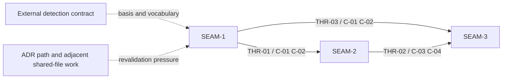

# Threading - Persist detected Linux distro + pkg manager

## Execution horizon summary

- **Active seam**: none
- **Next seam**: none
- **Future seam(s)**: `SEAM-1`, `SEAM-2`, `SEAM-3`

Execution discipline for this extracted pack:

- No active seam remains in the forward window because all three seams are landed.
- No next seam remains in the forward window; any new next seam requires an explicit horizon decision.

## Contract registry

- **Contract ID**: `C-01`
  - **Type**: `schema`
  - **Owner seam**: `SEAM-1`
  - **Direct consumers**: `SEAM-2`, `SEAM-3`
  - **Derived consumers**: future metadata-reading guidance surfaces outside this pack
  - **Thread IDs**: `THR-01`, `THR-03`
  - **Definition**:
    - The persisted `install_state.json` platform payload contract: `schema_version = 1`, exact `host_state.platform.*` nesting, preserved `host_state.group` / `host_state.linger`, preserved unknown keys, and literal `unknown` sentinel persistence when distro detection emitted it.
  - **Versioning / compat**:
    - Additive-only on schema version `1`; no field renames or second metadata file; future consumers ignore unknown keys.

- **Contract ID**: `C-02`
  - **Type**: `config`
  - **Owner seam**: `SEAM-1`
  - **Direct consumers**: `SEAM-2`, `SEAM-3`
  - **Derived consumers**: operator guidance and future cleanup/readers that reason about canonical path semantics
  - **Thread IDs**: `THR-01`, `THR-03`
  - **Definition**:
    - The canonical metadata location and authority-boundary contract: `<effective_prefix>/install_state.json` is the on-disk canonical file, `$SUBSTRATE_HOME/install_state.json` is the operator-facing alias for the default-prefix case, and upstream detection vocabulary remains externally owned and copied verbatim rather than re-derived locally.
  - **Versioning / compat**:
    - No second canonical file and no new env-var override; changes require revalidation of documentation and cleanup readers.

- **Contract ID**: `C-03`
  - **Type**: `state`
  - **Owner seam**: `SEAM-2`
  - **Direct consumers**: `SEAM-3`
  - **Derived consumers**: future metadata readers that rely on one stable file after successful Linux installs
  - **Thread IDs**: `THR-02`
  - **Definition**:
    - The successful-Linux producer matrix: hosted install, hosted `--no-world`, dev install, and dev `--no-world` create or update the canonical file on success; hosted `--dry-run` and non-Linux runs remain no-write for this feature.
  - **Versioning / compat**:
    - Any change to write/no-write branches or platform scope invalidates downstream smoke assertions and docs wording until revalidated.

- **Contract ID**: `C-04`
  - **Type**: `state`
  - **Owner seam**: `SEAM-2`
  - **Direct consumers**: `SEAM-3`
  - **Derived consumers**: post-exec reviewers and future maintainers diagnosing failed metadata writes
  - **Thread IDs**: `THR-02`
  - **Definition**:
    - The reliability contract: same-directory temp-file rendering to `install_state.json.tmp`, a single replace step only after complete JSON exists, no in-place truncation, and warning-only degradation that preserves install success and prior canonical content when write/replace fails.
  - **Versioning / compat**:
    - Changes to temp-file naming, cleanup behavior, or failure posture require revalidation of Linux smoke evidence and closeout assumptions.

- **Contract ID**: `C-05`
  - **Type**: `state`
  - **Owner seam**: `SEAM-3`
  - **Direct consumers**: none inside this pack
  - **Derived consumers**: checkpoint reviewers, maintainers, and future drift-guard work
  - **Thread IDs**: none
  - **Definition**:
    - The smoke evidence contract: Linux behavior smoke must cover no-event success, exact persisted platform fields, missing os-release degradation, and additive compatibility without requiring a manual validation playbook.
  - **Versioning / compat**:
    - Remains Linux-behavior-only; cross-platform parity is compile/testing evidence rather than new non-Linux runtime assertions.

- **Contract ID**: `C-06`
  - **Type**: `UX affordance`
  - **Owner seam**: `SEAM-3`
  - **Direct consumers**: none inside this pack
  - **Derived consumers**: operators and support maintainers reading `docs/INSTALLATION.md`
  - **Thread IDs**: none
  - **Definition**:
    - The operator wording contract: documentation must name the canonical path, shared hosted-plus-dev producer scope, `schema_version = 1`, and the four persisted `host_state.platform.*` fields without drifting from the implementation contract.
  - **Versioning / compat**:
    - Doc wording must be revalidated whenever field names, path semantics, or write/no-write branches change.

## Thread registry

- **Thread ID**: `THR-01`
  - **Producer seam**: `SEAM-1`
  - **Consumer seam(s)**: `SEAM-2`
  - **Carried contract IDs**: `C-01`, `C-02`
  - **Purpose**:
    - Carry the exact persisted schema, path rule, and authority boundary into runtime writer planning so the writer seam does not invent alternate field shapes or metadata paths.
  - **State**: `closed`
  - **Revalidation trigger**:
    - Upstream detection vocabulary changes, field-path changes, sentinel changes, or ADR path reconciliation that changes the canonical authority story.
  - **Satisfied by**:
    - `SEAM-1` closeout published the concrete schema/path contract, and `SEAM-2` landed against that closeout-backed truth without reopening the contract.
  - **Notes**:
    - This thread exists because the source pack split payload ownership from runtime writer mechanics; downstream planning should preserve that split.

- **Thread ID**: `THR-02`
  - **Producer seam**: `SEAM-2`
  - **Consumer seam(s)**: `SEAM-3`
  - **Carried contract IDs**: `C-03`, `C-04`
  - **Purpose**:
    - Carry the landed write matrix and reliability semantics into smoke coverage, operator docs, and checkpoint evidence.
  - **State**: `closed`
  - **Revalidation trigger**:
    - Any change to the successful-Linux branch matrix, dry-run/no-write behavior, non-Linux scope, temp-file placement, replace mechanics, or warning-only failure posture.
  - **Satisfied by**:
    - `SEAM-2` closeout published landed writer behavior and `SEAM-3` closeout consumed that record as accepted smoke, docs, and checkpoint evidence.
  - **Notes**:
    - `CP1` belongs to this thread as evidence, not as a separate seam.

- **Thread ID**: `THR-03`
  - **Producer seam**: `SEAM-1`
  - **Consumer seam(s)**: `SEAM-3`
  - **Carried contract IDs**: `C-01`, `C-02`
  - **Purpose**:
    - Carry the exact field names, path wording, and additive-compatibility rules into conformance work so smoke assertions and docs stay aligned to the persisted contract.
  - **State**: `closed`
  - **Revalidation trigger**:
    - Schema-version policy changes, field naming changes, path wording changes, or ADR reconciliation that changes which directory is authoritative.
  - **Satisfied by**:
    - `SEAM-3` closeout cites the latest `SEAM-1` closeout and records smoke/docs evidence that matches the landed contract.
  - **Notes**:
    - This thread should stay separate from `THR-02` because docs and smoke can be correct about field names while still lagging the landed writer branch matrix.

## Dependency graph

## Critical path

1. **Freeze persisted contract truth in `SEAM-1`.**
   - Exact field names, merge rules, path semantics, copy-through authority, and Linux-only boundaries must be concrete before downstream planning is safe.
2. **Use that truth to plan and land runtime writer reliability in `SEAM-2`.**
   - The writer seam should not decompose until `THR-01` is revalidated against the latest upstream detection contract and any ADR path cleanup.
3. **Consume landed writer truth in `SEAM-3`.**
   - Smoke coverage, docs wording, and checkpoint evidence should be updated against `SEAM-1` and `SEAM-2` closeouts rather than speculative assumptions.
4. **Reserve seam-exit closeout at every handoff.**
   - `SEAM-1` must publish enough closeout truth for `SEAM-2` promotion.
   - `SEAM-2` must publish enough closeout truth for `SEAM-3` promotion.
   - `SEAM-3` must emit the final conformance evidence and drift-guard posture for pack closeout.

## Workstreams

- **Workstream A — Contract and schema authority**
  - Dominated by `SEAM-1`
  - Shared-file collision risk is low in code but high in planning/docs authority surfaces.
- **Workstream B — Runtime writer behavior**
  - Dominated by `SEAM-2`
  - Shared-file collision risk is high in `scripts/substrate/install-substrate.sh` and `scripts/substrate/dev-install-substrate.sh`.
- **Workstream C — Evidence, docs, and checkpoint conformance**
  - Dominated by `SEAM-3`
  - Shared-file collision risk is high in `docs/INSTALLATION.md`, `tests/installers/install_state_smoke.sh`, `plan.md`, and `tasks.json`.

The workstreams can overlap in discovery, but the thread registry remains the control plane for promotion and revalidation.
