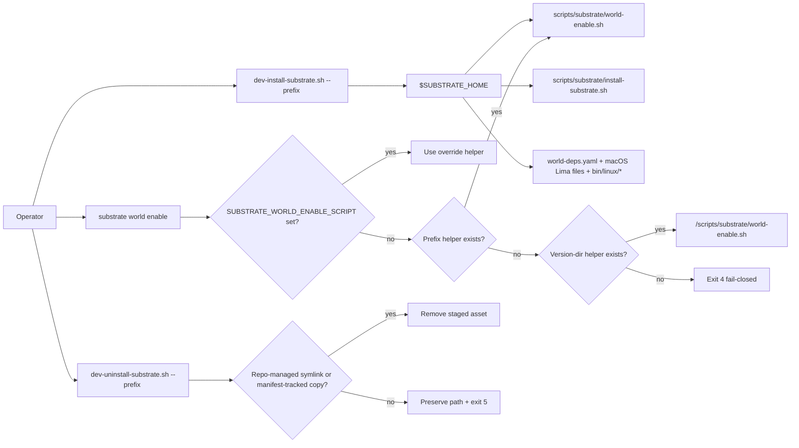
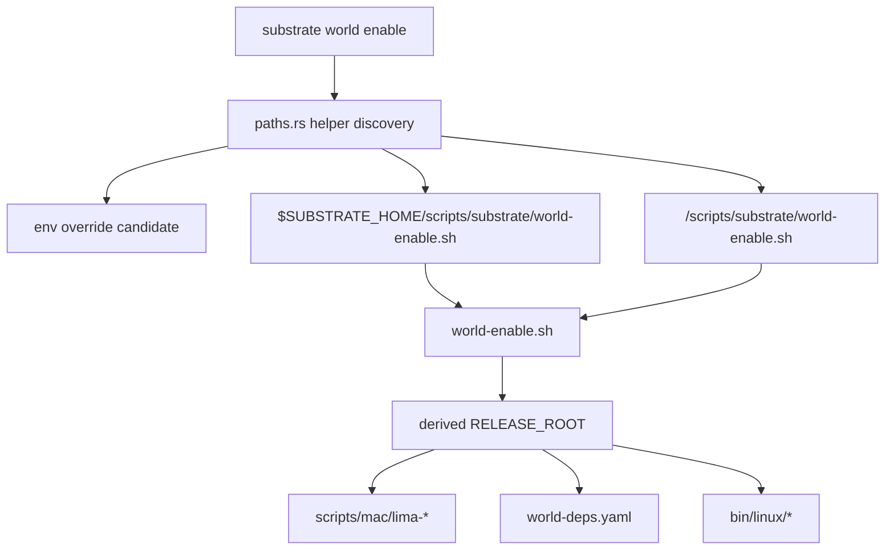
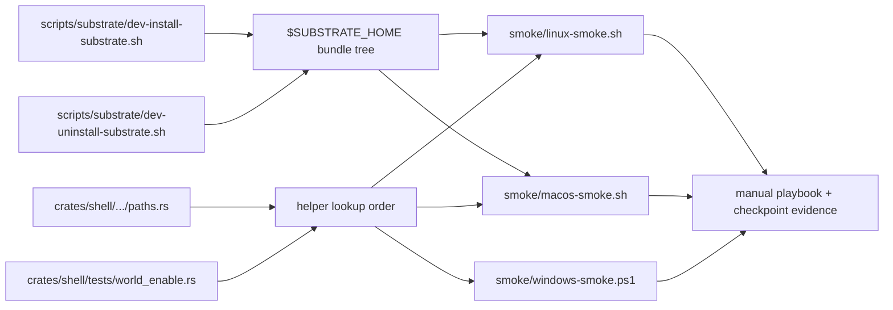

# Review Surfaces - stabilize-dev-install-helper-discovery

These diagrams orient the pack. They show the actual product/work shape that is expected to land.

They do not, by themselves, satisfy seam-local pre-exec review.

Active and next seams still require seam-local `review.md` artifacts later.

## R1 - Install → enable-later → uninstall lifecycle

Why this matters:

- The durable helper bundle and the managed cleanup rule are two halves of the same fixed-path contract.
- The operator-visible failure classes are part of the landed product shape, not just implementation details.

## R2 - Runtime resolution and release-root coupling

Orientation notes:

- The helper is discovered from `$SUBSTRATE_HOME`, but the script still derives its release-root behavior from where it runs.
- On macOS, helper discovery can be correct even when full provisioning would still need additional release-root assets; the pack explicitly keeps that broader parity out of scope.

## R3 - Landed touch surface and evidence map

Orientation notes:

- The landed code touch set stays narrow even though the pack carries rich validation scaffolding.
- `SEAM-3` must eventually compare these evidence surfaces against upstream closeouts, not against provisional assumptions alone.
