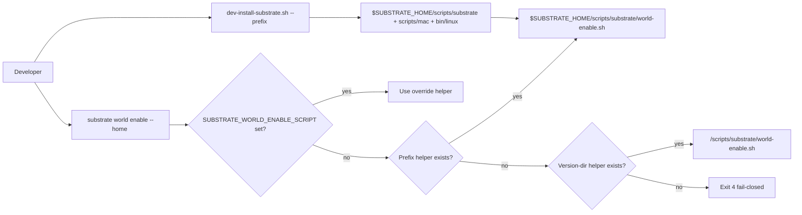
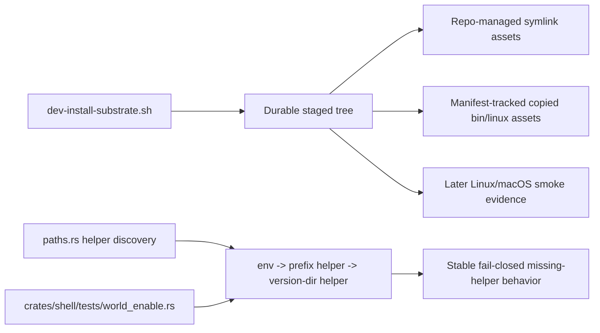

# Review Bundle - SEAM-1 Durable helper-bundle staging + discovery

This artifact feeds `gates.pre_exec.review`.
`../../review_surfaces.md` is pack orientation only.

## Falsification questions

- Can `substrate world enable` still prefer the inferred version-dir helper over the prefix-staged helper when both candidates exist?
- Can the dev install still leave the helper/runtime surface under `<repo>/target/...` or another non-durable location such that `cargo clean` breaks later enable flows?
- Can the staged bundle or helper-missing path still imply broader macOS provisioning parity or the wrong operator remediation message even though this seam only owns helper discovery and dry-run validation surfaces?

## R1 - Install-to-enable durable workflow

## R2 - Staging and validation touch surface

## Likely mismatch hotspots

- The fixed staged path list in `dev-install-substrate.sh` can drift from `C-02`, especially around `world-deps.yaml`, macOS Lima files, or best-effort Linux guest binaries.
- Repo-managed symlink rules versus manifest-tracked copied-binary rules can blur, especially for `bin/linux/*`, which would make `SEAM-2` cleanup unsafe or ambiguous.
- `paths.rs` can preserve the old inferred-version-dir behavior or keep helper-missing guidance that assumes a production layout instead of a dev-installed prefix helper.
- `substrate world enable` flag validation can accidentally widen to accept `--prefix`, which would break the owned `C-01` contract.

## Pre-exec findings

- `scripts/substrate/dev-install-substrate.sh` now stages the exact `C-02` durable script, YAML, and macOS support surface under `$SUBSTRATE_HOME/scripts/...` and keeps `bin/linux/*` within the named helper-bundle scope.
- The managed-asset boundary is concrete enough for execution: repo-managed symlinks cover the durable script/YAML/macOS surface plus `bin/linux/*` when those paths still target repo build outputs, while copied Linux guest binaries cached from Lima remain removable only through `.dev-install-managed/mac-linux-binaries.txt`.
- `crates/shell/src/builtins/world_enable/runner/paths.rs` still preserves `SUBSTRATE_WORLD_ENABLE_SCRIPT` -> prefix helper -> version-dir helper, and `crates/shell/tests/world_enable.rs` still locks prefix precedence together with the invalid `--prefix` CLI posture.
- `REM-003` is resolved by 2026-03-30 revalidation against the current ADR-0035 overlap surfaces.
- `REM-001` remains open because the missing-helper remediation text still says “Reinstall Substrate to refresh scripts” instead of explicitly naming the staged-prefix dev-install posture.

## Pre-exec gate disposition

- **Review gate**: passed
- **Contract gate**: passed
  - `C-02` now names one exact staged path list under `$SUBSTRATE_HOME`.
  - `C-03` now distinguishes repo-managed symlink assets from manifest-tracked copied Linux guest binaries without widening ownership beyond the named bundle paths.
  - `C-01` still keeps one exact helper-order, one exact fail-closed posture, and the current `--home` / invalid `--prefix` CLI surface.
- **Revalidation gate**: passed
  - `scripts/substrate/dev-install-substrate.sh`, `crates/shell/src/builtins/world_enable/runner/paths.rs`, and `crates/shell/tests/world_enable.rs` still match the owned `SEAM-1` contract.
  - ADR-0035 overlap remains a future stale trigger, not a present blocker.
- **Opened remediations**: none

## Planned seam-exit gate focus

- **What must be true before downstream promotion is legal**:
  - `C-01`, `C-02`, and `C-03` are published with landed evidence, and `THR-01` plus `THR-02` are explicitly recorded as `published`.
  - Closeout records the actual staged durable tree, managed-asset evidence for symlinks and copied Linux binaries, and helper-order evidence instead of relying on planned intent.
- **Which outbound contracts/threads matter most**:
  - `C-01`
  - `C-02`
  - `C-03`
  - `THR-01`
  - `THR-02`
- **Which review-surface deltas would force downstream revalidation**:
  - any delta to staged-path membership
  - any delta to helper candidate ordering or helper-missing wording
  - any delta to managed-asset eligibility or manifest location/schema
  - any macOS scope drift beyond helper discovery and dry-run proof
