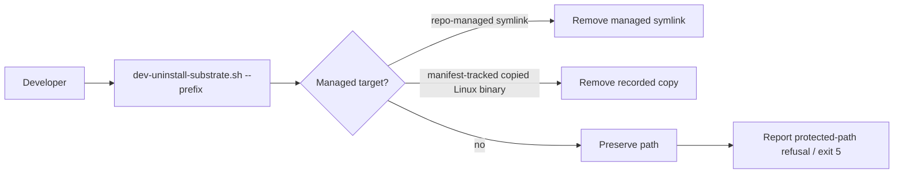
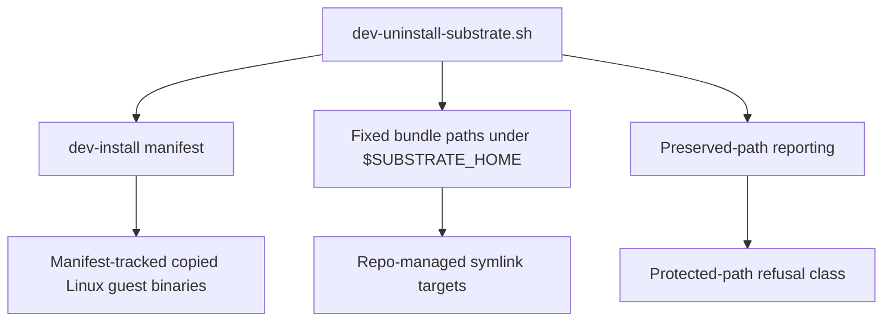

# Review Bundle - SEAM-2 Managed cleanup + protected-path guard

This artifact feeds `gates.pre_exec.review`.
`../../review_surfaces.md` is pack orientation only.

## Falsification questions

- Can `dev-uninstall-substrate.sh` delete a user-managed regular file or a non-repo-managed symlink at a managed path instead of refusing and preserving it?
- Can the manifest-tracked copied-binary path list drift so cleanup removes the wrong Linux guest binary or misses a recorded copy?
- Can directory pruning around `BIN_DIR`, `RUNTIME_SCRIPTS_DIR`, or `VERSION_DIR` become an implicit recursive cleanup shortcut rather than a bounded managed-target removal pass?

## R1 - Managed cleanup decision flow

## R2 - Cleanup surface and evidence map

## Likely mismatch hotspots

- The current uninstall script already knows how to remove repo-managed symlinks and manifest-tracked copied binaries, but the protected-path refusal contract still needs to be the explicit operator-facing outcome for unmanaged paths.
- Directory pruning around managed trees must stay bounded to the published bundle surface; it should not quietly widen into a recursive delete policy.
- The cleanup contract must continue to distinguish provenance from location, or `SEAM-3` will inherit ambiguous evidence.

## Pre-exec findings

- The current repo truth exposes the managed-target cleanup spine in `scripts/substrate/dev-uninstall-substrate.sh`.
- The current repo truth does not yet publish the seam-exit evidence for preserved-path refusal, so this seam needs a dedicated exit gate before downstream conformance can rely on it.

## Pre-exec gate disposition

- **Review gate**: passed
- **Contract gate**: passed
- **Revalidation gate**: passed
- **Opened remediations**: none

## Planned seam-exit gate focus

- What must be true before downstream promotion is legal:
  - managed-only deletion stays bounded to the published bundle surface
  - preserved-path refusal is deterministic and classed as exit 5
  - preserved-path reporting names the actual path that was refused
  - `THR-03` can be published from closeout-backed cleanup truth
- Which outbound contracts/threads matter most:
  - `C-04`
  - `THR-03`
  - `THR-01` revalidation against the published bundle surface
- Which review-surface deltas would force downstream revalidation:
  - refusal messaging drift
  - manifest schema or location drift
  - bundle-path or directory-pruning drift
  - any change to how managed provenance is inferred for symlinks or copied binaries
