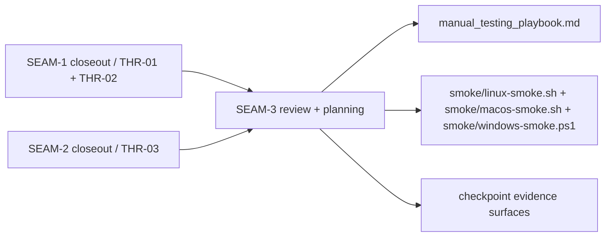
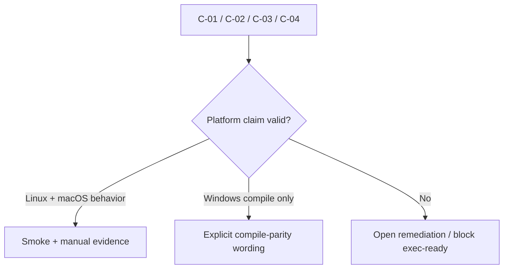

# Review Bundle - SEAM-3 Cross-platform proof + drift guards

This artifact feeds `gates.pre_exec.review`.
`../../review_surfaces.md` is pack orientation only.

## Falsification questions

- Can the smoke wrappers or manual playbook overclaim macOS provisioning parity beyond the staged helper bundle and managed-cleanup scope published by upstream closeouts?
- Can the conformance surfaces drift away from the landed `C-01`..`C-04` contracts so checkpoint proof passes while helper discovery or protected-path refusal behavior has already changed?
- Can Windows compile-parity-only validation be reported as behavior support instead of an explicit compile-only posture?

## R1 - Upstream truth to conformance surface flow

## R2 - Claim-boundary guard

## Likely mismatch hotspots

- macOS validation text can still overclaim provisioning parity if helper discovery correctness is mistaken for full release-root support
- checkpoint wording can drift from the landed upstream contract boundaries and silently stop testing protected-path refusal or helper-order behavior
- Windows evidence can drift from compile-parity-only wording into implied feature support

## Pre-exec findings

- `REM-002` remains open, but it is seam-local and non-blocking because `slice-1-freeze-platform-evidence-boundaries.md`, `slice-2-refresh-cross-platform-proof-surfaces.md`, and `slice-3-seam-exit-gate.md` already own the exact macOS scope, Windows compile-parity wording, and closeout-disposition work the remediation requires.
- Upstream basis freshness is now good enough for active seam-local planning: `THR-01`, `THR-02`, and `THR-03` all have closeout-backed truth.
- `SEAM-3` still owns no new runtime contract; the remaining work is evidence alignment against the landed `C-01`..`C-04` contracts rather than a reopened producer-seam decision.

## Pre-exec gate disposition

- **Review gate**: passed
- **Review gate concerns**:
  - none; the review bundle and seam-local slices now make the macOS-claim, Windows-compile-parity, and checkpoint-drift risks explicit enough to falsify the plan.
- **Contract gate**: passed
- **Contract gate concerns**:
  - none; `SEAM-3` owns evidence-boundary and proof-surface planning only, and the slice contracts are concrete enough to implement without reopening upstream behavior scope.
- **Revalidation gate**: passed
- **Revalidation gate concerns**:
  - none; `SEAM-1` and `SEAM-2` closeouts provide the closeout-backed `C-01`..`C-04` truth this seam consumes, and the remaining work is bounded to seam-local evidence alignment.
- **Opened remediations**: none

## Planned seam-exit gate focus

- What must be true before downstream closeout is legal:
  - smoke, playbook, and checkpoint surfaces align to landed `C-01`..`C-04`
  - macOS wording stays within helper discovery, validation, and managed-cleanup scope
  - Windows remains compile parity only
- Which outbound threads matter most:
  - `THR-01`
  - `THR-02`
  - `THR-03`
- Which review-surface deltas would force downstream revalidation:
  - helper-order wording drift
  - protected-path refusal wording drift
  - checkpoint boundary drift
  - platform claim drift
