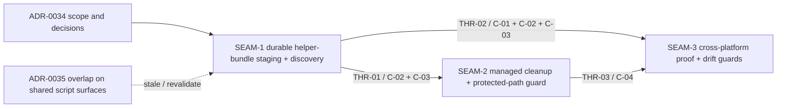

# Threading - stabilize-dev-install-helper-discovery

## Execution horizon summary

- **Active seam**: `SEAM-3`
- **Next seam**: none
- **Future seams**: none

Horizon policy for this pack:

- only the active seam is eligible for authoritative downstream sub-slices by default
- `SEAM-3` now has closeout-backed basis for authoritative seam-local planning and downstream sub-slices if later needed
- no queued next seam remains after `SEAM-2` published landed cleanup/refusal truth through closeout

## Contract registry

- **Contract ID**: `C-01`
  - **Type**: `config`
  - **Owner seam**: `SEAM-1`
  - **Direct consumers**: `SEAM-3`
  - **Derived consumers**: future follow-on work that broadens helper staging or runtime remediation
  - **Thread IDs**: `THR-02`
  - **Definition**: `substrate world enable` resolves helpers in the exact order `SUBSTRATE_WORLD_ENABLE_SCRIPT` → `$SUBSTRATE_HOME/scripts/substrate/world-enable.sh` → `<inferred version dir>/scripts/substrate/world-enable.sh`, and exits fail-closed when none exists.
  - **Versioning / compat**: preserve existing override precedence and keep `--home` valid while `--prefix` stays invalid on `substrate world enable`; any candidate-order or flag-surface change forces revalidation.

- **Contract ID**: `C-02`
  - **Type**: `state`
  - **Owner seam**: `SEAM-1`
  - **Direct consumers**: `SEAM-2`, `SEAM-3`
  - **Derived consumers**: future packs that broaden dev-install staging or rely on the helper bundle layout
  - **Thread IDs**: `THR-01`, `THR-02`
  - **Definition**: the fixed runtime bundle under `$SUBSTRATE_HOME` includes `scripts/substrate/world-enable.sh`, `scripts/substrate/install-substrate.sh`, `scripts/substrate/world-deps.yaml`, `scripts/mac/lima-warm.sh`, `scripts/mac/lima/substrate.yaml`, `scripts/mac/lima/substrate-dev.yaml`, and best-effort Linux guest binaries under `bin/linux/`.
  - **Versioning / compat**: additive or subtractive path-list changes are out of scope for this feature and stale both cleanup and parity seams.

- **Contract ID**: `C-03`
  - **Type**: `schema`
  - **Owner seam**: `SEAM-1`
  - **Direct consumers**: `SEAM-2`, `SEAM-3`
  - **Derived consumers**: future install/uninstall work that must distinguish dev-managed from user-managed assets
  - **Thread IDs**: `THR-01`, `THR-02`
  - **Definition**: repo-owned script, YAML, and macOS support assets stage as repo-managed symlinks. Linux guest binaries under `bin/linux/` are dev-managed only when they remain repo-managed symlinks into local build outputs or when they are copied from Lima and recorded in `.dev-install-managed/mac-linux-binaries.txt`; no other asset class is considered dev-managed.
  - **Versioning / compat**: managed-binary manifest location/schema changes, Linux guest asset-class changes, or symlink-ownership inference changes force cleanup and conformance revalidation.

- **Contract ID**: `C-04`
  - **Type**: `UX affordance`
  - **Owner seam**: `SEAM-2`
  - **Direct consumers**: `SEAM-3`
  - **Derived consumers**: future packs that rely on deterministic protected-path refusal semantics
  - **Thread IDs**: `THR-03`
  - **Definition**: protected-path conflicts preserve user-managed regular files and non-repo-managed symlinks, report the preserved path, and use the protected-path refusal class (`exit 5`) rather than destructive cleanup.
  - **Versioning / compat**: any change to refusal classification, preserved-path messaging, or cleanup eligibility forces conformance revalidation.

## Thread registry

- **Thread ID**: `THR-01`
  - **Producer seam**: `SEAM-1`
  - **Consumer seam(s)**: `SEAM-2`, `SEAM-3`
  - **Carried contract IDs**: `C-02`, `C-03`
  - **Purpose**: publish the real staged bundle surface and the managed-asset eligibility rules that cleanup and conformance must consume.
  - **State**: `revalidated`
  - **Revalidation trigger**: staged path list changes, file-type policy changes, manifest location/schema changes, or Linux guest copy rules change.
  - **Satisfied by**: `governance/seam-1-closeout.md` records the landed bundle tree, managed-marker evidence, and any downstream stale triggers; `threaded-seams/seam-2-managed-cleanup-protected-path-guard/review.md` revalidates cleanup planning against that published handoff.
  - **Notes**: `SEAM-2` has now rebound to the actual closeout-backed bundle layout. `SEAM-3` still consumes the same published truth later alongside `THR-02` and `THR-03`.

- **Thread ID**: `THR-02`
  - **Producer seam**: `SEAM-1`
  - **Consumer seam(s)**: `SEAM-3`
  - **Carried contract IDs**: `C-01`, `C-02`, `C-03`
  - **Purpose**: let the conformance seam prove helper discovery order, `cargo clean` survival, and fail-closed behavior against the landed runtime bundle.
  - **State**: `published`
  - **Revalidation trigger**: override precedence changes, helper-order changes, helper-missing remediation text changes, or CLI flag-surface changes.
  - **Satisfied by**: `governance/seam-1-closeout.md` plus updated smoke and manual evidence reflecting the landed helper resolution flow.
  - **Notes**: This thread is where macOS scope drift becomes visible if staged helper placement is mistaken for full provisioning parity.

- **Thread ID**: `THR-03`
  - **Producer seam**: `SEAM-2`
  - **Consumer seam(s)**: `SEAM-3`
  - **Carried contract IDs**: `C-04`
  - **Purpose**: let the conformance seam verify managed-only cleanup, preserved-path refusal, and protected-path exit behavior after cleanup lands.
  - **State**: `published`
  - **Revalidation trigger**: ownership-guard algorithm changes, refusal messaging changes, exit-code mapping changes, or cleanup directory-pruning behavior changes.
  - **Satisfied by**: `governance/seam-2-closeout.md` records preserved-path evidence, removal evidence, and the final cleanup disposition.
  - **Notes**: `SEAM-3` should not finalize parity claims until this thread is published from cleanup closeout.

## Dependency graph

## Critical path

1. `SEAM-1` lands the durable bundle layout, helper lookup order, and managed-marker contract.
2. `SEAM-2` revalidates against `SEAM-1` closeout and then lands managed-only cleanup and protected-path refusal.
3. `SEAM-3` revalidates against both upstream closeouts and only then publishes parity evidence, smoke proof, and drift guards.

Critical-path failure modes to watch:

- If ADR-0035 changes shared script surfaces first, revalidate `SEAM-1` and downstream bases before promotion.
- If macOS scope drifts from “helper discovery + dry-run proof” toward “full provisioning parity,” `SEAM-1` and `SEAM-3` both stale.
- If the helper-missing message or exit classification changes, `THR-02` and likely `THR-03` must be revalidated together.

## Workstreams

- **Workstream A — Runtime bundle landing**
  - Seam(s): `SEAM-1`
  - Why grouped: owns the first publishable contracts and the narrow critical-path code touch set.

- **Workstream B — Cleanup safety**
  - Seam(s): `SEAM-2`
  - Why grouped: consumes the published bundle/marker contract and adds the operator-facing cleanup/refusal behavior.

- **Workstream C — Conformance and parity lock-in**
  - Seam(s): `SEAM-3`
  - Why grouped: owns smoke evidence, parity proof, and post-landing drift guards across the first two seams.

Concurrency posture:

- `SEAM-3` now owns authoritative seam-local planning because `THR-01`, `THR-02`, and `THR-03` all have closeout-backed truth.
- No next seam is queued in this pack; later promotion depends on `SEAM-3` landing or on a new extraction pass.
