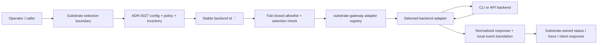
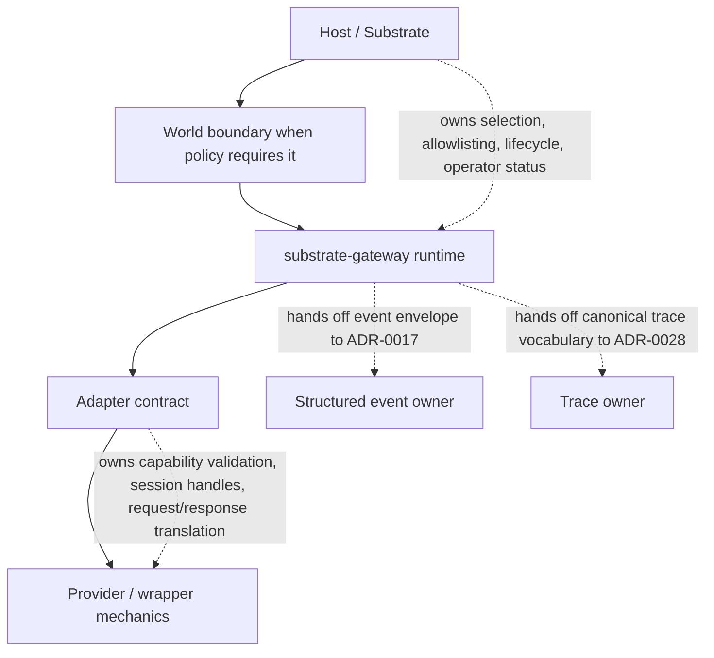
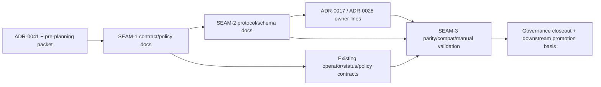

# Review Surfaces - Substrate gateway backend adapter contract

These diagrams orient the pack. They show the actual product and service shape that should land.
They do not, by themselves, satisfy seam-local pre-exec review.
`SEAM-1` and `SEAM-2` still require seam-local `review.md` artifacts later.

## R1 - End-to-end selection and execution workflow

## R2 - Ownership and boundary flow

## R3 - Pack touch-surface map

