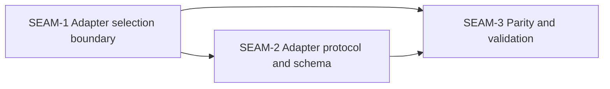

# Seam Map - Substrate gateway backend adapter contract

This seam map is extracted from ADR-0041 and the accepted pre-planning packet. It stays intentionally above seam-local slicing and preserves the downstream workstream order already implied by the pre-planning lane.

## Horizon policy

- **Active seam**: `SEAM-1`
- **Next seam**: `SEAM-2`
- **Future seam(s)**: `SEAM-3`

Explicit policy carried from extractor v2.5:

- only `SEAM-1` is eligible for authoritative downstream decomposition by default
- `SEAM-2` may later receive seam-local review and slices, but only provisional deeper planning until `SEAM-1` publishes the selection boundary and status-subset owner line
- `SEAM-3` remains seam-brief only in this pack
- the pre-planning `SGBA-*` draft seam skeleton is lineage input, not an authoritative execution-unit set

## Seam topology

## Source-plan roll-up

- `SGBA-FWS-contract_surface`, `contract.md`, and `policy-spec.md` roll into `SEAM-1`.
- `SGBA-FWS-protocol_schema`, `gateway-backend-adapter-protocol-spec.md`, and `gateway-backend-adapter-schema-spec.md` roll into `SEAM-2`.
- `SGBA-FWS-parity_validation`, `platform-parity-spec.md`, `compatibility-spec.md`, and `manual_testing_playbook.md` roll into `SEAM-3`.
- `pre-planning/ci_checkpoint_plan.md` remains pack governance input. It is represented here through `threading.md`, `review_surfaces.md`, and the closeout scaffolds instead of becoming a standalone seam.

## Why the seam count stays at three

The pre-planning packet already converged on three downstream workstreams and three draft seams:

1. contract surface and selection boundary
2. protocol and schema boundary
3. parity, compatibility, and validation proof

That split is still cohesive. `SEAM-1` owns the prerequisite contract truth, `SEAM-2` owns the protocol/schema contract-definition seam, and `SEAM-3` owns conformance-proof work after the first two seams have fixed the actual contract surface.

## SEAM-1 — Adapter selection boundary

- **Type**: `integration`
- **Execution horizon**: `active`
- **Source-plan lineage**: `SGBA-FWS-contract_surface`, `SGBA-01`
- **Primary value**:
  - Freeze one stable backend-id contract, one allowlist-driven evaluation order, one failure taxonomy, and one publication boundary for adapter-visible gateway status data before downstream seams consume them.
- **Primary touch surface**:
  - `contract.md`
  - `policy-spec.md`
  - `pre-planning/spec_manifest.md`
  - `pre-planning/impact_map.md`
  - `docs/project_management/adrs/draft/ADR-0041-substrate-gateway-backend-adapter-contract.md`
- **Natural boundary**:
  - This seam owns selection and contract truth, not protocol payload details or parity proof.
- **Likely verification path**:
  - Confirm the stable `<kind>:<name>` identity rule, deny-by-default gating order, invalid versus unavailable versus policy-denied classification, and the exact owner line for any additive adapter-visible `status --json` subset.
- **Key downstream consumers**:
  - `SEAM-2`
  - `SEAM-3`

## SEAM-2 — Adapter protocol and schema

- **Type**: `integration`
- **Execution horizon**: `next`
- **Source-plan lineage**: `SGBA-FWS-protocol_schema`, `SGBA-02`
- **Primary value**:
  - Turn the selected backend identity into one deterministic adapter dispatch lifecycle, one bounded Unified Agent API subset, and one explicit handoff boundary to ADR-0017 and ADR-0028.
- **Primary touch surface**:
  - `gateway-backend-adapter-protocol-spec.md`
  - `gateway-backend-adapter-schema-spec.md`
  - `pre-planning/workstream_triage.md`
  - `docs/project_management/adrs/draft/ADR-0017-agent-hub-concurrent-execution-and-output-routing.md`
  - `docs/project_management/adrs/draft/ADR-0028-in-world-process-execution-tracing-parity.md`
- **Natural boundary**:
  - This seam owns gateway-internal contract definition, not operator selection semantics or parity proof.
- **Likely verification path**:
  - Confirm exact dispatch ordering, capability-validation order, adopted extension-key subset, request/response/error/session-handle field inventory, and the exact local-to-external owner lines for event and trace semantics.
- **Key downstream consumers**:
  - `SEAM-3`

## SEAM-3 — Parity and validation

- **Type**: `conformance`
- **Execution horizon**: `future`
- **Source-plan lineage**: `SGBA-FWS-parity_validation`, `SGBA-03`
- **Primary value**:
  - Prove the adapter contract is additive, cross-platform, and compatible with ADR-0040 / ADR-0024 boundaries only after the upstream contract seams publish concrete truth.
- **Primary touch surface**:
  - `platform-parity-spec.md`
  - `compatibility-spec.md`
  - `manual_testing_playbook.md`
  - `pre-planning/ci_checkpoint_plan.md`
  - `docs/contracts/substrate-gateway-runtime-parity.md`
  - `docs/project_management/adrs/draft/ADR-0040-substrate-gateway-boundary-and-runtime-ownership.md`
- **Natural boundary**:
  - This seam is cross-seam proof and drift prevention. It does not own selection semantics or adapter payload shape.
- **Likely verification path**:
  - Confirm one Linux/macOS/Windows guarantee matrix, one supersession proof that keeps ADR-0024 historical only, one decision on ADR-0040 evidence-only alignment, and one deterministic manual-validation gate.
- **Key downstream consumers**:
  - pack closeout
  - future gateway adapter features that rely on the same contract boundary

## Why the extraction stops here

Extractor v2.5 reserves downstream `S00` / `S99` intent but does not create slices. This pack therefore captures:

- seam briefs instead of slice specs
- contract and thread scaffolds instead of task graphs
- pack-level review surfaces instead of seam-local `review.md`
- governance remediations instead of implicit unresolved questions
