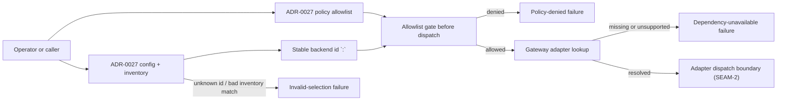
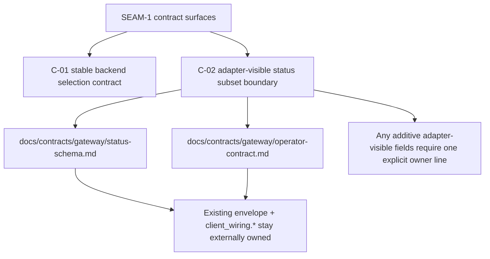

# Review Bundle - SEAM-1 Adapter selection boundary

This artifact feeds `gates.pre_exec.review`.
`../../review_surfaces.md` is pack orientation only.

## Falsification questions

- Can one selected backend id still split into planner, provider, router, wrapper, or auth-authority identities anywhere in the local contract text?
- Can adapter authorization still be interpreted as happening after dispatch or from gateway-local admin, persistence, or session state instead of from ADR-0027 config and policy inputs?
- Can invalid selection, dependency unavailability, and policy denial still collapse into one failure bucket that downstream seams cannot distinguish?
- Can additive adapter-visible `status --json` metadata still widen the existing status schema without one explicit owner line and bounded field family?
- Can ADR-0041 still cite stale `packs/active/...` authorities and cause downstream planning to anchor itself to the wrong config-policy pack?

## R1 - Selection boundary and failure classification

## R2 - Status publication owner line

## Likely mismatch hotspots

- `ADR-0041` still cites `docs/project_management/packs/active/llm_and_agent_config_policy_surface/*` even though this checkout uses `docs/project_management/packs/implemented/llm_and_agent_config_policy_surface/*`.
- any future adapter-visible status field family would widen the current runtime schema and tests, so it still must not ship without a status-schema owner update first.
- The gateway operator contract, status schema, and policy-evaluation contract are all external owners; if `contract.md` or `policy-spec.md` drift from those boundaries, this seam recreates the multi-owner ambiguity it is supposed to remove.

## Pre-exec findings

- No inbound closeout or thread publication blocks this seam. `SEAM-1` remains the first contract-definition seam in the pack, so revalidation is against the current ADR + pre-planning basis rather than against upstream landed work.
- The seam-local decomposition is now concrete enough to falsify the selection boundary and the downstream handoff.
- `C-01` now has a canonical baseline at `docs/contracts/gateway/backend-adapter-selection.md`.
- `C-02` is now concrete enough for producer-seam readiness: v1 publishes no additive adapter-visible `status --json` field family beyond the existing `status` and `client_wiring.*` shape, and any future additive family must be introduced by the status-schema owner before runtime models widen.
- `REM-005` remains material rather than blocking, but the stale ADR authority paths still need cleanup before the final handoff can be considered clean.
- Readiness is not blocked: this seam has no inbound publication dependency, its owned-contract baseline is concrete in seam-local planning, and no open remediation currently blocks `status: exec-ready`.

## Pre-exec gate disposition

- **Review gate**: passed
- **Contract gate**: passed
  - `C-01` is anchored in `docs/contracts/gateway/backend-adapter-selection.md`.
  - `C-02` is anchored in the current status-schema owner line: no additive adapter-visible field family is published in v1 beyond `status` and `client_wiring.*`.
- **Revalidation gate**: passed
  - No inbound thread or closeout dependency exists for `SEAM-1`.
  - The current ADR and pre-planning packet still agree on the stable backend-id, allowlist-first, and fail-closed boundary posture.
- **Opened remediations**:
  - none for the contract gate
  - `REM-005` remains open as non-blocking review cleanup
- **Current readiness posture**:
  - `SEAM-1` may move to `status: exec-ready` now.
  - `THR-01` remains unpublished until landing and closeout record the realized seam-exit evidence.

## Planned seam-exit gate focus

- **What must be true before downstream promotion is legal**:
  - `C-01` exists at `docs/contracts/gateway/backend-adapter-selection.md`.
  - `C-02` keeps the v1 status boundary narrow: no additive adapter-visible field family ships until the status-schema owner explicitly publishes one.
  - `THR-01` is published from closeout with the final failure taxonomy and stale triggers recorded.
- **Which outbound contracts/threads matter most**:
  - `C-01`
  - `C-02`
  - `THR-01`
- **Which review-surface deltas would force downstream revalidation**:
  - any change to backend-id grammar
  - any change to allowlist evaluation order or failure-bucket naming
  - any change to the additive status-subset owner line
  - any new authority-path drift in ADR-0041
