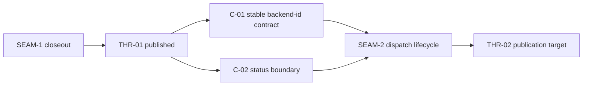
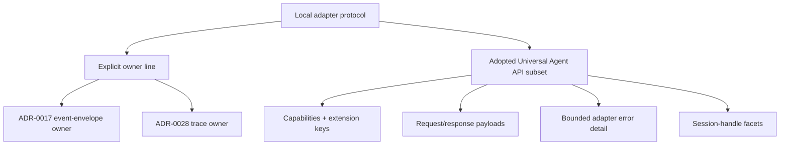

# Review Bundle - SEAM-2 Adapter protocol and schema

This artifact feeds `gates.pre_exec.review`.
`../../review_surfaces.md` is pack orientation only.

## Falsification questions

- Can the protocol still redefine the published backend-id selection boundary instead of consuming `THR-01` as fixed upstream truth?
- Can unsupported capabilities or required extension keys still fall through to permissive behavior instead of failing closed?
- Can request/response payloads, adapter errors, or session-handle facets still widen without one concrete adopted Universal Agent API subset?
- Can local adapter translation still silently redefine ADR-0017 event-envelope or ADR-0028 trace ownership instead of handing off to those external owners explicitly?
- Can seam-local planning still treat `THR-02` as an inbound prerequisite instead of as outbound publication work owned by this seam?

## R1 - Consumed upstream handoff

## R2 - Protocol and schema ownership split

## Likely mismatch hotspots

- `REM-002` is still open because the adopted Universal Agent API subset is not yet pinned for capability ids, extension keys, session-handle facets, and bounded adapter error detail.
- `REM-003` is still open because the seam has not yet fixed the local-to-external owner line between adapter translation and ADR-0017 / ADR-0028.
- Any seam-local draft that treats `THR-02` as required inbound state would falsely block activation and invert producer/consumer ownership.

## Pre-exec findings

- Upstream revalidation is satisfied: `../../governance/seam-1-closeout.md` records `seam_exit_gate.status: passed`, `promotion_readiness: ready`, and `THR-01` as published.
- The seam is safe to activate and decompose because the consumed upstream contract truth is now landed and current.
- Review is concrete enough to falsify the intended lifecycle, schema, and owner-line shape.
- Readiness remains blocked:
  - `REM-002` blocks the contract gate until the exact adopted Universal Agent API subset is pinned for `C-04`.
  - `REM-003` blocks the contract gate until the local adapter translation boundary versus ADR-0017 / ADR-0028 is pinned for `C-03`.
- No additional remediation entry is needed at promotion time because the existing blockers already name the correct owner seam and blocked transition.

## Pre-exec gate disposition

- **Review gate**: passed
  - the seam-local review now makes the dispatch lifecycle, schema inventory, and owner-line risks falsifiable.
- **Contract gate**: pending
  - blocked by `REM-002` and `REM-003`.
- **Revalidation gate**: passed
  - `SEAM-1` closeout is landed and still matches the seam brief basis.
- **Opened remediations**:
  - none; existing blocker entries remain authoritative.
- **Current readiness posture**:
  - `SEAM-2` is active but remains `status: decomposed`.
  - `THR-02` stays `defined` until this seam lands and closes out its owned contracts.

## Planned seam-exit gate focus

- **What must be true before downstream promotion is legal**:
  - `C-03` has one deterministic dispatch lifecycle and one explicit ADR-0017 / ADR-0028 owner line.
  - `C-04` has one bounded adopted schema subset with fail-closed capability and extension-key behavior.
  - `THR-02` is published from closeout with schema, lifecycle, and stale-trigger evidence recorded.
- **Which outbound contracts/threads matter most**:
  - `C-03`
  - `C-04`
  - `THR-02`
- **Which review-surface deltas would force downstream revalidation**:
  - any change to capability ids or extension-key subset
  - any change to payload, error, or session-handle schema
  - any change to ADR-0017 or ADR-0028 owner-line wording
